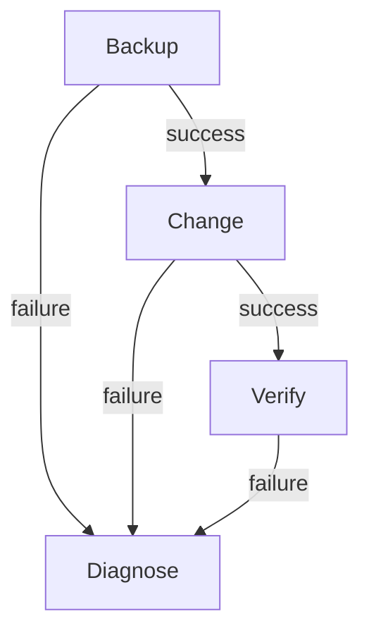

# 11 — Controller objects and execution

## Create and inspect

Create Machine, Source Control and Container Registry credentials, a Git Project, inventory groups, a published EE and four Job Templates: Backup, Change, Verify, Diagnose. The complete CaC in chapter 12 creates the same objects for repeatable practice.

Use AAP's Automation Execution views to inspect each object. Sync the Project and verify its selected revision and discovered playbooks. Assign the EE and Machine plus Trust/Backup credentials to every template. Match inventory groups to the local graph. Launch a version/verification job only after the execution node can route to `172.30.0.0/24` and pull the EE.

The trust credential renders a file of verified server public keys into the job and injects its path as `EX457_KNOWN_HOSTS`. Machine credentials supply client identity. They serve different purposes. Regenerate the public trust input when you intentionally rotate host keys.

[AWX credentials](https://docs.ansible.com/projects/awx/en/24.6.1/userguide/credentials.html). [AWX projects](https://docs.ansible.com/projects/awx/en/24.6.1/userguide/projects.html). [AWX custom credentials](https://docs.ansible.com/projects/awx/en/24.6.1/userguide/credential_types.html).

## Workflow gate

Record every node's job ID/status. A handled failure can leave a workflow successful, so `controller/launch.yml` also asserts successful Backup, Change and Verify node jobs. A missing node or incomplete paginated response fails. This workflow gates control-plane practice; the lab-host namespace/persistence gates remain explicit chapter-20 requirements.

[AWX workflows](https://docs.ansible.com/projects/awx/en/24.6.1/userguide/workflow_templates.html). [AAP 2.6 execution best practices](https://docs.redhat.com/en/documentation/red_hat_ansible_automation_platform/2.6/develop-assembly_controller_best_practices).

