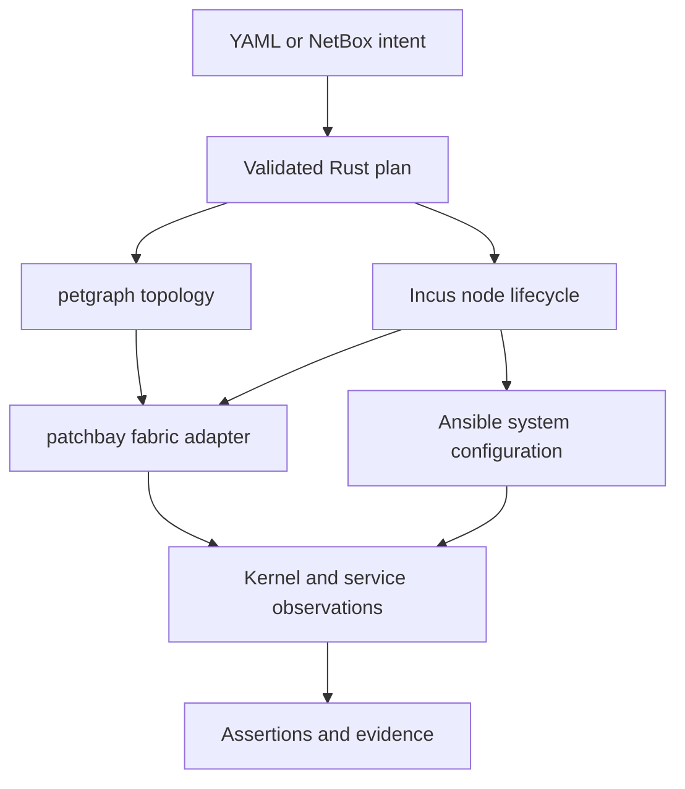

> **AGENT INSTRUCTION: DO NOT IMPLEMENT THIS DOCUMENT.** This is a documentation-only migration proposal. Do not change code, configuration, dependencies, infrastructure, or runtime state from these instructions unless the user separately requests implementation. Documentation review and correction are permitted.

# Target architecture and ownership contracts

## Make one desired-state plan

Compile root lab YAML, EX457 BGP intent and NetBox snapshots into a versioned plan. The plan must contain lab UUID, schema version, input hashes, node IDs/roles, image fingerprints, CPU/memory/process/disk budgets, management assignments, named interfaces, medium, MTU, edge identity, directional impairment, and routing mode. Keep source object IDs and provenance. Do not use a petgraph `NodeIndex`, a mutable display name or an Incus PID as a durable identity.

Separate three objects: **desired plan**, **observed runtime**, and **execution evidence**. A graph edge saying `up` is not proof of carrier, BGP adjacency or successful payload. A model checkpoint is not an Incus rootfs snapshot. An Incus snapshot is not a coordinated PostgreSQL/Slurm/Kubernetes checkpoint.

## Assign one owner to each resource

| Resource | Owner | Boundary |
|---|---|---|
| Node rootfs, cgroup, PID/user/mount/network namespaces | Incus | patchbay borrows identities; it must not delete these namespaces. |
| Incus `p2p` NIC/veth pair | Incus | Keep the host peer where Incus expects it; patchbay may enslave it to its owned wire bridge. |
| Per-wire bridge, fabric qdisc, fabric-only rules | patchbay adapter | Exact ownership tags/ledger; never flush host networking globally. |
| Stable object relationships and path analysis | petgraph/Rust plan | No independent packet forwarding or BGP implementation. |
| Static FIB in model-routing mode | Rust route compiler | Use a dedicated route protocol/table; never compete with FRR. |
| BGP/EVPN/FIB in network-training mode | FRR/Linux configured by Ansible | Graph is intended connectivity/observer; it cannot conceal FRR failure with generated routes. |
| Guest users, packages, files, systemd services | Ansible roles | Work through documented connections; handlers run only on actual changes. |
| Host driver/modules, host time, host block devices | Dedicated host roles | Never delegate kernel ownership to an unprivileged container. |
| NetBox database content | NetBox/operator | Importer remains read-only; lab seeding is a separate explicit fixture step. |
| Pods, CRI sandboxes, CNI devices | Kubernetes/containerd/CNI | Incus controls the machine boundary; patchbay controls its underlay, not every CNI route. |

## Separate network planes

Use an out-of-band management network for SSH, API, package acquisition and diagnostics, and distinct interfaces for data traffic. Separate storage and InfiniBand semantics where declared. Allocate non-overlapping address pools after checking host/VPN routes. Handle IPv6 explicitly; lack of IPv4 connectivity does not exclude an IPv6 bypass.

The management bridge is an Incus-owned service plane. Limit it to controller-to-node traffic and necessary infrastructure services. A guest must not route data traffic through management, DNS or an internet gateway. Enforce and test destination/output restrictions, forwarding rules and explicit source/interface binding. Disconnecting the data cut set must break the tested workload while management remains available. Temporary image-build egress must not survive into an accepted offline data-path test.

Within a data plane, every physical edge has its own two-endpoint wire. Do not attach all nodes to one shared bridge and call it a spine-leaf topology. FRR inside an Incus switch represents a software router; it does not reproduce Spectrum ASIC queues, PFC, ECN or vendor NOS semantics.

## Resource efficiency

Keep the portable model as the zero-container path for large topology studies. Materialize only the selected practice subgraph, with boundary behavior explicitly declared; no unmaterialized node may answer a live probe. Start with two nodes/one wire, then four switches/two clients, then a measured service cluster.

Budget host overhead, Incus daemon/storage, systemd/SSH/FRR processes, page cache, bridges/veths/conntrack/queues, Ansible forks, API workers, build parallelism and monitoring retention. `limits.cpu` selects/counts CPUs; a Docker fractional CPU value needs a separately validated Incus allowance, not blind string substitution. Memory cap, swap behavior, PID count and disk quota are distinct settings. Kernel resources and host OOM remain shared.

Define admission using measured peak RSS/PSS, cgroup memory.current/peak and pressure, free disk/inodes, actual image/snapshot footprint, open FDs, namespace count, and netem queue memory. Reserve headroom for the desktop. Stop admission before pressure causes uncontrolled swapping. Publish measured scenarios instead of promising 100–1000 live controllers from a portable-node limit. The current native 240-link bound remains until its allocator and tested limits change.

## Durability and failure semantics

Maintain a locked, atomically written per-run resource journal. Record requested state, Incus operation UUIDs, actual object IDs, observed namespace generation, link ifindices, image identity, created vs pre-existing resources and cleanup status. Store credentials separately with strict permissions. Hash stable desired-state material; do not include transient PIDs in its identity.

Use validate → plan → create stopped nodes → configure → start → wire → verify → publish inventory. A partially created topology must never appear ready. On error, undo only objects created by the transaction, in reverse dependency order. If rollback fails, mark the run degraded and refuse traffic operations until cleanup/reconciliation succeeds. Resume by observing the daemon and kernel, not by trusting a stale success file.

Snapshots require quiescing applications, recording all external volumes and a consistent intent/configuration version. Restoring regenerates namespace handles and reattaches fabric. Fresh deployment gets fresh SSH machine identity; a same-node restore has an explicit identity policy and must not silently disable host-key checking.

## Preserve the whole Air-inspired API surface

Keep the existing portable semantics explicit when extending them to real instances. Review `api.rs`, `command.rs`, `manifest.rs` and `simulator/docs/api-coverage.md` together; a backend replacement must not quietly reinterpret old metadata as an instruction to execute host commands.

| Surface | Required runtime interpretation |
|---|---|
| Create/update/delete simulation or node | Keep portable validation/ownership. Native mutations use the lifecycle transaction and reject an incompatible active topology. |
| Start/shutdown/rebuild | Distinguish model state from observed Incus state. Rebuild has an explicit data-retention policy and requalifies identity, namespace and image generation. |
| Clone/checkpoint/restore | Preserve exact configuration-compatibility checks. Native clone needs separate rootfs/data handling, fresh network identity and regenerated resource ownership. Never copy an active lab's host ports or MACs into a second live lab. |
| OOB and DHCP metadata | Allocate actual management leases through one owner, check conflicts and write observed values back to inventory. A portable `172.31.x.x` label is not proof of a guest address. |
| Services and exposed ports | Keep declared service metadata separate from real listener/proxy creation. Bind exposure to explicit management addresses, validate ports and ACLs, record ownership and remove forwards on teardown. Never expose a service just because its metadata was imported. |
| ZTP, user-data, meta-data, instructions | Define a supported provisioning format and execution boundary. Retain opaque fields when unsupported; fail requests for unsupported execution instead of marking them complete. Do not execute untrusted imported strings in the privileged host context. |
| Guest files and instruction results | Separate portable in-memory files from real guest files. Use authenticated guest file/exec channels, bound size/output and preserve modes/ownership. Report a runtime instruction complete only after its real result is verified. |
| Sleep/expiry schedules | Define stop versus destroy/retain-data policy, persist deadlines and reconcile after controller downtime. A timestamp in the model is not a durable host scheduler. |
| History and errors | Preserve ordering, retention bounds and structured error codes; add operation/run identity without placing secrets in history. |

Root and EX457 intent carry explicit addresses; the current native backend also has its own link-address allocator. The common compiler must resolve this difference explicitly, preserving supplied addresses for teaching labs and using generated addresses only under a declared allocation policy. Likewise, image names/resources in portable manifests need a validated mapping to native image fingerprints/units; never infer a registry pull from an arbitrary model image string.

Storage throughput, GPU/NIC/NUMA placement, power, thermal and BMC behavior are not made operational by moving a node into Incus. Preserve their declared limitations, and require distinct state-machine/model work before reporting such physical behavior. Service metadata alone is not a working storage or management appliance.

Sources: [Incus concepts](https://linuxcontainers.org/incus/docs/main/explanation/instances/), [NIC types](https://linuxcontainers.org/incus/docs/main/reference/devices_nic/), [petgraph source pin](https://github.com/QuasarRay/petgraph/tree/a4d94bd2c39ac198c22682b2dcb1ff21583d0db0), and [05](05-patchbay-petgraph-networking.md). Resource rules and ownership split above are project design requirements.
