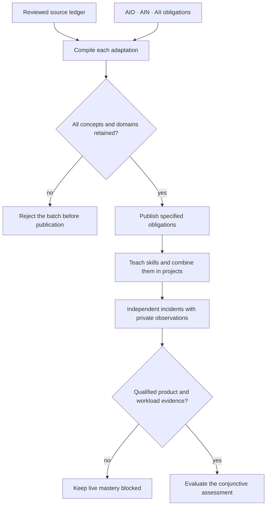

# Expanded NCP-Metablueprint scope

The three NVIDIA blueprints remain the mandatory core of every integrated
assessment. AIO, AIN and AII are conjunctive prerequisites: success in one or two
cannot earn fractional mastery. Additional tracks deepen the work in GPU
infrastructure and its CPU, network, storage, operating-system and control-plane
dependencies. Their project names are independent adaptations, not certifications
issued or endorsed by the original vendors.

Priority follows the user's instructions: retain all NVIDIA source obligations,
then implement NCP-DCIT, then the remaining tracks. The original core registry
still contains 113 source identities and 203 facets. Its source lock is unchanged.
Live proprietary and hardware acceptance remains incomplete.

The [DCIT ledger](extensions/NCP-DCIT.md) retains all 52 numbered leaf objectives
and 84 inline concepts reviewed from Cisco's three-page DCIT v1.2 document.
Repeated subjects with separate source IDs remain separate obligations. Twelve
progressive units specify investigations, required observations and fidelity
boundaries. A source mapping is not a delivered course or an observation of a
running product; each entry is explicitly `specified-not-qualified`.

The [scope registry](extensions/scope.json) also retains NCP-WCA, CKA, CKNE, CNPE,
EX200, EX294, EX342, EX457, NCP-CCDE and VCDX-VCF as open source-review obligations.
WCA includes the requested CBT Nuggets course. NCP-CCDE includes AI infrastructure,
on-premises/cloud and CCNP Data Center design. VCDX-VCF includes virtualization
and the remainder of its architecture blueprint. A track may not be silently
dropped because its official version or reference material needs further review.

Author one DCIT adaptation in `education/authoring/dcit.py`; the compiler expands
its reviewed source concepts, NVIDIA references and delivery IDs into both the
machine catalog and the human ledger. `tools/meta.py render` then `check` validates
the complete batch. Both Verus and Kani check the same existing decision predicates
used by the extension's concrete coverage and three-domain obligations; source
interpretation and Python code are outside those proofs. The compiler does not
turn a nonempty description into a learning or hardware certificate.

An operator must be able to follow the causal chain from intended topology to
realized configuration to observed packets or I/O to the workload. For example,
Linux Ethernet cut/restore evidence can settle a CPU-side path investigation;
it cannot certify OSPF, EVPN, Fibre Channel credits, RDMA, GPU execution or switch
ASIC behavior. Cisco-specific source behavior stays visible alongside its NVIDIA
adaptation rather than disappearing behind a renamed simulator feature.
