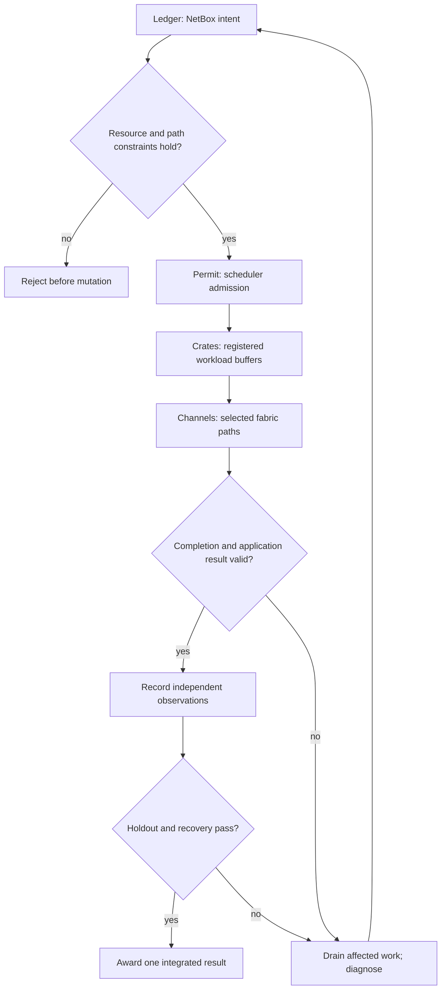

# NCP-Metablueprint

An independent, integrated GPU datacenter lab specification. This is a project
assessment, not an NVIDIA certification, endorsement, exam replica, or question
dump. Its source baseline was inspected on 24 September 2026.

The assessment unit is a **working causal chain**: installed resources → reachable
and isolated data paths → admitted workload → measured result → recoverable
operation. An otherwise correct answer that breaks any link earns no mastery
credit. Familiarity with one or two source exams remains useful prerequisite
knowledge, but earns zero completed Metablueprint assessment units by itself.
This is an assessment rule, not a claim that prior learning has no value.

## Source completeness

[blueprint.json](blueprint.json) retains **113 source objective identities and 203
facets**: 31 current AIO webpage bullets, 19 AIO guide objectives, 24 AIN objectives
and 39 AII objectives. AIN/AII webpage and guide entries agree and share IDs.
[coverage.md](coverage.md) indexes each objective to a course, project, and two
independent assessments. A mapping is a coverage obligation, not evidence that a
lab exists or that a learner passed it.

The AIO webpage weights (31/23/23/23) disagree with the guide (28/20/32/20).
The guide also retains Fleet Command, cloud VMI and storage-planning objectives.
Keep the union. Its contents-only cognition heading has no matching numbered
objective; record that discrepancy instead of silently adding a fictional exam
domain. Preserve source IDs when NVIDIA updates either document; revisions need
an explicit diff, new learning material and regression checks.

Compound objectives require evidence for **every facet**. For example, a single
successful RDMA transfer cannot demonstrate ECN, PFC, routing and telemetry;
each needs a separate intervention, observation and counterexample.

## Assessment contract

Each of the twenty units has a course C01–C20, project P01–P20 and independent
incident pair E01a–E20b. Every assessed question must contain all of:

1. An AII decision about physical resources, installation, compatibility or validation.
2. An AIN decision about paths, isolation, transport or network evidence.
3. An AIO decision about admission, deployment, observability or recovery.
4. A causal experiment connecting those decisions. Change one variable, predict
   which observations change and which stay invariant, then collect evidence.
5. An independent holdout: another topology, resource budget, workload, fault
   location or event ordering. Memorizing a fixed solution must fail.

The grader reports `pending`, `fail`, `blocked`, or `pass`. Missing capability or
evidence is `blocked`, never a pass. An exercise passes only when all three
domain checks, the coupled outcome, every mapped facet, provenance and safety
checks pass. No additive partial-credit rule can compensate for a missing domain.
Diagnostic feedback may show partial progress; it does not award mastery.

Each unit contributes one indivisible mastery token only after both incidents
pass. Completion requires all twenty tokens and all 203 facets, including their
required execution tiers. This deliberately uses no inherited exam percentages:
those percentages describe different exams, not an integrated lab curriculum.
A suggested assessment delivery is twenty 90–180 minute practical stations over
multiple days. This is a comprehensive assessment bank, not a promise that all
objectives fit into a two-hour exam. An operator can use a shorter formative
selection, but must label it partial coverage.

## Learning order

Complete the twenty courses in order. A course teaches and demonstrates its new
skills, then asks the learner to predict an observable state transition. Complete
**all courses before any guided project**. Projects increase integration scope
and assume the entire blueprint is already learned. Exercises begin after the
corresponding guided projects; only the incident, available interfaces,
constraints and observable acceptance conditions are disclosed.

A new project skill requires a course addition. A new exercise skill requires
both a course and project addition. The coverage checker rejects dangling IDs;
reviewers must also assess semantic sufficiency. A JSON link cannot establish
that prose teaches a skill or that an exercise measures it.

## Execution and fidelity boundaries

| Tier | Evidence | What it cannot establish |
|---|---|---|
| Model | Deterministic transitions, counterfactuals and resource accounting | NVIDIA hardware execution or proprietary control-plane behavior |
| Emulated | Real Incus processes, Linux networking, patchbay paths and fault recovery | Switch ASIC queues, GPU kernels, optical signal quality |
| Upstream | Pinned NVIDIA DeepOps tasks, API compatibility probes, actual scheduler/tool output | Supported CachyOS/Rusternetes status without validation |
| Hardware/product | Independently collected vendor/hardware observations with revisions and workload identity | General validity beyond the measured setup |

KWOK simulates worker lifecycle; its synthetic Running status does not execute
CUDA, NCCL or a pod. Rusternetes is a separate control-plane implementation:
operator, admission, discovery, watch and scheduler compatibility require tests.
Petgraph represents intent and dependency relationships. Patchbay provides Linux
network emulation. Neither is an InfiniBand ASIC, an NVSwitch, a DPU or a GPU.
The existing simulator's CUDA/NCCL, native RDMA, ibsim, topology, telemetry,
NetBox and evidence modules remain the reusable execution components.

The local lab removes Docker and Containerlab. Two source objectives explicitly
require Docker. They remain in the ledger as **external evidence assessments**;
an OCI/containerd exercise is not equivalent evidence of Docker mastery. The
local lab may teach diagnosis from captured evidence, but full live completion
of those source objectives needs an external assessment. No local runtime is
installed to circumvent this restriction. Physical insertion, replacement,
cooling and signal validation likewise require physical/product evidence before
they can be reported as live skills. Public-source simulators cannot implement
licensed BCM, Run:ai, UFM, NetQ or NVIDIA Air merely by reusing their names.

## Precise English and visual notation

Use a port workshop as the visual vocabulary. A sealed crate represents a buffer
with an owner; a loading permit represents an admission/resource grant; a dock
represents an endpoint; a channel represents a transport path. This is a teaching
analogy, with explicit limits. A packet is not literally a crate and an RDMA
completion does not imply application-level remote consumption or persistence.

Every diagram names real entities beside the symbol, labels branch predicates,
separates memory and control paths and shows failure and recovery edges. Every
lesson defines inputs, units, state, preconditions, transition, observations and
postconditions. State what is modeled and what actually runs. Avoid arrows that
imply a synchronous barrier where the system is asynchronous.

## Proof discipline

Specify acceptance and failure conditions before authoring a scenario. Share the
grading kernel between execution and verification; do not prove an unrelated
toy implementation. Kani checks bounded Rust properties and must include unwind
checks. Verus proves stated invariants for supported code under stated
assumptions. Both need successful logs tied to an exact source revision before
any property is described as proved.

Neither tool by itself proves Rustlings' UI/process/OS behavior, the kernel,
Ansible, upstream services, vendor firmware, the correctness of English lessons,
or that the formal specification matches real NVIDIA equipment. Track those
boundaries explicitly and use negative tests and live evidence for them.

## Development and merge delivery

Each development cycle gets a pushed branch and a small PR based on the previous
branch. A final aggregate PR from the stack tip to `main` contains the complete
stack and provides one ordinary merge action when repository checks permit it.
Merging the last dependency PR into its immediate base does **not** merge all
changes to `main`. Do not auto-merge or alter protections as part of this work.

Current baseline: simulator `0106893e3e31217c9b2de4af1e445996d45265a5`;
Rustlings `ffb4eeeba5050970a6ea4655f10df0e954af2128`.
