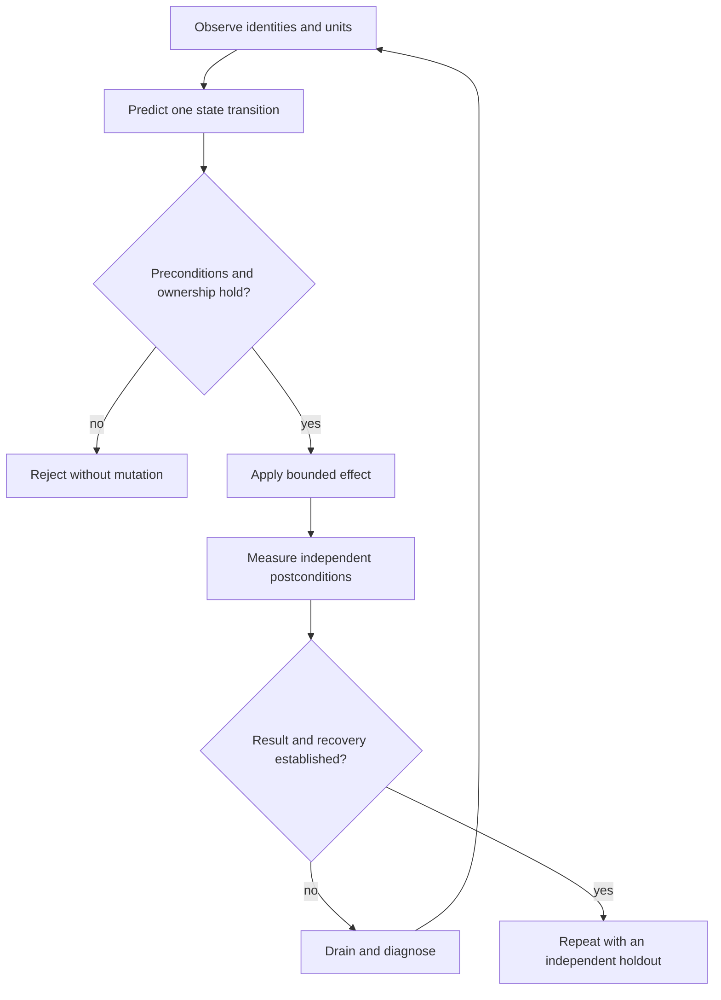

# C00 · The operator and visual language

The work unit is `observe → predict → apply → measure → recover`. Before any
mutation, name its owner, its input units, its preconditions, its deadline and
the resource it may change. After a mutation, read independent state. An API
acknowledgment is an acknowledgment, not a postcondition.

We write normal English with explicit state semantics: “Keep the registered
buffer alive until completion permits release” specifies a lifetime. “Drain
the affected allocation before replacing its identity” specifies ordering.
“Reject the plan without changing the lab” specifies atomic failure. None of
these statements implies Rust, CUDA or firmware has been formally verified.

## Code vocabulary

Use immutable dataclasses or Rust structs for intent, unpythonic `pipe1` for pure
transformations, mcpyrate macros for repeated contract syntax, and kr8s for the
explicitly selected Rusternetes API. Keep network and device effects outside
pure transformations. A shorter expression is useful only if ownership, units
and failure behavior remain visible. New libraries need a concrete benefit and
an executable example before becoming prerequisites.

The `require[condition]` macro in the teaching SDK evaluates once and raises on
failure even under optimized Python. Inspect its expansion and compare it with
ordinary Python before relying on generated infrastructure. It is separate from
the trainer's Rust grading kernel and cannot grant credit.

## Work with the real system

An operator must first provide a qualified Incus host, immutable CachyOS image,
native service assets and an active owned journal. Follow
[native provisioning](../../../integrations/incus/PROVISIONING.md).
No GPU, switch ASIC or licensed controller is conjured by a model. The hardware
and product stations require those capabilities, or stay blocked.

From a Python session with the local SDK installed and repository on `sys.path`:

```python
from education.session import Session

session = Session(repo="/srv/ncp/datacenter-simulator", state="/srv/ncp/lab-state")
session.start("C01")       # actual pinned DeepOps host reconciliation
session.example("C01")     # macro-aware planning example, separate evidence tier
```

The same `start` operation begins every guided project and independent lab.
It records stage identity and the DeepOps report. It does not award a station.
In an assessed deployment, the operator runs privileged reconciliation outside
the learner's identity; the learner receives only scoped guest/API access.

The existing simulator is available through Python without interactive commands:

```python
from ncp_lab import Twin

with Twin("/srv/ncp/datacenter-simulator/simulator/target/debug/datacenter-simulator") as twin:
    sim = twin.create("first-path")
    a = twin.node(sim, "compute-a")
    b = twin.node(sim, "compute-b")
    twin.cable(sim, a, b)
    twin.call("start", simulation=sim)
    trace = twin.call("transfer", simulation=sim, source=a, destination=b, bytes=4096)
```

This executes the existing topology model. Native Linux traffic uses the Incus
and patchbay path; GPU collectives use the existing native NCCL backend with
pinned CUDA/NCCL libraries. Never exchange these evidence labels.

## Visual vocabulary

| Material symbol | Actual referent | Limit of the analogy |
|---|---|---|
| Sealed crate | Buffer or versioned artifact with an owner | Data can be copied; ownership rules must still be stated |
| Loading permit | Scheduler allocation or control lease | A permit does not prove execution or physical health |
| Dock and channel | Endpoint and selected data path | A graph edge does not prove packet or DMA behavior |
| Dispatch board | Desired/observed API objects | Status can be synthetic or stale |
| Lockout tag | Enforced maintenance/drain state | It does not replace physical service procedures |
| Inspection window | Independent observation | Observation quality and timing remain assumptions |



All C01–C20 precede P01. The projects combine these skills in progressively
larger scopes. An exercise discloses symptoms, interfaces and required outcomes;
it withholds the fault recipe and expected implementation. Trainer evidence
determines completion. The public source repository is not itself a confidential
exam delivery environment.

