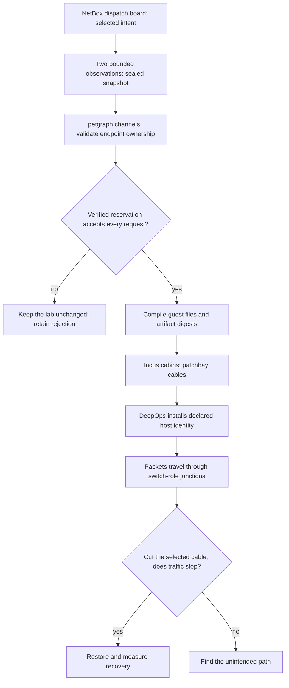

# C01 practical · Compile the dispatch board into a real fabric

Keep the NetBox reader outside the learner's container. Give it a read-only token
and one site scope. Device roles describe forwarding authority; interface IDs
describe sockets; cables join exactly two sockets. Changing a screen label cannot
create a physical cable. This experiment realizes that intent as isolated Linux
Ethernet links and retains the distinction in its evidence.

Use the simulator built with `incus,netbox`, a qualified native image, and the
Python SDK environment from C00. Start with
[`native.example.json`](../../../integrations/netbox/native.example.json). Supply
the actual NetBox origin, selected roles, image fingerprint and memory budget.
Its placeholder fingerprint is deliberately invalid. Never put the token in the
recipe or generated bundle; the importer reads the named environment variable.

```python
import json
from pathlib import Path
from unpythonic import pipe1
from integrations.incus.fabric import native_fabric

recipe = json.loads(Path("integrations/netbox/native.example.json").read_text())

@native_fabric
def classroom(name, site, pool):
    return recipe | {"project": name, "ipv4_pool": pool,
                     "netbox": recipe["netbox"] | {"device_filter": {"site": site}}}

lab = classroom("ncp-course01", "ncp-lab", "10.88.0.0/16",
    binary="simulator/target/debug/datacenter-simulator",
    destination="/srv/ncp/course01")
report = pipe1(lab, lambda fabric: fabric.deploy(), lambda fabric: fabric.reconcile())
assert report["returncode"] == 0
assert lab.reconcile()["returncode"] == 0
```

The decorator replaces repeated compiler plumbing. The Rust emitter generates
one manifest, Incus configuration, network configuration per port, forwarding
policy per node, route table and digest ledger. It expands data into reviewed
configuration; it does not evaluate arbitrary strings as guest programs.
Read `READY.json` and `provisioning-vars.json` before drawing conclusions.



Every cable receives its own /30 from the declared lab pool. This is a lab overlay,
not imported production IPAM addressing. Only switch-role guests enable IPv4
forwarding. Petgraph derives static routes over up cables; it never uses a host
as a transit router. These routes do not claim BGP, EVPN, RoCE, PFC or switch-ASIC
behavior. Later courses must supply their own qualified protocol adapters.

Open the generated manifest and choose the two compute IDs. From trainer code,
use `Incus(lab.directory / "state/incus.json")` and its `execute` method to send
a native payload from one compute guest to the other. Keep the returned exit
status, stdout and stderr. In the owned lifecycle, disable their required cable,
repeat the identical payload, restore the cable and repeat again. A planned graph
path alone earns no workload claim.

Predict three rejections before trying them in a fresh plan directory: reduce
memory below the sum of node requests; use a /30 pool for two cables; connect one
interface to two cables. The first two use the same `reserve` body verified by
Verus and Kani. Endpoint uniqueness is separately checked by the compiler; do
not extend the arithmetic proof to petgraph, NetBox, filesystems or the daemon.

Finally reorder the NetBox listing without changing intent, then change one cable
state. Compare generated addresses and routes. Inspect the second DeepOps report:
the native qualification requires zero changed hosts. Preserve the reports, then
call `lab.destroy()` to remove exactly the journal-owned resources.
