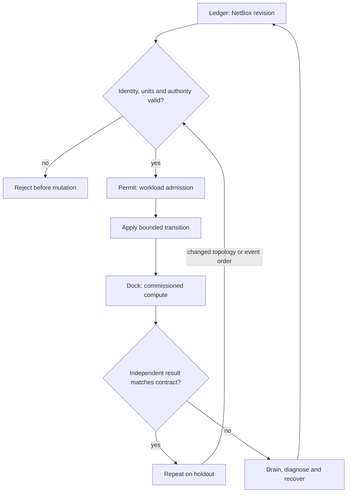

# C01 · Intent before intervention

Prerequisite: [C00](C00.md). New skills: immutable intent, units and resource ownership, topology import, DeepOps provenance.
This course teaches these skills through a guided build. Model examples predict behavior;
the live steps establish behavior on the named execution tier.

## State, ownership and the reason for the rule

Treat a deployment as a transaction with three independent inputs: the physical envelope, the fabric graph and the workload admission policy. NetBox describes intended identity and cabling; it does not prove that a cable exists. Petgraph can discover a path in that intent; it does not establish that packets traverse it. DeepOps applies reviewed host configuration; a zero exit code does not establish GPU workload correctness.

Allocate no workload permit until all three inputs refer to the same site revision. Use watts for both power and cooling limits, MiB for host memory, bytes for payloads and bits per second for links. Preserve a rejected intent as data. Do not partially mutate a shared plan and then return an error. The immutable envelope below teaches this commit boundary. It is a planning model, not an electrical commissioning procedure.

## Trace the transition

The symbols name physical objects beside their actual technical referents. Solid
arrows show the labeled dependency or data path, not an implicit synchronous barrier.
The drawing describes this lesson's contract; it is not an undocumented NVIDIA
internal implementation diagram.



## Build it in code

Start the qualified native lab with `Session.start("C01")` as described in C00.
That operation reconciles real pinned DeepOps host configuration and stores the
report. Read the journal and inventory before changing state. Keep the control,
compute, services and leaf containers inside the owned Incus project.

Run [the complete planning example](../examples/C01.py) through the macro-aware
session runner. Predict both its successful and rejected states first.

```python
from ncp_lab import Envelope, commissioning
from ncp_lab.macros import macros, require
plan = commissioning(Envelope(gpus=8, watts=4000, rack_watts=5000, cooling_watts=4500))
require[plan.admitted]
try:
    commissioning(Envelope(8, 4000, 5000, 3500))
except ValueError:
    rejected = True
else:
    rejected = False
require[rejected]
```

The `require` macro evaluates its predicate once and retains the check under
optimized Python execution. It is a teaching aid; live evidence is graded by
the separate Rust decision kernel. Change one input, predict the observable
effect, then run again. Save both the prediction and the observation.

## Guided live build

1. Read the NetBox snapshot and compile it with the existing simulator netbox module. Compare device IDs, interfaces and cable endpoints against the manifest; retain the source snapshot digest.

2. Build a control node, two compute nodes, a service node and a leaf in the Incus manifest. Assign an explicit image fingerprint and resource budget. Reconcile their hostnames through the pinned DeepOps hosts role.

3. Run the envelope example. Lower cooling below demand and predict rejection before evaluating it. Then import the manifest into Twin and request a transfer between the two compute identities.

4. Observe the real Linux path separately. Remove one trainer-owned patchbay cable, repeat the same payload, restore the cable, and compare admission, path and workload outcomes. Repeat against a second NetBox revision.

Use typed Python APIs, generated intent and reviewed Ansible playbooks for these
operations. Narrow command adapters are appropriate when a vendor exposes no API;
record their exact arguments, exit status, output and version. Do not substitute
an illustrative calculation for a device or product observation.

## Every facet gets its own evidence

For each row, attach the concrete input/configuration, the operation performed,
the independently observed result and a counterexample that this operation rejects.
Related rows may share one raw trace only when it establishes each distinct facet.
Missing hardware or licensed services leaves that row blocked.

| Facet identity | Required skill | Course-to-assessment obligation |
|---|---|---|
| `AIO-W-2.2/design` | AIO: Factory architecture — design | A versioned action, independent observation, and rejected counterexample for this specific facet. |
| `AIO-G-1.3/architecture` | AIO: Factory design — architecture | A versioned action, independent observation, and rejected counterexample for this specific facet. |
| `AIN-1.1/GPU` | AIN: Factory components — GPU | A versioned action, independent observation, and rejected counterexample for this specific facet. |
| `AIN-1.1/BlueField` | AIN: Factory components — BlueField | A versioned action, independent observation, and rejected counterexample for this specific facet. |
| `AIN-1.1/scalable-unit` | AIN: Factory components — scalable-unit | A versioned action, independent observation, and rejected counterexample for this specific facet. |
| `AIN-1.1/switch` | AIN: Factory components — switch | A versioned action, independent observation, and rejected counterexample for this specific facet. |
| `AIN-2.4/simulation` | AIN: Air rehearsal — simulation | A versioned action, independent observation, and rejected counterexample for this specific facet. |
| `AIN-2.4/diagnosis` | AIN: Air rehearsal — diagnosis | A versioned action, independent observation, and rejected counterexample for this specific facet. |
| `AII-1.1/deployment` | AII: Commissioning order — deployment | A versioned action, independent observation, and rejected counterexample for this specific facet. |
| `AII-1.1/validation` | AII: Commissioning order — validation | A versioned action, independent observation, and rejected counterexample for this specific facet. |

## Explain, perturb, recover

Submit a four-part trace: physical resource identity; authorized fabric path;
admitted workload and result; recovery after the controlled intervention. The
trainer independently removes one AIO, one AIN and one AII decision in separate
trials. Each removal must break the integrated acceptance condition; each restore
must recover it. Then repeat with a new topology, workload or event ordering.

Before moving on, explain why your planning example cannot establish the product
facets in the table. Collect those observations on the appropriate course station.
The original source references and discrepancy policy are in [the blueprint](../README.md).
