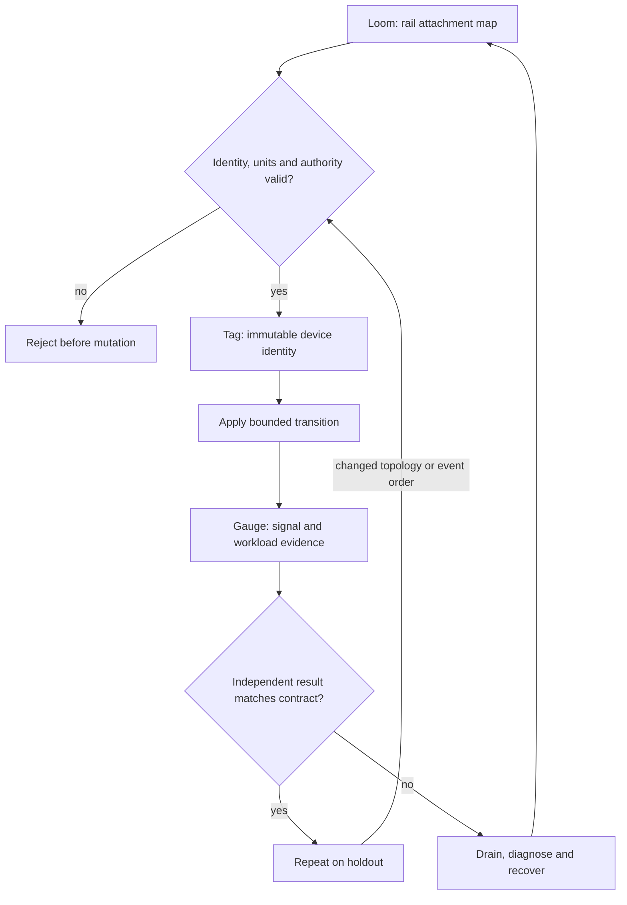

# C02 · Commission a rail

Prerequisite: [C01](C01.md). New skills: rail locality, physical identity and OOB separation, optical and environmental acceptance.
This course teaches these skills through a guided build. Model examples predict behavior;
the live steps establish behavior on the named execution tier.

## State, ownership and the reason for the rule

A rail is an identity-preserving attachment pattern, not merely another reachable switch. A logical GPU ordinal can change after a rebuild; the physical GPU, NIC PCI function, slot and switch port must still join through stable inventory identities. Keep BMC/OOB management distinct from the workload plane so a data-path failure does not also remove the recovery path.

The drawing is a cable loom: each strand has two recorded endpoints. A matching label is weaker evidence than LLDP/port identity, and both are weaker than physical inspection for a mislabelled optic. TPM state, power feeds, cooling, GPU insertion and signal quality require their own observations. A synthetic SMI record proves parser behavior only. Never energize, reseat or replace hardware from a generic lesson; follow the exact system service procedure with the authorized hardware operator.

## Trace the transition

The symbols name physical objects beside their actual technical referents. Solid
arrows show the labeled dependency or data path, not an implicit synchronous barrier.
The drawing describes this lesson's contract; it is not an undocumented NVIDIA
internal implementation diagram.



## Build it in code

Start the qualified native lab with `Session.start("C02")` as described in C00.
That operation reconciles real pinned DeepOps host configuration and stores the
report. Read the journal and inventory before changing state. Keep the control,
compute, services and leaf containers inside the owned Incus project.

Run [the complete planning example](../examples/C02.py) through the macro-aware
session runner. Predict both its successful and rejected states first.

```python
from ncp_lab.macros import macros, require
rails = [("gpu-A", "nic-A", "leaf1:1"), ("gpu-B", "nic-B", "leaf1:2")]
require[len({gpu for gpu, _, _ in rails}) == len(rails)]
require[len({port for _, _, port in rails}) == len(rails)]
observed = {"nic-A": "leaf1:1", "nic-B": "leaf1:2"}
require[all(observed[nic] == port for _, nic, port in rails)]
```

The `require` macro evaluates its predicate once and retains the check under
optimized Python execution. It is a teaching aid; live evidence is graded by
the separate Rust decision kernel. Change one input, predict the observable
effect, then run again. Save both the prediction and the observation.

## Guided live build

1. Join rack, slot, GPU UUID, NIC PCI address and switch port into one rail record. Reject duplicate endpoint ownership before generating native network configuration.

2. Use OOB access to collect BMC identity and TPM/boot evidence. Compare the power and cooling envelope with the actual installed parts and site limits.

3. Audit cables and optics at both ends: supported part number, speed, breakout mode, firmware and signal/error counters. Obtain supervised physical GPU installation evidence and correlate it with post-install SMI inventory.

4. Run the same acceptance workload before and after the trainer moves one logical attachment in the rehearsal graph. Explain why a graph repair cannot certify a real optic, then repeat the physical rail check on the holdout.

Use typed Python APIs, generated intent and reviewed Ansible playbooks for these
operations. Narrow command adapters are appropriate when a vendor exposes no API;
record their exact arguments, exit status, output and version. Do not substitute
an illustrative calculation for a device or product observation.

## Every facet gets its own evidence

For each row, attach the concrete input/configuration, the operation performed,
the independently observed result and a counterexample that this operation rejects.
Related rows may share one raw trace only when it establishes each distinct facet.
Missing hardware or licensed services leaves that row blocked.

| Facet identity | Required skill | Course-to-assessment obligation |
|---|---|---|
| `AIN-1.2/topology` | AIN: Rail placement — topology | A versioned action, independent observation, and rejected counterexample for this specific facet. |
| `AII-1.2/design` | AII: Factory topology — design | A versioned action, independent observation, and rejected counterexample for this specific facet. |
| `AII-1.3/BMC` | AII: Management root — BMC | A versioned action, independent observation, and rejected counterexample for this specific facet. |
| `AII-1.3/OOB` | AII: Management root — OOB | A versioned action, independent observation, and rejected counterexample for this specific facet. |
| `AII-1.3/TPM` | AII: Management root — TPM | A versioned action, independent observation, and rejected counterexample for this specific facet. |
| `AII-1.5/power` | AII: Environmental envelope — power | A versioned action, independent observation, and rejected counterexample for this specific facet. |
| `AII-1.5/cooling` | AII: Environmental envelope — cooling | A versioned action, independent observation, and rejected counterexample for this specific facet. |
| `AII-1.6/SMI` | AII: Server installation — SMI | A versioned action, independent observation, and rejected counterexample for this specific facet. |
| `AII-1.7/validation` | AII: Component inventory — validation | A versioned action, independent observation, and rejected counterexample for this specific facet. |
| `AII-1.8/cable` | AII: Optical compatibility — cable | A versioned action, independent observation, and rejected counterexample for this specific facet. |
| `AII-1.8/transceiver` | AII: Optical compatibility — transceiver | A versioned action, independent observation, and rejected counterexample for this specific facet. |
| `AII-1.9/physical-installation` | AII: GPU insertion — physical-installation | A versioned action, independent observation, and rejected counterexample for this specific facet. |
| `AII-4.4/quality` | AII: Signal integrity — quality | A versioned action, independent observation, and rejected counterexample for this specific facet. |
| `AII-4.5/correctness` | AII: Cable audit — correctness | A versioned action, independent observation, and rejected counterexample for this specific facet. |
| `AIO-W-3.5/DCGM` | AIO: Diagnostic tools — DCGM | A versioned action, independent observation, and rejected counterexample for this specific facet. |
| `AIO-W-3.5/NVSM` | AIO: Diagnostic tools — NVSM | A versioned action, independent observation, and rejected counterexample for this specific facet. |
| `AIO-W-3.5/SMI` | AIO: Diagnostic tools — SMI | A versioned action, independent observation, and rejected counterexample for this specific facet. |

## Explain, perturb, recover

Submit a four-part trace: physical resource identity; authorized fabric path;
admitted workload and result; recovery after the controlled intervention. The
trainer independently removes one AIO, one AIN and one AII decision in separate
trials. Each removal must break the integrated acceptance condition; each restore
must recover it. Then repeat with a new topology, workload or event ordering.

Before moving on, explain why your planning example cannot establish the product
facets in the table. Collect those observations on the appropriate course station.
The original source references and discrepancy policy are in [the blueprint](../README.md).
