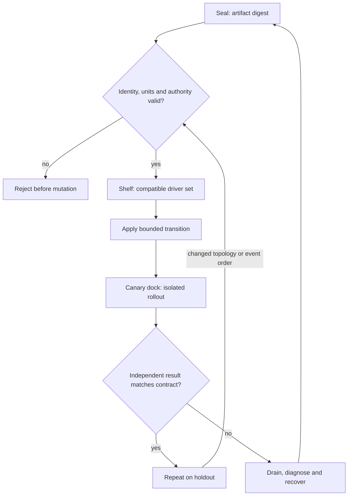

# C03 · Software and payload supply

Prerequisite: [C02](C02.md). New skills: artifact identity, driver and userspace compatibility, reversible software rollout, NGC and runtime diagnosis.
This course teaches these skills through a guided build. Model examples predict behavior;
the live steps establish behavior on the named execution tier.

## State, ownership and the reason for the rule

A tag is a mutable name. A digest identifies bytes; a compatibility record states where those bytes were tested. Neither establishes that the running process loaded the expected driver or library. Record the OS, kernel, GPU driver, CUDA userspace, DOCA host/DPU components and payload digest independently. Incus guests share the host kernel: installing a guest package cannot provide an independent GPU kernel driver.

Teach Docker daemon/toolkit diagnosis and GPU execution in the course's external product station because those are explicit source objectives. The projects and incidents use native processes in Incus. Do not relabel a system container as a Docker demonstration. NGC retrieval failures can arise from credentials, DNS, TLS, routing, storage or digest mismatch; test the layer before replacing the payload. Upstream DeepOps OS support must be checked rather than forged with Ansible facts.

## Trace the transition

The symbols name physical objects beside their actual technical referents. Solid
arrows show the labeled dependency or data path, not an implicit synchronous barrier.
The drawing describes this lesson's contract; it is not an undocumented NVIDIA
internal implementation diagram.



## Build it in code

Start the qualified native lab with `Session.start("C03")` as described in C00.
That operation reconciles real pinned DeepOps host configuration and stores the
report. Read the journal and inventory before changing state. Keep the control,
compute, services and leaf containers inside the owned Incus project.

Run [the complete planning example](../examples/C03.py) through the macro-aware
session runner. Predict both its successful and rejected states first.

```python
import hashlib
from unpythonic import pipe1
from ncp_lab.macros import macros, require
payload = b"teaching artifact, not a GPU binary"
identity = pipe1(payload, hashlib.sha256, lambda h: h.hexdigest())
manifest = {"digest": identity, "os": "cachyos", "execution": "native-incus"}
require[manifest["digest"] == hashlib.sha256(payload).hexdigest()]
require[manifest["execution"] == "native-incus"]
```

The `require` macro evaluates its predicate once and retains the check under
optimized Python execution. It is a teaching aid; live evidence is graded by
the separate Rust decision kernel. Change one input, predict the observable
effect, then run again. Save both the prediction and the observation.

## Guided live build

1. Create a compatibility manifest from actual source revisions and binary/library hashes. Provision OS and packages only through a reviewed adapter for the real host distribution.

2. Use a temporary canary to install, update and remove the GPU and DOCA userspace packages; record host driver identity separately. Preserve a rollback package set and drain before disruptive changes.

3. Install and exercise the NGC client against a permitted payload. Verify digest, entitlement, destination capacity and network path; inject a DNS or TLS failure without changing the payload.

4. At the external Docker course station, diagnose a daemon failure separately from toolkit/device injection, then demonstrate a real GPU result. Carry the assessor evidence forward; the Incus exercise installs no Docker daemon.

Use typed Python APIs, generated intent and reviewed Ansible playbooks for these
operations. Narrow command adapters are appropriate when a vendor exposes no API;
record their exact arguments, exit status, output and version. Do not substitute
an illustrative calculation for a device or product observation.

## Every facet gets its own evidence

For each row, attach the concrete input/configuration, the operation performed,
the independently observed result and a counterexample that this operation rejects.
Related rows may share one raw trace only when it establishes each distinct facet.
Missing hardware or licensed services leaves that row blocked.

| Facet identity | Required skill | Course-to-assessment obligation |
|---|---|---|
| `AIO-W-3.7/deployment` | AIO: NGC payloads — deployment | A versioned action, independent observation, and rejected counterexample for this specific facet. |
| `AIO-W-4.1/daemon` | AIO: Docker diagnosis — daemon | A versioned action, independent observation, and rejected counterexample for this specific facet. |
| `AIO-W-4.1/toolkit` | AIO: Docker diagnosis — toolkit | A versioned action, independent observation, and rejected counterexample for this specific facet. |
| `AIO-W-4.6/deployment` | AIO: NGC diagnosis — deployment | A versioned action, independent observation, and rejected counterexample for this specific facet. |
| `AIO-G-3.3/deployment` | AIO: NGC payloads — deployment | A versioned action, independent observation, and rejected counterexample for this specific facet. |
| `AIO-G-4.1/daemon` | AIO: Docker diagnosis — daemon | A versioned action, independent observation, and rejected counterexample for this specific facet. |
| `AIO-G-4.1/toolkit` | AIO: Docker diagnosis — toolkit | A versioned action, independent observation, and rejected counterexample for this specific facet. |
| `AII-3.2/installation` | AII: OS installation — installation | A versioned action, independent observation, and rejected counterexample for this specific facet. |
| `AII-3.4/GPU` | AII: Driver lifecycle — GPU | A versioned action, independent observation, and rejected counterexample for this specific facet. |
| `AII-3.4/DOCA` | AII: Driver lifecycle — DOCA | A versioned action, independent observation, and rejected counterexample for this specific facet. |
| `AII-3.4/install` | AII: Driver lifecycle — install | A versioned action, independent observation, and rejected counterexample for this specific facet. |
| `AII-3.4/update` | AII: Driver lifecycle — update | A versioned action, independent observation, and rejected counterexample for this specific facet. |
| `AII-3.4/remove` | AII: Driver lifecycle — remove | A versioned action, independent observation, and rejected counterexample for this specific facet. |
| `AII-3.5/installation` | AII: Toolkit installation — installation | A versioned action, independent observation, and rejected counterexample for this specific facet. |
| `AII-3.6/demonstration` | AII: Docker GPU execution — demonstration | A versioned action, independent observation, and rejected counterexample for this specific facet. |
| `AII-3.7/host-installation` | AII: NGC client — host-installation | A versioned action, independent observation, and rejected counterexample for this specific facet. |
| `AIN-5.3/GPU` | AIN: Interconnect latency — GPU | A versioned action, independent observation, and rejected counterexample for this specific facet. |
| `AIN-5.3/CPU` | AIN: Interconnect latency — CPU | A versioned action, independent observation, and rejected counterexample for this specific facet. |
| `AIN-5.3/storage` | AIN: Interconnect latency — storage | A versioned action, independent observation, and rejected counterexample for this specific facet. |

## Explain, perturb, recover

Submit a four-part trace: physical resource identity; authorized fabric path;
admitted workload and result; recovery after the controlled intervention. The
trainer independently removes one AIO, one AIN and one AII decision in separate
trials. Each removal must break the integrated acceptance condition; each restore
must recover it. Then repeat with a new topology, workload or event ordering.

Before moving on, explain why your planning example cannot establish the product
facets in the table. Collect those observations on the appropriate course station.
The original source references and discrepancy policy are in [the blueprint](../README.md).
