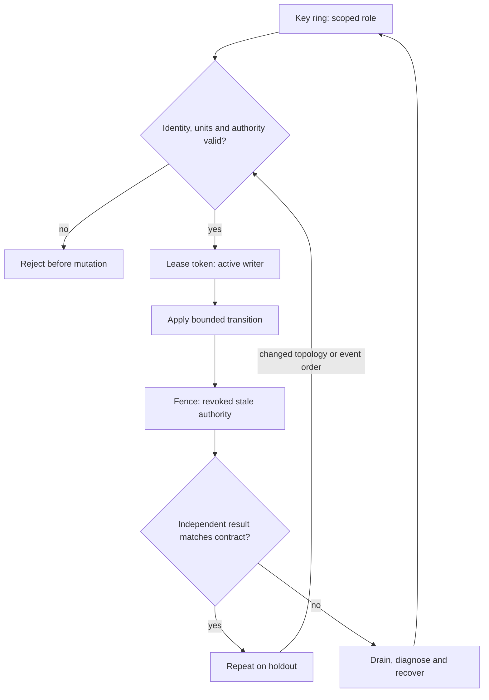

# C04 · Cluster authority and fencing

Prerequisite: [C03](C03.md). New skills: authority scopes, fencing, cluster categories, service health versus workload health.
This course teaches these skills through a guided build. Model examples predict behavior;
the live steps establish behavior on the named execution tier.

## State, ownership and the reason for the rule

A controller holds a lease to change a resource; possession of a dashboard session is not that lease. Express identity as subject, resource and permitted operation. An admission request may read several categories, but only one active owner may write a given allocation. A failed controller must be fenced before its successor acts. A timeout alone does not prove that the old writer stopped.

Mission Control, Base View and BCM have different responsibilities and require actual product observations. Build categories from hardware and workload needs; do not assume category labels enforce network isolation. Separate reported utilization, measured performance and health. A BCM service can be reachable while scheduling, node provisioning or a DPU/switch workflow remains unhealthy.

## Trace the transition

The symbols name physical objects beside their actual technical referents. Solid
arrows show the labeled dependency or data path, not an implicit synchronous barrier.
The drawing describes this lesson's contract; it is not an undocumented NVIDIA
internal implementation diagram.



## Build it in code

Start the qualified native lab with `Session.start("C04")` as described in C00.
That operation reconciles real pinned DeepOps host configuration and stores the
report. Read the journal and inventory before changing state. Keep the control,
compute, services and leaf containers inside the owned Incus project.

Run [the complete planning example](../examples/C04.py) through the macro-aware
session runner. Predict both its successful and rejected states first.

```python
from ncp_lab.macros import macros, require
permissions = {"observer": {"read"}, "provisioner": {"read", "provision"}}
require["provision" not in permissions["observer"]]
epoch, lease_epoch, fenced = 8, 8, True
successor_may_write = fenced and lease_epoch == epoch
require[successor_may_write]
require[not (fenced and 7 == epoch)]
```

The `require` macro evaluates its predicate once and retains the check under
optimized Python execution. It is a teaching aid; live evidence is graded by
the separate Rust decision kernel. Change one input, predict the observable
effect, then run again. Save both the prediction and the observation.

## Guided live build

1. Install/configure the licensed product in its supported course station and record exact versions. Use DeepOps for the surrounding host intent; identify each tool owner explicitly.

2. Create least-privilege accounts and roles. Test one allowed and one denied provisioning/allocation action for each role; retain the denied API response.

3. Build categories for physical inventory and workload purpose. Associate node, DPU and switch intent, then compare Slurm and Kubernetes-oriented allocation views with independent workload observations.

4. Configure and verify supported BCM HA. Fence the old writer, fail the active controller and check a fresh write through the successor. Recheck Base View utilization, performance and health without treating a stale green tile as recovery.

Use typed Python APIs, generated intent and reviewed Ansible playbooks for these
operations. Narrow command adapters are appropriate when a vendor exposes no API;
record their exact arguments, exit status, output and version. Do not substitute
an illustrative calculation for a device or product observation.

## Every facet gets its own evidence

For each row, attach the concrete input/configuration, the operation performed,
the independently observed result and a counterexample that this operation rejects.
Related rows may share one raw trace only when it establishes each distinct facet.
Missing hardware or licensed services leaves that row blocked.

| Facet identity | Required skill | Course-to-assessment obligation |
|---|---|---|
| `AIO-W-1.1/toolkit` | AIO: Mission Control — toolkit | A versioned action, independent observation, and rejected counterexample for this specific facet. |
| `AIO-W-1.2/performance` | AIO: Base View — performance | A versioned action, independent observation, and rejected counterexample for this specific facet. |
| `AIO-W-1.2/utilization` | AIO: Base View — utilization | A versioned action, independent observation, and rejected counterexample for this specific facet. |
| `AIO-W-1.2/health` | AIO: Base View — health | A versioned action, independent observation, and rejected counterexample for this specific facet. |
| `AIO-W-1.3/Slurm` | AIO: BCM scheduling — Slurm | A versioned action, independent observation, and rejected counterexample for this specific facet. |
| `AIO-W-1.3/Kubernetes` | AIO: BCM scheduling — Kubernetes | A versioned action, independent observation, and rejected counterexample for this specific facet. |
| `AIO-W-1.3/allocation` | AIO: BCM scheduling — allocation | A versioned action, independent observation, and rejected counterexample for this specific facet. |
| `AIO-W-1.5/account` | AIO: BCM identity — account | A versioned action, independent observation, and rejected counterexample for this specific facet. |
| `AIO-W-1.5/role` | AIO: BCM identity — role | A versioned action, independent observation, and rejected counterexample for this specific facet. |
| `AIO-W-1.5/permission` | AIO: BCM identity — permission | A versioned action, independent observation, and rejected counterexample for this specific facet. |
| `AIO-W-1.6/node` | AIO: BCM networking — node | A versioned action, independent observation, and rejected counterexample for this specific facet. |
| `AIO-W-1.6/DPU` | AIO: BCM networking — DPU | A versioned action, independent observation, and rejected counterexample for this specific facet. |
| `AIO-W-1.6/switch` | AIO: BCM networking — switch | A versioned action, independent observation, and rejected counterexample for this specific facet. |
| `AIO-W-1.8/hardware` | AIO: BCM categories — hardware | A versioned action, independent observation, and rejected counterexample for this specific facet. |
| `AIO-W-1.8/workload` | AIO: BCM categories — workload | A versioned action, independent observation, and rejected counterexample for this specific facet. |
| `AIO-G-2.3/administration` | AIO: BCM provisioner — administration | A versioned action, independent observation, and rejected counterexample for this specific facet. |
| `AIO-G-2.3/provisioning` | AIO: BCM provisioner — provisioning | A versioned action, independent observation, and rejected counterexample for this specific facet. |
| `AIO-G-3.1/installation` | AIO: BCM bootstrap — installation | A versioned action, independent observation, and rejected counterexample for this specific facet. |
| `AIO-G-3.1/configuration` | AIO: BCM bootstrap — configuration | A versioned action, independent observation, and rejected counterexample for this specific facet. |
| `AII-3.1/installation` | AII: BCM redundancy — installation | A versioned action, independent observation, and rejected counterexample for this specific facet. |
| `AII-3.1/HA-configuration` | AII: BCM redundancy — HA-configuration | A versioned action, independent observation, and rejected counterexample for this specific facet. |
| `AII-3.1/HA-verification` | AII: BCM redundancy — HA-verification | A versioned action, independent observation, and rejected counterexample for this specific facet. |
| `AIN-5.3/GPU` | AIN: Interconnect latency — GPU | A versioned action, independent observation, and rejected counterexample for this specific facet. |
| `AIN-5.3/CPU` | AIN: Interconnect latency — CPU | A versioned action, independent observation, and rejected counterexample for this specific facet. |
| `AIN-5.3/storage` | AIN: Interconnect latency — storage | A versioned action, independent observation, and rejected counterexample for this specific facet. |

## Explain, perturb, recover

Submit a four-part trace: physical resource identity; authorized fabric path;
admitted workload and result; recovery after the controlled intervention. The
trainer independently removes one AIO, one AIN and one AII decision in separate
trials. Each removal must break the integrated acceptance condition; each restore
must recover it. Then repeat with a new topology, workload or event ordering.

Before moving on, explain why your planning example cannot establish the product
facets in the table. Collect those observations on the appropriate course station.
The original source references and discrepancy policy are in [the blueprint](../README.md).
