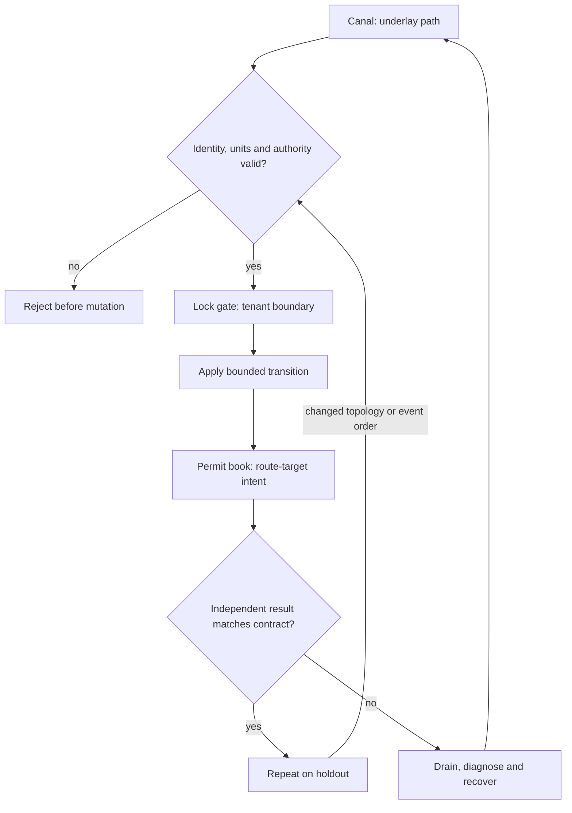

# C05 · Routed tenant boundaries

Prerequisite: [C04](C04.md). New skills: BGP and EVPN intent, tenant isolation, NVUE generation, idempotent network delivery.
This course teaches these skills through a guided build. Model examples predict behavior;
the live steps establish behavior on the named execution tier.

## State, ownership and the reason for the rule

A route advertises reachability; a tenant boundary constrains who may use that reachability. Keep underlay adjacency, overlay membership and workload authorization separate. An established BGP session does not prove correct EVPN route import/export. A permitted route target is not a substitute for testing forbidden traffic.

Compile tenant declarations into reviewed NVUE/Ansible intent, then compare intended and observed state. The simulator graph models topology, and Linux/FRR can exercise selected routing behaviors. Neither implements every Spectrum ASIC or NVUE behavior. Teach idempotence as a postcondition: the second reconciliation produces no new change, while an unauthorized flow remains denied after both runs.

## Trace the transition

The symbols name physical objects beside their actual technical referents. Solid
arrows show the labeled dependency or data path, not an implicit synchronous barrier.
The drawing describes this lesson's contract; it is not an undocumented NVIDIA
internal implementation diagram.



## Build it in code

Start the qualified native lab with `Session.start("C05")` as described in C00.
That operation reconciles real pinned DeepOps host configuration and stores the
report. Read the journal and inventory before changing state. Keep the control,
compute, services and leaf containers inside the owned Incus project.

Run [the complete planning example](../examples/C05.py) through the macro-aware
session runner. Predict both its successful and rejected states first.

```python
from unpythonic import pipe1
from ncp_lab.macros import macros, require
tenants = [{"name":"red","vni":10001,"rt":"65000:1"}, {"name":"blue","vni":10002,"rt":"65000:2"}]
vnis = pipe1(tenants, lambda rows: [r["vni"] for r in rows])
require[len(vnis) == len(set(vnis))]
imports = {row["name"]: {row["rt"]} for row in tenants}
require[imports["red"].isdisjoint(imports["blue"])]
```

The `require` macro evaluates its predicate once and retains the check under
optimized Python execution. It is a teaching aid; live evidence is graded by
the separate Rust decision kernel. Change one input, predict the observable
effect, then run again. Save both the prediction and the observation.

## Guided live build

1. Declare two tenants with distinct VNI, subnet and route-target identities; check collisions as a pure function before rendering NVUE templates.

2. Apply the native Linux/FRR rehearsal through DeepOps-backed automation. On the product station, apply the corresponding NVUE and Ansible VLAN/RoCE intent and read back its effective state.

3. Probe same-tenant reachability and cross-tenant denial from independent endpoints. Capture BGP/EVPN route and neighbor evidence alongside the workload request ID.

4. Withdraw one path and repeat both permitted and forbidden probes. Reapply identical intent and compare the change set; a no-op must not erase the isolation test.

Use typed Python APIs, generated intent and reviewed Ansible playbooks for these
operations. Narrow command adapters are appropriate when a vendor exposes no API;
record their exact arguments, exit status, output and version. Do not substitute
an illustrative calculation for a device or product observation.

## Every facet gets its own evidence

For each row, attach the concrete input/configuration, the operation performed,
the independently observed result and a counterexample that this operation rejects.
Related rows may share one raw trace only when it establishes each distinct facet.
Missing hardware or licensed services leaves that row blocked.

| Facet identity | Required skill | Course-to-assessment obligation |
|---|---|---|
| `AIN-2.3/BGP` | AIN: EVPN tenancy — BGP | A versioned action, independent observation, and rejected counterexample for this specific facet. |
| `AIN-2.3/EVPN` | AIN: EVPN tenancy — EVPN | A versioned action, independent observation, and rejected counterexample for this specific facet. |
| `AIN-2.3/isolation` | AIN: EVPN tenancy — isolation | A versioned action, independent observation, and rejected counterexample for this specific facet. |
| `AIN-6.1/templates` | AIN: NVUE generation — templates | A versioned action, independent observation, and rejected counterexample for this specific facet. |
| `AIN-6.2/VLAN` | AIN: Ansible fabric delivery — VLAN | A versioned action, independent observation, and rejected counterexample for this specific facet. |
| `AIN-6.2/RoCE` | AIN: Ansible fabric delivery — RoCE | A versioned action, independent observation, and rejected counterexample for this specific facet. |
| `AIO-W-3.5/DCGM` | AIO: Diagnostic tools — DCGM | A versioned action, independent observation, and rejected counterexample for this specific facet. |
| `AIO-W-3.5/NVSM` | AIO: Diagnostic tools — NVSM | A versioned action, independent observation, and rejected counterexample for this specific facet. |
| `AIO-W-3.5/SMI` | AIO: Diagnostic tools — SMI | A versioned action, independent observation, and rejected counterexample for this specific facet. |
| `AII-1.10/hardware-validation` | AII: Workload acceptance — hardware-validation | A versioned action, independent observation, and rejected counterexample for this specific facet. |

## Explain, perturb, recover

Submit a four-part trace: physical resource identity; authorized fabric path;
admitted workload and result; recovery after the controlled intervention. The
trainer independently removes one AIO, one AIN and one AII decision in separate
trials. Each removal must break the integrated acceptance condition; each restore
must recover it. Then repeat with a new topology, workload or event ordering.

Before moving on, explain why your planning example cannot establish the product
facets in the table. Collect those observations on the appropriate course station.
The original source references and discrepancy policy are in [the blueprint](../README.md).
