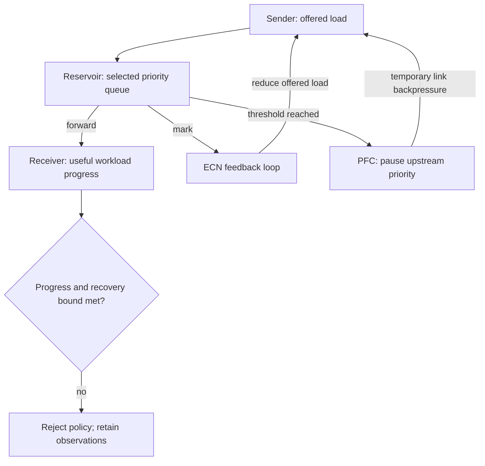

# C06 · Congestion without deadlock

Prerequisite: [C05](C05.md). New skills: queue units, ECN and PFC distinction, bounded headroom, congestion experiments.
This course teaches these skills through a guided build. Model examples predict behavior;
the live steps establish behavior on the named execution tier.

## State, ownership and the reason for the rule

ECN asks a congestion-control loop to reduce offered load. PFC pauses a selected priority at a link; it is not end-to-end congestion control. A configuration that prevents one drop can still create pause propagation, unfairness or deadlock. Link utilization alone cannot distinguish useful throughput from stalled work.

The reservoir drawing represents queue occupancy, not a literal shared ASIC implementation. The headroom example estimates bytes arriving while a sender reacts plus one in-flight frame. Real allocation also depends on the exact ASIC, cable delay, MTU, pipeline and buffer policy. Spectrum-X adaptive routing and SuperNIC behavior require product measurements; tc netem provides delay/rate/fault emulation and must never be reported as PFC or ECN ASIC validation.

## Trace the transition

The symbols name physical objects beside their actual technical referents. Solid
arrows show the labeled dependency or data path, not an implicit synchronous barrier.
The drawing describes this lesson's contract; it is not an undocumented NVIDIA
internal implementation diagram.



## Build it in code

Start the qualified native lab with `Session.start("C06")` as described in C00.
That operation reconciles real pinned DeepOps host configuration and stores the
report. Read the journal and inventory before changing state. Keep the control,
compute, services and leaf containers inside the owned Incus project.

Run [the complete planning example](../examples/C06.py) through the macro-aware
session runner. Predict both its successful and rejected states first.

```python
from ncp_lab import headroom_bytes
from ncp_lab.macros import macros, require
minimum = headroom_bytes(400_000_000_000, 1000, 9216)
require[minimum == 59216]
require[headroom_bytes(400_000_000_000, 2000, 9216) > minimum]
# This lower bound is not a Spectrum buffer configuration.
```

The `require` macro evaluates its predicate once and retains the check under
optimized Python execution. It is a teaching aid; live evidence is graded by
the separate Rust decision kernel. Change one input, predict the observable
effect, then run again. Save both the prediction and the observation.

## Guided live build

1. Fix workload placement and collect a baseline with offered load, useful throughput, completion latency, queue/mark/drop counters and pause durations.

2. Calculate the illustrative headroom lower bound in bytes. Compare it with the documented allocation rules for the actual switch; record the difference rather than rounding toward a desired answer.

3. Apply QoS, ECN, PFC and adaptive-routing changes one at a time through versioned automation. Observe which counters should change and which workload results must remain correct.

4. Introduce an incast and a path loss. Confirm that congestion recovery preserves progress for other priorities and tenants. Roll back a policy that avoids drops by stopping useful work.

Use typed Python APIs, generated intent and reviewed Ansible playbooks for these
operations. Narrow command adapters are appropriate when a vendor exposes no API;
record their exact arguments, exit status, output and version. Do not substitute
an illustrative calculation for a device or product observation.

## Every facet gets its own evidence

For each row, attach the concrete input/configuration, the operation performed,
the independently observed result and a counterexample that this operation rejects.
Related rows may share one raw trace only when it establishes each distinct facet.
Missing hardware or licensed services leaves that row blocked.

| Facet identity | Required skill | Course-to-assessment obligation |
|---|---|---|
| `AIN-2.1/configuration` | AIN: Spectrum-X RoCE — configuration | A versioned action, independent observation, and rejected counterexample for this specific facet. |
| `AIN-2.2/QoS` | AIN: Lossless policy — QoS | A versioned action, independent observation, and rejected counterexample for this specific facet. |
| `AIN-2.2/ECN` | AIN: Lossless policy — ECN | A versioned action, independent observation, and rejected counterexample for this specific facet. |
| `AIN-2.2/PFC` | AIN: Lossless policy — PFC | A versioned action, independent observation, and rejected counterexample for this specific facet. |
| `AIN-2.2/adaptive-routing` | AIN: Lossless policy — adaptive-routing | A versioned action, independent observation, and rejected counterexample for this specific facet. |
| `AIN-2.2/telemetry` | AIN: Lossless policy — telemetry | A versioned action, independent observation, and rejected counterexample for this specific facet. |
| `AIO-W-3.5/DCGM` | AIO: Diagnostic tools — DCGM | A versioned action, independent observation, and rejected counterexample for this specific facet. |
| `AIO-W-3.5/NVSM` | AIO: Diagnostic tools — NVSM | A versioned action, independent observation, and rejected counterexample for this specific facet. |
| `AIO-W-3.5/SMI` | AIO: Diagnostic tools — SMI | A versioned action, independent observation, and rejected counterexample for this specific facet. |
| `AII-1.10/hardware-validation` | AII: Workload acceptance — hardware-validation | A versioned action, independent observation, and rejected counterexample for this specific facet. |

## Explain, perturb, recover

Submit a four-part trace: physical resource identity; authorized fabric path;
admitted workload and result; recovery after the controlled intervention. The
trainer independently removes one AIO, one AIN and one AII decision in separate
trials. Each removal must break the integrated acceptance condition; each restore
must recover it. Then repeat with a new topology, workload or event ordering.

Before moving on, explain why your planning example cannot establish the product
facets in the table. Collect those observations on the appropriate course station.
The original source references and discrepancy policy are in [the blueprint](../README.md).
