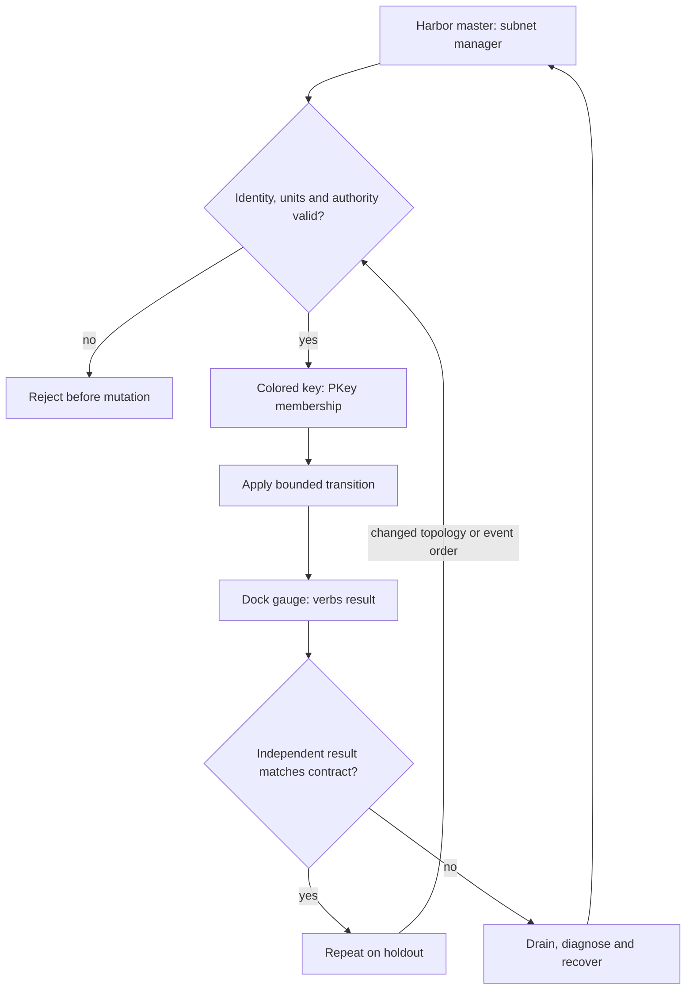

# C07 · InfiniBand membership and failover

Prerequisite: [C06](C06.md). New skills: InfiniBand membership, subnet management and HA, diagnostic evidence selection.
This course teaches these skills through a guided build. Model examples predict behavior;
the live steps establish behavior on the named execution tier.

## State, ownership and the reason for the rule

InfiniBand reachability requires more than an active physical link. The subnet manager supplies fabric configuration; partition membership restricts communication. A PKey combines a partition identity with a membership bit. Limited members of the same partition cannot communicate directly with each other; at least one endpoint must be a full member. Do not infer tenant isolation from equal low bits alone.

Keep fabric-management simulation, verbs execution and UFM product evidence separate. ibsim can exercise management behavior; the existing software Fabric checks memory regions and completion rules; native rust-ibverbs requires real supported devices. Latency and bandwidth tools answer different questions. A successful ibping cannot certify RDMA bandwidth or workload completion.

## Trace the transition

The symbols name physical objects beside their actual technical referents. Solid
arrows show the labeled dependency or data path, not an implicit synchronous barrier.
The drawing describes this lesson's contract; it is not an undocumented NVIDIA
internal implementation diagram.



## Build it in code

Start the qualified native lab with `Session.start("C07")` as described in C00.
That operation reconciles real pinned DeepOps host configuration and stores the
report. Read the journal and inventory before changing state. Keep the control,
compute, services and leaf containers inside the owned Incus project.

Run [the complete planning example](../examples/C07.py) through the macro-aware
session runner. Predict both its successful and rejected states first.

```python
from ncp_lab import pkey_allows
from ncp_lab.macros import macros, require
require[pkey_allows(0x8001, 0x0001)]
require[not pkey_allows(0x0001, 0x0001)]
require[not pkey_allows(0x8001, 0x8002)]
```

The `require` macro evaluates its predicate once and retains the check under
optimized Python execution. It is a teaching aid; live evidence is graded by
the separate Rust decision kernel. Change one input, predict the observable
effect, then run again. Save both the prediction and the observation.

## Guided live build

1. Provision a reviewed fabric and its supported management HA configuration. Record active/standby manager identities and test takeover without competing active authorities.

2. Generate PKey membership from tenant intent. Test full/full, full/limited, limited/limited and different-partition cases before admitting the workload.

3. Collect ibstat, ibnodes and iblinkinfo for identities/state, ibdiagnet for diagnostics, ibping for a management reachability probe, and ib_write_lat/ib_write_bw for distinct data-path measurements. Use Python subprocess arrays only behind an evidence adapter.

4. Change QoS and adaptive routing with a fixed placement; observe UFM link-state/bandwidth and the workload result. Repeat after a manager or link failover and verify forbidden membership remains forbidden.

Use typed Python APIs, generated intent and reviewed Ansible playbooks for these
operations. Narrow command adapters are appropriate when a vendor exposes no API;
record their exact arguments, exit status, output and version. Do not substitute
an illustrative calculation for a device or product observation.

## Every facet gets its own evidence

For each row, attach the concrete input/configuration, the operation performed,
the independently observed result and a counterexample that this operation rejects.
Related rows may share one raw trace only when it establishes each distinct facet.
Missing hardware or licensed services leaves that row blocked.

| Facet identity | Required skill | Course-to-assessment obligation |
|---|---|---|
| `AIN-3.1/provisioning` | AIN: Fabric bootstrap — provisioning | A versioned action, independent observation, and rejected counterexample for this specific facet. |
| `AIN-3.1/HA` | AIN: Fabric bootstrap — HA | A versioned action, independent observation, and rejected counterexample for this specific facet. |
| `AIN-3.2/multi-tenancy` | AIN: PKey membership — multi-tenancy | A versioned action, independent observation, and rejected counterexample for this specific facet. |
| `AIN-3.3/QoS` | AIN: Fabric traffic policy — QoS | A versioned action, independent observation, and rejected counterexample for this specific facet. |
| `AIN-3.3/adaptive-routing` | AIN: Fabric traffic policy — adaptive-routing | A versioned action, independent observation, and rejected counterexample for this specific facet. |
| `AIN-3.4/link-state` | AIN: UFM observation — link-state | A versioned action, independent observation, and rejected counterexample for this specific facet. |
| `AIN-3.4/bandwidth` | AIN: UFM observation — bandwidth | A versioned action, independent observation, and rejected counterexample for this specific facet. |
| `AIN-5.5/ib_write_lat` | AIN: IB diagnostics — ib_write_lat | A versioned action, independent observation, and rejected counterexample for this specific facet. |
| `AIN-5.5/ib_write_bw` | AIN: IB diagnostics — ib_write_bw | A versioned action, independent observation, and rejected counterexample for this specific facet. |
| `AIN-5.5/ibping` | AIN: IB diagnostics — ibping | A versioned action, independent observation, and rejected counterexample for this specific facet. |
| `AIN-5.5/ibstat` | AIN: IB diagnostics — ibstat | A versioned action, independent observation, and rejected counterexample for this specific facet. |
| `AIN-5.5/ibdiagnet` | AIN: IB diagnostics — ibdiagnet | A versioned action, independent observation, and rejected counterexample for this specific facet. |
| `AIN-5.5/ibnodes` | AIN: IB diagnostics — ibnodes | A versioned action, independent observation, and rejected counterexample for this specific facet. |
| `AIN-5.5/iblinkinfo` | AIN: IB diagnostics — iblinkinfo | A versioned action, independent observation, and rejected counterexample for this specific facet. |
| `AIO-W-3.5/DCGM` | AIO: Diagnostic tools — DCGM | A versioned action, independent observation, and rejected counterexample for this specific facet. |
| `AIO-W-3.5/NVSM` | AIO: Diagnostic tools — NVSM | A versioned action, independent observation, and rejected counterexample for this specific facet. |
| `AIO-W-3.5/SMI` | AIO: Diagnostic tools — SMI | A versioned action, independent observation, and rejected counterexample for this specific facet. |
| `AII-1.10/hardware-validation` | AII: Workload acceptance — hardware-validation | A versioned action, independent observation, and rejected counterexample for this specific facet. |

## Explain, perturb, recover

Submit a four-part trace: physical resource identity; authorized fabric path;
admitted workload and result; recovery after the controlled intervention. The
trainer independently removes one AIO, one AIN and one AII decision in separate
trials. Each removal must break the integrated acceptance condition; each restore
must recover it. Then repeat with a new topology, workload or event ordering.

Before moving on, explain why your planning example cannot establish the product
facets in the table. Collect those observations on the appropriate course station.
The original source references and discrepancy policy are in [the blueprint](../README.md).
