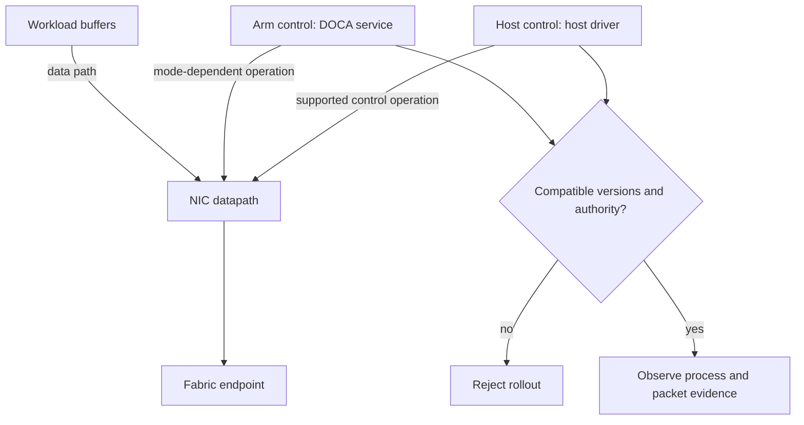

# C08 · DPU control and data ownership

Prerequisite: [C07](C07.md). New skills: host and DPU authority, DOCA compatibility, packet ownership, SuperNIC congestion evidence.
This course teaches these skills through a guided build. Model examples predict behavior;
the live steps establish behavior on the named execution tier.

## State, ownership and the reason for the rule

The host CPU, BlueField Arm subsystem and NIC datapath are distinct execution and authority domains. A command issued on the host does not imply that an Arm service was updated. A packet crossing a representor does not by itself prove the expected offload. State the DPU mode and supported ownership model before changing host/DPU software.

Treat the DPU as a customs station with two control desks and a forwarding lane. The picture must not imply that every packet traverses Arm userspace. Record firmware, host driver, DPU OS/DOCA and service revisions separately. A rollback must restore a compatible set, not just one package. Network isolation and workload admission must agree about who owns the offloaded resources.

## Trace the transition

The symbols name physical objects beside their actual technical referents. Solid
arrows show the labeled dependency or data path, not an implicit synchronous barrier.
The drawing describes this lesson's contract; it is not an undocumented NVIDIA
internal implementation diagram.



## Build it in code

Start the qualified native lab with `Session.start("C08")` as described in C00.
That operation reconciles real pinned DeepOps host configuration and stores the
report. Read the journal and inventory before changing state. Keep the control,
compute, services and leaf containers inside the owned Incus project.

Run [the complete planning example](../examples/C08.py) through the macro-aware
session runner. Predict both its successful and rejected states first.

```python
from ncp_lab.macros import macros, require
release = {"host":"h2", "dpu":"d2", "firmware":"f2"}
qualified = {("h1","d1","f1"), ("h2","d2","f2")}
require[tuple(release[k] for k in ("host","dpu","firmware")) in qualified]
mixed = ("h2","d1","f2")
require[mixed not in qualified]
```

The `require` macro evaluates its predicate once and retains the check under
optimized Python execution. It is a teaching aid; live evidence is graded by
the separate Rust decision kernel. Change one input, predict the observable
effect, then run again. Save both the prediction and the observation.

## Guided live build

1. Inventory host PCI identity, BlueField generation, DPU mode and firmware. Establish an independent management path and recovery procedure before applying a BFB or disruptive configuration.

2. Install matching supported DOCA components on host and DPU through reviewed automation. Deploy an actual Arm service and capture its process identity and lifecycle.

3. Observe a permitted and a denied packet path using representor/counter evidence appropriate to the selected mode. Distinguish software forwarding from hardware offload.

4. Configure SuperNIC packet-processing and congestion behavior on the supported product. Correlate its observations with host GPU workload progress, then test host-service and DPU-service failures separately.

Use typed Python APIs, generated intent and reviewed Ansible playbooks for these
operations. Narrow command adapters are appropriate when a vendor exposes no API;
record their exact arguments, exit status, output and version. Do not substitute
an illustrative calculation for a device or product observation.

## Every facet gets its own evidence

For each row, attach the concrete input/configuration, the operation performed,
the independently observed result and a counterexample that this operation rejects.
Related rows may share one raw trace only when it establishes each distinct facet.
Missing hardware or licensed services leaves that row blocked.

| Facet identity | Required skill | Course-to-assessment obligation |
|---|---|---|
| `AIO-W-1.11/DOCA` | AIO: Arm services — DOCA | A versioned action, independent observation, and rejected counterexample for this specific facet. |
| `AIO-G-3.6/DOCA` | AIO: Arm services — DOCA | A versioned action, independent observation, and rejected counterexample for this specific facet. |
| `AIN-2.7/host` | AIN: DOCA installation — host | A versioned action, independent observation, and rejected counterexample for this specific facet. |
| `AIN-2.7/DPU` | AIN: DOCA installation — DPU | A versioned action, independent observation, and rejected counterexample for this specific facet. |
| `AIN-2.8/packet-processing` | AIN: SuperNIC configuration — packet-processing | A versioned action, independent observation, and rejected counterexample for this specific facet. |
| `AIN-2.8/congestion` | AIN: SuperNIC configuration — congestion | A versioned action, independent observation, and rejected counterexample for this specific facet. |
| `AII-2.1/configuration` | AII: BlueField lifecycle — configuration | A versioned action, independent observation, and rejected counterexample for this specific facet. |
| `AII-2.1/management` | AII: BlueField lifecycle — management | A versioned action, independent observation, and rejected counterexample for this specific facet. |

## Explain, perturb, recover

Submit a four-part trace: physical resource identity; authorized fabric path;
admitted workload and result; recovery after the controlled intervention. The
trainer independently removes one AIO, one AIN and one AII decision in separate
trials. Each removal must break the integrated acceptance condition; each restore
must recover it. Then repeat with a new topology, workload or event ordering.

Before moving on, explain why your planning example cannot establish the product
facets in the table. Collect those observations on the appropriate course station.
The original source references and discrepancy policy are in [the blueprint](../README.md).
