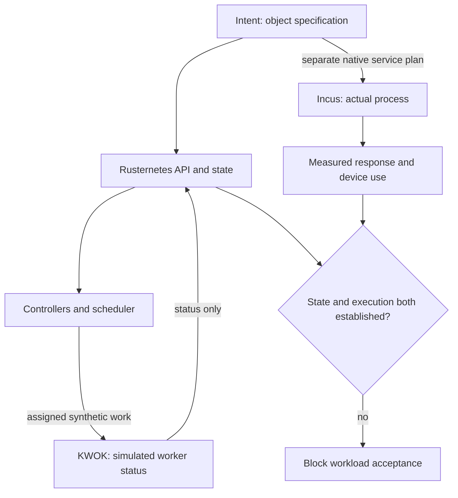

# C09 · Kubernetes API and real execution

Prerequisite: [C08](C08.md). New skills: API reconciliation, synthetic worker isolation, operator compatibility, execution evidence.
This course teaches these skills through a guided build. Model examples predict behavior;
the live steps establish behavior on the named execution tier.

## State, ownership and the reason for the rule

The API records desired and observed objects. A scheduler selects placement; a controller reconciles objects; a worker executes the payload. Rusternetes supplies the selected control plane. KWOK simulates worker lifecycle and status. A KWOK Running pod is not a CUDA process, and creating a GPU resource field does not allocate a physical GPU.

Use a dispatch board for API state and a workshop floor for native Incus processes. Keep the arrow between them explicit: the native workload adapter, not KWOK, launches the process. NVIDIA Network Operator and BCM Kubernetes bootstrap objectives still require original-product course evidence. Test discovery, watches, status subresources, RBAC, CRDs and admission compatibility before claiming an operator runs on Rusternetes. Unsupported behavior is blocked, not silently replaced by success.

## Trace the transition

The symbols name physical objects beside their actual technical referents. Solid
arrows show the labeled dependency or data path, not an implicit synchronous barrier.
The drawing describes this lesson's contract; it is not an undocumented NVIDIA
internal implementation diagram.



## Build it in code

Start the qualified native lab with `Session.start("C09")` as described in C00.
That operation reconciles real pinned DeepOps host configuration and stores the
report. Read the journal and inventory before changing state. Keep the control,
compute, services and leaf containers inside the owned Incus project.

Run [the complete planning example](../examples/C09.py) through the macro-aware
session runner. Predict both its successful and rejected states first.

```python
from ncp_lab.macros import macros, require
nodes = [{"name":"w0","synthetic":True,"advertised_gpu":8},
         {"name":"incus-compute-a","synthetic":False,"observed_gpu":1}]
physical = sum(n.get("observed_gpu",0) for n in nodes if not n["synthetic"])
require[physical == 1]
require[physical != sum(n.get("advertised_gpu",0) for n in nodes)]
```

The `require` macro evaluates its predicate once and retains the check under
optimized Python execution. It is a teaching aid; live evidence is graded by
the separate Rust decision kernel. Change one input, predict the observable
effect, then run again. Save both the prediction and the observation.

## Guided live build

1. Use DeepOps-backed host reconciliation, then start pinned etcd and Rusternetes services natively inside the control container. Select its TLS kubeconfig explicitly through kr8s.

2. Generate tainted synthetic worker objects with integrations.incus.services.worker_objects. Create them with ncp_lab.cluster.Cluster; test that a normal workload cannot accidentally be treated as executed by KWOK.

3. Probe API create/read/watch/update/delete and RBAC denial. In the product course station, install/initialize the supported cluster and deploy Network Operator for RDMA/InfiniBand; inspect reconciliation and device/network evidence.

4. Deploy inference as a native Incus service for the project route. Compare API status, process identity and actual response separately; kill the process while leaving a synthetic Running object and require detection.

Use typed Python APIs, generated intent and reviewed Ansible playbooks for these
operations. Narrow command adapters are appropriate when a vendor exposes no API;
record their exact arguments, exit status, output and version. Do not substitute
an illustrative calculation for a device or product observation.

## Every facet gets its own evidence

For each row, attach the concrete input/configuration, the operation performed,
the independently observed result and a counterexample that this operation rejects.
Related rows may share one raw trace only when it establishes each distinct facet.
Missing hardware or licensed services leaves that row blocked.

| Facet identity | Required skill | Course-to-assessment obligation |
|---|---|---|
| `AIO-W-1.10/install` | AIO: BCM Kubernetes bootstrap — install | A versioned action, independent observation, and rejected counterexample for this specific facet. |
| `AIO-W-1.10/initialize` | AIO: BCM Kubernetes bootstrap — initialize | A versioned action, independent observation, and rejected counterexample for this specific facet. |
| `AIO-W-2.4/administration` | AIO: Kubernetes operations — administration | A versioned action, independent observation, and rejected counterexample for this specific facet. |
| `AIO-W-3.1/deployment` | AIO: Kubernetes inference — deployment | A versioned action, independent observation, and rejected counterexample for this specific facet. |
| `AIO-G-2.1/administration` | AIO: Kubernetes operations — administration | A versioned action, independent observation, and rejected counterexample for this specific facet. |
| `AIO-G-3.2/installation` | AIO: BCM Kubernetes bootstrap — installation | A versioned action, independent observation, and rejected counterexample for this specific facet. |
| `AIO-G-3.2/initialization` | AIO: BCM Kubernetes bootstrap — initialization | A versioned action, independent observation, and rejected counterexample for this specific facet. |
| `AIN-4.1/RDMA` | AIN: Network Operator rollout — RDMA | A versioned action, independent observation, and rejected counterexample for this specific facet. |
| `AIN-4.1/InfiniBand` | AIN: Network Operator rollout — InfiniBand | A versioned action, independent observation, and rejected counterexample for this specific facet. |
| `AIN-4.2/verification` | AIN: Network Operator acceptance — verification | A versioned action, independent observation, and rejected counterexample for this specific facet. |
| `AII-1.10/hardware-validation` | AII: Workload acceptance — hardware-validation | A versioned action, independent observation, and rejected counterexample for this specific facet. |

## Explain, perturb, recover

Submit a four-part trace: physical resource identity; authorized fabric path;
admitted workload and result; recovery after the controlled intervention. The
trainer independently removes one AIO, one AIN and one AII decision in separate
trials. Each removal must break the integrated acceptance condition; each restore
must recover it. Then repeat with a new topology, workload or event ordering.

Before moving on, explain why your planning example cannot establish the product
facets in the table. Collect those observations on the appropriate course station.
The original source references and discrepancy policy are in [the blueprint](../README.md).
