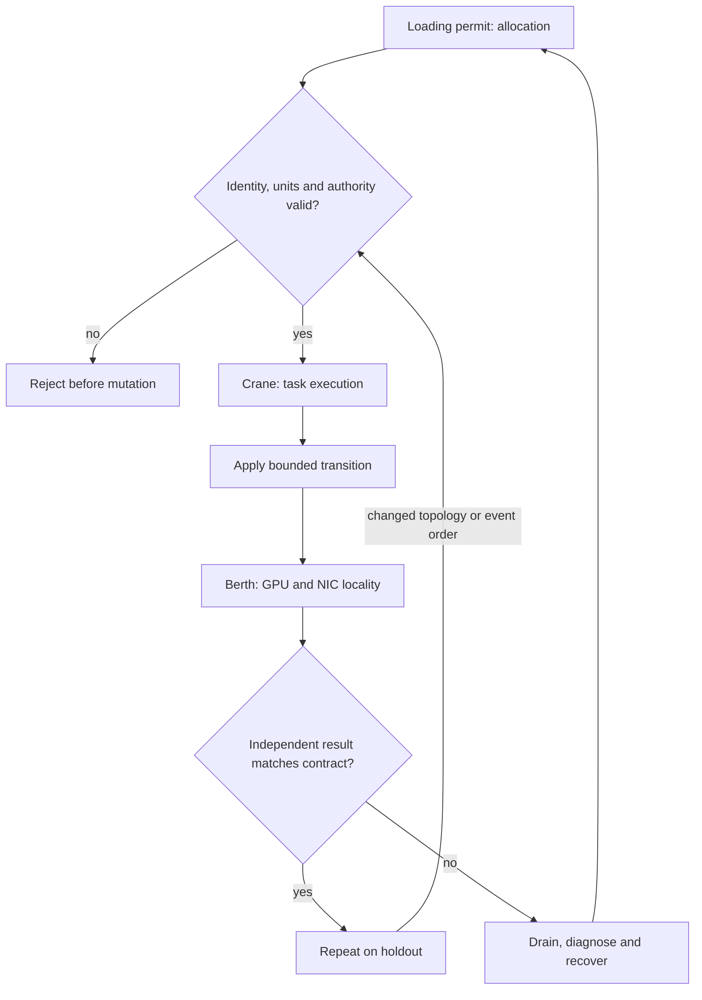

# C10 · Slurm admission and locality

Prerequisite: [C09](C09.md). New skills: Slurm service lifecycle, GRES locality, training launch, Enroot and Pyxis boundaries.
This course teaches these skills through a guided build. Model examples predict behavior;
the live steps establish behavior on the named execution tier.

## State, ownership and the reason for the rule

A Slurm allocation grants scheduler resources; it does not prove that the selected device, NIC and storage path are usable. GRES identity must correspond to the actual visible GPU or MIG device. Node categories and interfaces constrain placement, while partitions and accounts constrain admission. Preserve their distinct meanings in generated configuration.

Use a loading permit for allocation and a crane for execution. Enroot prepares a userspace environment and Pyxis integrates it with Slurm; neither replaces the host GPU driver or creates a new physical GPU. Real DeepOps Slurm roles must be run on a supported or qualified adapted OS. The current CachyOS role port remains a release gate; do not overwrite distribution facts to make upstream tasks appear supported.

## Trace the transition

The symbols name physical objects beside their actual technical referents. Solid
arrows show the labeled dependency or data path, not an implicit synchronous barrier.
The drawing describes this lesson's contract; it is not an undocumented NVIDIA
internal implementation diagram.



## Build it in code

Start the qualified native lab with `Session.start("C10")` as described in C00.
That operation reconciles real pinned DeepOps host configuration and stores the
report. Read the journal and inventory before changing state. Keep the control,
compute, services and leaf containers inside the owned Incus project.

Run [the complete planning example](../examples/C10.py) through the macro-aware
session runner. Predict both its successful and rejected states first.

```python
from ncp_lab.macros import macros, require
requests = {"team-a": 2, "team-b": 2}
allocations = {"team-a": 2, "team-b": 2}
physical = 4
require[sum(allocations.values()) <= physical]
require[all(0 < n <= allocations[t] for t,n in requests.items())]
drained = {"gpu-3"}
placement = {"gpu-0", "gpu-1"}
require[placement.isdisjoint(drained)]
```

The `require` macro evaluates its predicate once and retains the check under
optimized Python execution. It is a teaching aid; live evidence is graded by
the separate Rust decision kernel. Change one input, predict the observable
effect, then run again. Save both the prediction and the observation.

## Guided live build

1. Inspect the pinned DeepOps Slurm playbook and role inputs. Build a supported course station or qualify the native OS adapter; record installation, controller/worker services and their actual revisions.

2. Generate categories, interfaces and GRES from stable physical inventory. Submit one allowed and one rejected allocation using the scheduler API or a narrow Python adapter.

3. Deploy a small real training payload through Slurm. When Enroot/Pyxis is used, record the payload identity, mount/device visibility and process ancestry independently of the allocation response.

4. Drain one rail, resubmit under a new placement and verify no job escapes its resource grant. Correlate completion with the actual network and storage paths, then recover the drained capacity.

Use typed Python APIs, generated intent and reviewed Ansible playbooks for these
operations. Narrow command adapters are appropriate when a vendor exposes no API;
record their exact arguments, exit status, output and version. Do not substitute
an illustrative calculation for a device or product observation.

## Every facet gets its own evidence

For each row, attach the concrete input/configuration, the operation performed,
the independently observed result and a counterexample that this operation rejects.
Related rows may share one raw trace only when it establishes each distinct facet.
Missing hardware or licensed services leaves that row blocked.

| Facet identity | Required skill | Course-to-assessment obligation |
|---|---|---|
| `AIO-W-1.13/installation` | AIO: Slurm bootstrap — installation | A versioned action, independent observation, and rejected counterexample for this specific facet. |
| `AIO-W-2.1/administration` | AIO: Slurm operations — administration | A versioned action, independent observation, and rejected counterexample for this specific facet. |
| `AIO-W-3.3/deployment` | AIO: Slurm training — deployment | A versioned action, independent observation, and rejected counterexample for this specific facet. |
| `AIO-G-1.2/administration` | AIO: Slurm operations — administration | A versioned action, independent observation, and rejected counterexample for this specific facet. |
| `AII-3.3/category` | AII: Cluster bootstrap — category | A versioned action, independent observation, and rejected counterexample for this specific facet. |
| `AII-3.3/interface` | AII: Cluster bootstrap — interface | A versioned action, independent observation, and rejected counterexample for this specific facet. |
| `AII-3.3/Slurm` | AII: Cluster bootstrap — Slurm | A versioned action, independent observation, and rejected counterexample for this specific facet. |
| `AII-3.3/Enroot` | AII: Cluster bootstrap — Enroot | A versioned action, independent observation, and rejected counterexample for this specific facet. |
| `AII-3.3/Pyxis` | AII: Cluster bootstrap — Pyxis | A versioned action, independent observation, and rejected counterexample for this specific facet. |
| `AIN-5.3/GPU` | AIN: Interconnect latency — GPU | A versioned action, independent observation, and rejected counterexample for this specific facet. |
| `AIN-5.3/CPU` | AIN: Interconnect latency — CPU | A versioned action, independent observation, and rejected counterexample for this specific facet. |
| `AIN-5.3/storage` | AIN: Interconnect latency — storage | A versioned action, independent observation, and rejected counterexample for this specific facet. |

## Explain, perturb, recover

Submit a four-part trace: physical resource identity; authorized fabric path;
admitted workload and result; recovery after the controlled intervention. The
trainer independently removes one AIO, one AIN and one AII decision in separate
trials. Each removal must break the integrated acceptance condition; each restore
must recover it. Then repeat with a new topology, workload or event ordering.

Before moving on, explain why your planning example cannot establish the product
facets in the table. Collect those observations on the appropriate course station.
The original source references and discrepancy policy are in [the blueprint](../README.md).
