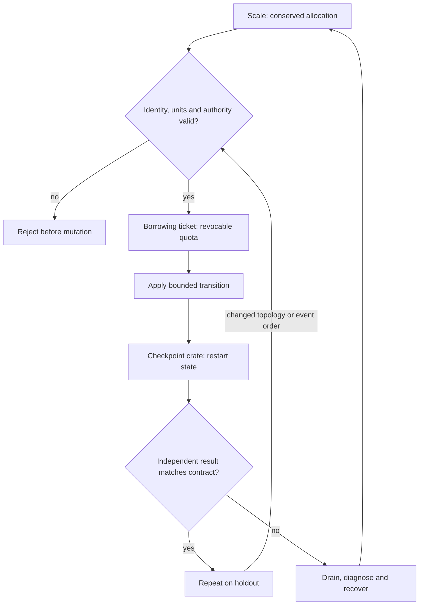

# C11 · Team quotas across schedulers

Prerequisite: [C10](C10.md). New skills: cross-scheduler accounting, fairness and preemption, Run:ai service lifecycle, inference versus training SLOs.
This course teaches these skills through a guided build. Model examples predict behavior;
the live steps establish behavior on the named execution tier.

## State, ownership and the reason for the rule

A team budget must have one authoritative owner even when several schedulers expose it. Adding the same physical GPU to Slurm and a Kubernetes-oriented scheduler does not double capacity. Distinguish a quota, a reservation, a running allocation and observed utilization. A borrowed idle resource may need to be returned before a higher-priority request starts.

The shared ledger is a scale with conserved weights. It is an accounting analogy: it does not assert that all Run:ai allocation policies are equivalent to simple integer division. Training favors sustained throughput; inference may require a tail-latency objective. Preemption is a workload transition with checkpoint and recovery consequences, not only a subtraction from a counter.

## Trace the transition

The symbols name physical objects beside their actual technical referents. Solid
arrows show the labeled dependency or data path, not an implicit synchronous barrier.
The drawing describes this lesson's contract; it is not an undocumented NVIDIA
internal implementation diagram.



## Build it in code

Start the qualified native lab with `Session.start("C11")` as described in C00.
That operation reconciles real pinned DeepOps host configuration and stores the
report. Read the journal and inventory before changing state. Keep the control,
compute, services and leaf containers inside the owned Incus project.

Run [the complete planning example](../examples/C11.py) through the macro-aware
session runner. Predict both its successful and rejected states first.

```python
from ncp_lab.macros import macros, require
ownership = {"gpu0":"inference", "gpu1":"training"}
slurm = {"gpu1"}
rusternetes = {"gpu0"}
require[slurm.isdisjoint(rusternetes)]
require[slurm | rusternetes == set(ownership)]
running = {"gpu0", "gpu1"}
require["gpu1" in running]  # A requested preemption has not yet freed it.
```

The `require` macro evaluates its predicate once and retains the check under
optimized Python execution. It is a teaching aid; live evidence is graded by
the separate Rust decision kernel. Change one input, predict the observable
effect, then run again. Save both the prediction and the observation.

## Guided live build

1. Install and administer the supported Run:ai product in the course station. Record identity, project policy and the actual inference/training deployment paths.

2. Create a common physical resource ledger and separate scheduler views. Generate team policy for Run:ai, Slurm and Kubernetes-oriented admission; prevent simultaneous ownership of the same device.

3. Measure inference latency and training progress before borrowing idle quota. Preempt through the supported API, verify checkpoint/restart behavior and observe actual resource release.

4. Repeat under a fabric bottleneck. Explain why a quota increase cannot cure a congested path, and show that a failed preemption does not manufacture free capacity in the ledger.

Use typed Python APIs, generated intent and reviewed Ansible playbooks for these
operations. Narrow command adapters are appropriate when a vendor exposes no API;
record their exact arguments, exit status, output and version. Do not substitute
an illustrative calculation for a device or product observation.

## Every facet gets its own evidence

For each row, attach the concrete input/configuration, the operation performed,
the independently observed result and a counterexample that this operation rejects.
Related rows may share one raw trace only when it establishes each distinct facet.
Missing hardware or licensed services leaves that row blocked.

| Facet identity | Required skill | Course-to-assessment obligation |
|---|---|---|
| `AIO-W-1.12/installation` | AIO: Run:ai bootstrap — installation | A versioned action, independent observation, and rejected counterexample for this specific facet. |
| `AIO-W-2.3/administration` | AIO: Run:ai operations — administration | A versioned action, independent observation, and rejected counterexample for this specific facet. |
| `AIO-W-3.2/deployment` | AIO: Run:ai inference — deployment | A versioned action, independent observation, and rejected counterexample for this specific facet. |
| `AIO-W-3.4/deployment` | AIO: Run:ai training — deployment | A versioned action, independent observation, and rejected counterexample for this specific facet. |
| `AIO-W-3.6/Run:ai` | AIO: Team allocation — Run:ai | A versioned action, independent observation, and rejected counterexample for this specific facet. |
| `AIO-W-3.6/Slurm` | AIO: Team allocation — Slurm | A versioned action, independent observation, and rejected counterexample for this specific facet. |
| `AIO-W-3.6/Kubernetes` | AIO: Team allocation — Kubernetes | A versioned action, independent observation, and rejected counterexample for this specific facet. |
| `AIO-G-1.4/administration` | AIO: Run:ai operations — administration | A versioned action, independent observation, and rejected counterexample for this specific facet. |
| `AIN-5.3/GPU` | AIN: Interconnect latency — GPU | A versioned action, independent observation, and rejected counterexample for this specific facet. |
| `AIN-5.3/CPU` | AIN: Interconnect latency — CPU | A versioned action, independent observation, and rejected counterexample for this specific facet. |
| `AIN-5.3/storage` | AIN: Interconnect latency — storage | A versioned action, independent observation, and rejected counterexample for this specific facet. |
| `AII-1.10/hardware-validation` | AII: Workload acceptance — hardware-validation | A versioned action, independent observation, and rejected counterexample for this specific facet. |

## Explain, perturb, recover

Submit a four-part trace: physical resource identity; authorized fabric path;
admitted workload and result; recovery after the controlled intervention. The
trainer independently removes one AIO, one AIN and one AII decision in separate
trials. Each removal must break the integrated acceptance condition; each restore
must recover it. Then repeat with a new topology, workload or event ordering.

Before moving on, explain why your planning example cannot establish the product
facets in the table. Collect those observations on the appropriate course station.
The original source references and discrepancy policy are in [the blueprint](../README.md).
