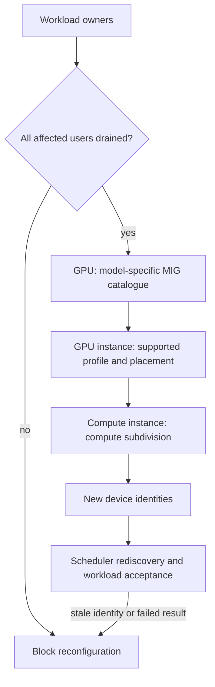

# C12 · MIG geometry and disruption

Prerequisite: [C11](C11.md). New skills: MIG profile placement, GI and CI identity, drain and reconfiguration, AI and HPC acceptance.
This course teaches these skills through a guided build. Model examples predict behavior;
the live steps establish behavior on the named execution tier.

## State, ownership and the reason for the rule

A MIG profile is a supported partition shape on a particular GPU model. GPU instances partition relevant device resources; compute instances subdivide compute within a GPU instance. Memory-size arithmetic alone does not establish a legal layout. Consult the model-specific profile and placement catalogue, and record the generated GI/CI identities after each change.

Use a machined tray for placement: enough total area does not imply that every shape fits every slot. This is a geometry analogy, not an assertion that all resources have identical boundaries. Drain active users before disruptive reconfiguration and refresh scheduler/device inventory afterward. Test both AI and HPC workload behavior; do not assume a profile appropriate for inference preserves a collective application's requirements.

## Trace the transition

The symbols name physical objects beside their actual technical referents. Solid
arrows show the labeled dependency or data path, not an implicit synchronous barrier.
The drawing describes this lesson's contract; it is not an undocumented NVIDIA
internal implementation diagram.



## Build it in code

Start the qualified native lab with `Session.start("C12")` as described in C00.
That operation reconciles real pinned DeepOps host configuration and stores the
report. Read the journal and inventory before changing state. Keep the control,
compute, services and leaf containers inside the owned Incus project.

Run [the complete planning example](../examples/C12.py) through the macro-aware
session runner. Predict both its successful and rejected states first.

```python
from ncp_lab import mig_fits
from ncp_lab.macros import macros, require
# Illustrative symbols only; replace with the observed model-specific catalogue.
catalogue = [("small@0","small@1"), ("large@0",)]
require[mig_fits(("small@0","small@1"), catalogue)]
require[not mig_fits(("small@1","small@0"), catalogue)]
```

The `require` macro evaluates its predicate once and retains the check under
optimized Python execution. It is a teaching aid; live evidence is graded by
the separate Rust decision kernel. Change one input, predict the observable
effect, then run again. Save both the prediction and the observation.

## Guided live build

1. Read the physical GPU model, supported profiles and placement options from actual product tooling. Save that catalogue with the driver revision; never reuse an A100 catalogue for an unrelated model.

2. Compile requested partitions against the catalogue. Reject an unsupported arrangement even when the sum of advertised memory or slices appears to fit.

3. Drain affected allocations and confirm users have released the device. Apply the supported MIG transition, rediscover GI/CI identifiers and regenerate scheduler resource advertisements.

4. Run AI and HPC acceptance workloads over the intended NIC/storage path. Compare isolation and performance, then restore the original layout and reject a stale pre-change device identity.

Use typed Python APIs, generated intent and reviewed Ansible playbooks for these
operations. Narrow command adapters are appropriate when a vendor exposes no API;
record their exact arguments, exit status, output and version. Do not substitute
an illustrative calculation for a device or product observation.

## Every facet gets its own evidence

For each row, attach the concrete input/configuration, the operation performed,
the independently observed result and a counterexample that this operation rejects.
Related rows may share one raw trace only when it establishes each distinct facet.
Missing hardware or licensed services leaves that row blocked.

| Facet identity | Required skill | Course-to-assessment obligation |
|---|---|---|
| `AIO-W-2.5/configuration` | AIO: MIG partitioning — configuration | A versioned action, independent observation, and rejected counterexample for this specific facet. |
| `AIO-G-1.5/AI` | AIO: MIG partitioning — AI | A versioned action, independent observation, and rejected counterexample for this specific facet. |
| `AIO-G-1.5/HPC` | AIO: MIG partitioning — HPC | A versioned action, independent observation, and rejected counterexample for this specific facet. |
| `AII-2.2/AI` | AII: MIG partitioning — AI | A versioned action, independent observation, and rejected counterexample for this specific facet. |
| `AII-2.2/HPC` | AII: MIG partitioning — HPC | A versioned action, independent observation, and rejected counterexample for this specific facet. |
| `AIN-5.3/GPU` | AIN: Interconnect latency — GPU | A versioned action, independent observation, and rejected counterexample for this specific facet. |
| `AIN-5.3/CPU` | AIN: Interconnect latency — CPU | A versioned action, independent observation, and rejected counterexample for this specific facet. |
| `AIN-5.3/storage` | AIN: Interconnect latency — storage | A versioned action, independent observation, and rejected counterexample for this specific facet. |

## Explain, perturb, recover

Submit a four-part trace: physical resource identity; authorized fabric path;
admitted workload and result; recovery after the controlled intervention. The
trainer independently removes one AIO, one AIN and one AII decision in separate
trials. Each removal must break the integrated acceptance condition; each restore
must recover it. Then repeat with a new topology, workload or event ordering.

Before moving on, explain why your planning example cannot establish the product
facets in the table. Collect those observations on the appropriate course station.
The original source references and discrepancy policy are in [the blueprint](../README.md).
