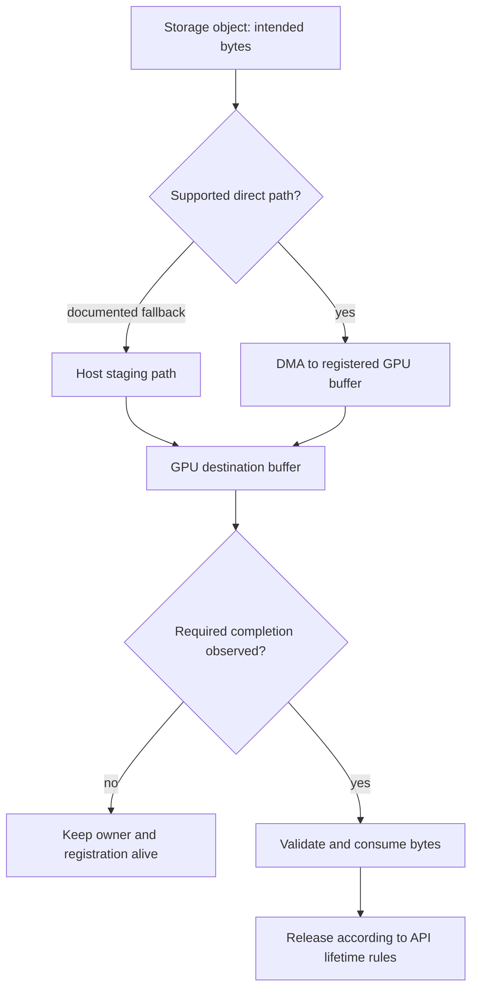

# C13 · Storage to GPU lifetime

Prerequisite: [C12](C12.md). New skills: storage sizing, buffer lifetime, GPUDirect and fallback, durability and integrity.
This course teaches these skills through a guided build. Model examples predict behavior;
the live steps establish behavior on the named execution tier.

## State, ownership and the reason for the rule

A storage read has at least four separate obligations: locate the intended bytes, transport them through an authorized path, place them in a live destination buffer and establish completion before consuming them. Completion of a transfer does not automatically mean application consumption or durable storage. Keep the owner of a registered buffer alive until the relevant completion rule permits release.

GPUDirect Storage can avoid a CPU bounce buffer on a supported path. Fallback can still return correct bytes while changing CPU use and throughput. Diagnose correctness first, then prove which path executed. The existing simulator Fabric models registered-memory lifetime and transfers; it does not implement a filesystem or certify GPUDirect Storage. Third-party storage tuning must use measured workload distributions and the vendor's supported parameters.

## Trace the transition

The symbols name physical objects beside their actual technical referents. Solid
arrows show the labeled dependency or data path, not an implicit synchronous barrier.
The drawing describes this lesson's contract; it is not an undocumented NVIDIA
internal implementation diagram.



## Build it in code

Start the qualified native lab with `Session.start("C13")` as described in C00.
That operation reconciles real pinned DeepOps host configuration and stores the
report. Read the journal and inventory before changing state. Keep the control,
compute, services and leaf containers inside the owned Incus project.

Run [the complete planning example](../examples/C13.py) through the macro-aware
session runner. Predict both its successful and rejected states first.

```python
import hashlib
from ncp_lab import RouteBudget
from ncp_lab.macros import macros, require
checkpoint = b"epoch=12;weights=example"
expected = hashlib.sha256(checkpoint).hexdigest()
require[hashlib.sha256(checkpoint[:-1]).hexdigest() != expected]
budget = RouteBudget(100_000_000_000, 1000)
require[budget.optimistic_ns(1_000_000) == 81_000]
# Cache, queueing, storage and GPU time are additional measured costs.
```

The `require` macro evaluates its predicate once and retains the check under
optimized Python execution. It is a teaching aid; live evidence is graded by
the separate Rust decision kernel. Change one input, predict the observable
effect, then run again. Save both the prediction and the observation.

## Guided live build

1. Compute working-set, checkpoint, retention and recovery capacity from explicit units. Install/configure the actual storage service using its supported third-party parameters and DeepOps-managed host mounts.

2. Run sequential, random and concurrent acceptance loads with recorded block sizes, queue depth, dataset identity and cache conditions. Compare latency distributions and sustained throughput rather than one warm-cache sample.

3. Trace Magnum IO/GDS path selection, buffer registration and completion. Introduce a controlled unsupported alignment or path condition and observe the documented failure/fallback behavior without labelling it direct DMA.

4. Corrupt or truncate a test object, reject its checksum, restore it and verify a real GPU consumer. Repeat with a slower network path and distinguish storage, transport and compute bottlenecks.

Use typed Python APIs, generated intent and reviewed Ansible playbooks for these
operations. Narrow command adapters are appropriate when a vendor exposes no API;
record their exact arguments, exit status, output and version. Do not substitute
an illustrative calculation for a device or product observation.

## Every facet gets its own evidence

For each row, attach the concrete input/configuration, the operation performed,
the independently observed result and a counterexample that this operation rejects.
Related rows may share one raw trace only when it establishes each distinct facet.
Missing hardware or licensed services leaves that row blocked.

| Facet identity | Required skill | Course-to-assessment obligation |
|---|---|---|
| `AIO-W-4.4/data-path` | AIO: Magnum IO diagnosis — data-path | A versioned action, independent observation, and rejected counterexample for this specific facet. |
| `AIO-W-4.5/performance` | AIO: Storage diagnosis — performance | A versioned action, independent observation, and rejected counterexample for this specific facet. |
| `AIO-G-3.5/requirements` | AIO: Storage sizing — requirements | A versioned action, independent observation, and rejected counterexample for this specific facet. |
| `AIO-G-4.4/data-path` | AIO: Magnum IO diagnosis — data-path | A versioned action, independent observation, and rejected counterexample for this specific facet. |
| `AIO-G-4.5/performance` | AIO: Storage diagnosis — performance | A versioned action, independent observation, and rejected counterexample for this specific facet. |
| `AII-1.11/third-party-parameters` | AII: Storage bootstrap — third-party-parameters | A versioned action, independent observation, and rejected counterexample for this specific facet. |
| `AII-4.14/testing` | AII: Storage acceptance — testing | A versioned action, independent observation, and rejected counterexample for this specific facet. |
| `AII-5.5/optimization` | AII: Storage tuning — optimization | A versioned action, independent observation, and rejected counterexample for this specific facet. |
| `AIN-5.3/GPU` | AIN: Interconnect latency — GPU | A versioned action, independent observation, and rejected counterexample for this specific facet. |
| `AIN-5.3/CPU` | AIN: Interconnect latency — CPU | A versioned action, independent observation, and rejected counterexample for this specific facet. |
| `AIN-5.3/storage` | AIN: Interconnect latency — storage | A versioned action, independent observation, and rejected counterexample for this specific facet. |

## Explain, perturb, recover

Submit a four-part trace: physical resource identity; authorized fabric path;
admitted workload and result; recovery after the controlled intervention. The
trainer independently removes one AIO, one AIN and one AII decision in separate
trials. Each removal must break the integrated acceptance condition; each restore
must recover it. Then repeat with a new topology, workload or event ordering.

Before moving on, explain why your planning example cannot establish the product
facets in the table. Collect those observations on the appropriate course station.
The original source references and discrepancy policy are in [the blueprint](../README.md).
