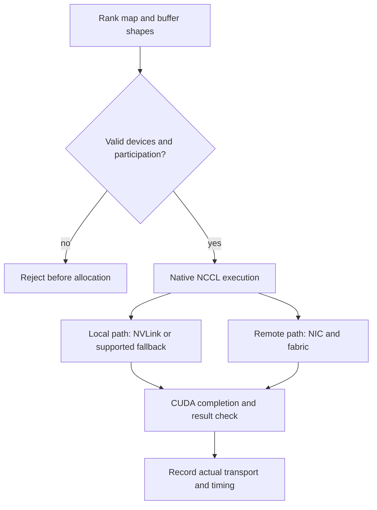

# C14 · Collectives across both fabrics

Prerequisite: [C13](C13.md). New skills: collective shape and rank mapping, intra-node and inter-node fabrics, native NCCL evidence, Fabric Manager lifecycle.
This course teaches these skills through a guided build. Model examples predict behavior;
the live steps establish behavior on the named execution tier.

## State, ownership and the reason for the rule

A collective is a contract over ranks, buffers, element counts and an operation. Every rank must participate consistently. A correct mathematical result does not identify the transport used, and an attractive bandwidth number does not prove the result is correct. Distinguish intra-node NVLink/NVSwitch paths from inter-node NIC/switch paths and host/storage paths.

The diagram is a set of loading cranes inside a dock and shipping lanes between docks. NVSwitch is not an Ethernet leaf, and Fabric Manager is not a generic Linux bridge manager. The existing simulator deliberately delegates collective arithmetic to native NCCL. It validates shapes and device assignments first, and native execution records library identities and real completion time; use that path rather than writing a Python sum and calling it NCCL.

## Trace the transition

The symbols name physical objects beside their actual technical referents. Solid
arrows show the labeled dependency or data path, not an implicit synchronous barrier.
The drawing describes this lesson's contract; it is not an undocumented NVIDIA
internal implementation diagram.



## Build it in code

Start the qualified native lab with `Session.start("C14")` as described in C00.
That operation reconciles real pinned DeepOps host configuration and stores the
report. Read the journal and inventory before changing state. Keep the control,
compute, services and leaf containers inside the owned Incus project.

Run [the complete planning example](../examples/C14.py) through the macro-aware
session runner. Predict both its successful and rejected states first.

```python
from ncp_lab.macros import macros, require
ranks = [("node-a",0),("node-b",0)]
inputs = [[1.0,2.0],[3.0,4.0]]
require[len(ranks) == len(inputs)]
require[len({tuple(x) for x in ranks}) == len(ranks)]
require[len({len(x) for x in inputs}) == 1]
# Shape validation only. Actual reduction is delegated to native NCCL.
```

The `require` macro evaluates its predicate once and retains the check under
optimized Python execution. It is a teaching aid; live evidence is graded by
the separate Rust decision kernel. Change one input, predict the observable
effect, then run again. Save both the prediction and the observation.

## Guided live build

1. Create a rank-to-node-to-GPU-to-NIC map. Validate equal element counts and supported reduce-scatter divisibility; reject duplicate device assignments before launching.

2. Inspect the actual NVLink/NVSwitch topology and supported Fabric Manager service state. Run a local collective and correlate its correctness and transport evidence with that topology.

3. Use the simulator native NCCL backend with pinned CUDA/NCCL libraries for a namespace-separated rehearsal on the host. Physical inter-node acceptance additionally requires actual separate hosts and a qualified distributed launch adapter. Record rank-local completion time, aggregate network counters and result values; do not attribute all interface bytes exclusively to NCCL.

4. Inject one local-fabric service failure and one inter-node path failure in separate authorized trials. Recover each, repeat on a different rank placement and explain GPU/CPU/storage interconnect latency independently.

Use typed Python APIs, generated intent and reviewed Ansible playbooks for these
operations. Narrow command adapters are appropriate when a vendor exposes no API;
record their exact arguments, exit status, output and version. Do not substitute
an illustrative calculation for a device or product observation.

## Every facet gets its own evidence

For each row, attach the concrete input/configuration, the operation performed,
the independently observed result and a counterexample that this operation rejects.
Related rows may share one raw trace only when it establishes each distinct facet.
Missing hardware or licensed services leaves that row blocked.

| Facet identity | Required skill | Course-to-assessment obligation |
|---|---|---|
| `AIO-W-4.2/Fabric Manager` | AIO: NVSwitch service — Fabric Manager | A versioned action, independent observation, and rejected counterexample for this specific facet. |
| `AIO-W-4.2/NVLink` | AIO: NVSwitch service — NVLink | A versioned action, independent observation, and rejected counterexample for this specific facet. |
| `AIO-W-4.2/NVSwitch` | AIO: NVSwitch service — NVSwitch | A versioned action, independent observation, and rejected counterexample for this specific facet. |
| `AIO-G-4.2/Fabric Manager` | AIO: NVSwitch service — Fabric Manager | A versioned action, independent observation, and rejected counterexample for this specific facet. |
| `AIO-G-4.2/NVLink` | AIO: NVSwitch service — NVLink | A versioned action, independent observation, and rejected counterexample for this specific facet. |
| `AIO-G-4.2/NVSwitch` | AIO: NVSwitch service — NVSwitch | A versioned action, independent observation, and rejected counterexample for this specific facet. |
| `AIN-1.3/intra-node` | AIN: GPU communication — intra-node | A versioned action, independent observation, and rejected counterexample for this specific facet. |
| `AIN-1.3/inter-node` | AIN: GPU communication — inter-node | A versioned action, independent observation, and rejected counterexample for this specific facet. |
| `AIN-5.3/GPU` | AIN: Interconnect latency — GPU | A versioned action, independent observation, and rejected counterexample for this specific facet. |
| `AIN-5.3/CPU` | AIN: Interconnect latency — CPU | A versioned action, independent observation, and rejected counterexample for this specific facet. |
| `AIN-5.3/storage` | AIN: Interconnect latency — storage | A versioned action, independent observation, and rejected counterexample for this specific facet. |
| `AII-4.3/NCCL` | AII: Local collective — NCCL | A versioned action, independent observation, and rejected counterexample for this specific facet. |
| `AII-4.3/NVLink-Switch` | AII: Local collective — NVLink-Switch | A versioned action, independent observation, and rejected counterexample for this specific facet. |
| `AII-4.10/NCCL` | AII: East-west collective — NCCL | A versioned action, independent observation, and rejected counterexample for this specific facet. |
| `AII-4.10/bandwidth` | AII: East-west collective — bandwidth | A versioned action, independent observation, and rejected counterexample for this specific facet. |

## Explain, perturb, recover

Submit a four-part trace: physical resource identity; authorized fabric path;
admitted workload and result; recovery after the controlled intervention. The
trainer independently removes one AIO, one AIN and one AII decision in separate
trials. Each removal must break the integrated acceptance condition; each restore
must recover it. Then repeat with a new topology, workload or event ordering.

Before moving on, explain why your planning example cannot establish the product
facets in the table. Collect those observations on the appropriate course station.
The original source references and discrepancy policy are in [the blueprint](../README.md).
