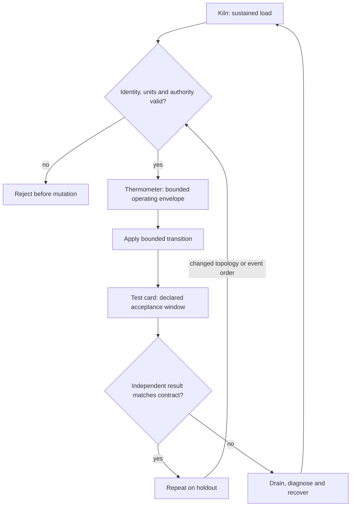

# C15 · Acceptance under sustained load

Prerequisite: [C14](C14.md). New skills: acceptance thresholds, soak experiments, thermal and error trends, workload-specific validation.
This course teaches these skills through a guided build. Model examples predict behavior;
the live steps establish behavior on the named execution tier.

## State, ownership and the reason for the rule

Acceptance is a predeclared predicate over a measurement window, not the best sample in that window. Define correctness, duration, concurrency, thermal envelope, permitted errors and recovery behavior before a soak begins. HPL, NCCL, ClusterKit, NeMo and node stress test different behavior; one cannot stand in for all the others.

Use a test kiln: sustained heat reveals a defect that a quick inspection misses. The analogy stops at the actual cooling and device limits. A monotonic timestamp bounds elapsed time; aligned device and network records allow diagnosis. Keep the workload identity and environmental conditions fixed when comparing runs. A tool that exits successfully while skipping a GPU is not an accepted GPU test.

## Trace the transition

The symbols name physical objects beside their actual technical referents. Solid
arrows show the labeled dependency or data path, not an implicit synchronous barrier.
The drawing describes this lesson's contract; it is not an undocumented NVIDIA
internal implementation diagram.



## Build it in code

Start the qualified native lab with `Session.start("C15")` as described in C00.
That operation reconciles real pinned DeepOps host configuration and stores the
report. Read the journal and inventory before changing state. Keep the control,
compute, services and leaf containers inside the owned Incus project.

Run [the complete planning example](../examples/C15.py) through the macro-aware
session runner. Predict both its successful and rejected states first.

```python
from ncp_lab.macros import macros, require
samples = [{"second":i,"errors":0,"participants":4,"progress":10+i} for i in range(5)]
require[all(s["participants"] == 4 and s["errors"] == 0 for s in samples)]
require[all(a["progress"] < b["progress"] for a,b in zip(samples,samples[1:]))]
require[samples[-1]["second"]-samples[0]["second"] == 4]
# Five model samples are not a hardware soak.
```

The `require` macro evaluates its predicate once and retains the check under
optimized Python execution. It is a teaching aid; live evidence is graded by
the separate Rust decision kernel. Change one input, predict the observable
effect, then run again. Save both the prediction and the observation.

## Guided live build

1. Write thresholds and abort conditions before collecting data. Verify the physical installation, cooling and network path with an initial hardware acceptance workload.

2. Execute node stress, HPL and ClusterKit separately. Record actual participating devices, correctness checks, duration, temperatures, throttling and errors.

3. Run NCCL, HPL and NeMo burn-in workloads with a justified duration and concurrency. Collect time-series observations across compute, storage and fabric; keep every failed interval.

4. Introduce a bounded path impairment and a recoverable service interruption. Confirm both the steady-state objective and recovery bound on a second workload placement. Stop safely when a declared abort condition holds.

Use typed Python APIs, generated intent and reviewed Ansible playbooks for these
operations. Narrow command adapters are appropriate when a vendor exposes no API;
record their exact arguments, exit status, output and version. Do not substitute
an illustrative calculation for a device or product observation.

## Every facet gets its own evidence

For each row, attach the concrete input/configuration, the operation performed,
the independently observed result and a counterexample that this operation rejects.
Related rows may share one raw trace only when it establishes each distinct facet.
Missing hardware or licensed services leaves that row blocked.

| Facet identity | Required skill | Course-to-assessment obligation |
|---|---|---|
| `AII-1.10/hardware-validation` | AII: Workload acceptance — hardware-validation | A versioned action, independent observation, and rejected counterexample for this specific facet. |
| `AII-4.1/execution` | AII: Node stress — execution | A versioned action, independent observation, and rejected counterexample for this specific facet. |
| `AII-4.2/execution` | AII: HPL acceptance — execution | A versioned action, independent observation, and rejected counterexample for this specific facet. |
| `AII-4.9/assessment` | AII: ClusterKit acceptance — assessment | A versioned action, independent observation, and rejected counterexample for this specific facet. |
| `AII-4.11/burn-in` | AII: NCCL soak — burn-in | A versioned action, independent observation, and rejected counterexample for this specific facet. |
| `AII-4.12/burn-in` | AII: HPL soak — burn-in | A versioned action, independent observation, and rejected counterexample for this specific facet. |
| `AII-4.13/burn-in` | AII: NeMo soak — burn-in | A versioned action, independent observation, and rejected counterexample for this specific facet. |
| `AIO-W-3.5/DCGM` | AIO: Diagnostic tools — DCGM | A versioned action, independent observation, and rejected counterexample for this specific facet. |
| `AIO-W-3.5/NVSM` | AIO: Diagnostic tools — NVSM | A versioned action, independent observation, and rejected counterexample for this specific facet. |
| `AIO-W-3.5/SMI` | AIO: Diagnostic tools — SMI | A versioned action, independent observation, and rejected counterexample for this specific facet. |
| `AIN-5.3/GPU` | AIN: Interconnect latency — GPU | A versioned action, independent observation, and rejected counterexample for this specific facet. |
| `AIN-5.3/CPU` | AIN: Interconnect latency — CPU | A versioned action, independent observation, and rejected counterexample for this specific facet. |
| `AIN-5.3/storage` | AIN: Interconnect latency — storage | A versioned action, independent observation, and rejected counterexample for this specific facet. |

## Explain, perturb, recover

Submit a four-part trace: physical resource identity; authorized fabric path;
admitted workload and result; recovery after the controlled intervention. The
trainer independently removes one AIO, one AIN and one AII decision in separate
trials. Each removal must break the integrated acceptance condition; each restore
must recover it. Then repeat with a new topology, workload or event ordering.

Before moving on, explain why your planning example cannot establish the product
facets in the table. Collect those observations on the appropriate course station.
The original source references and discrepancy policy are in [the blueprint](../README.md).
