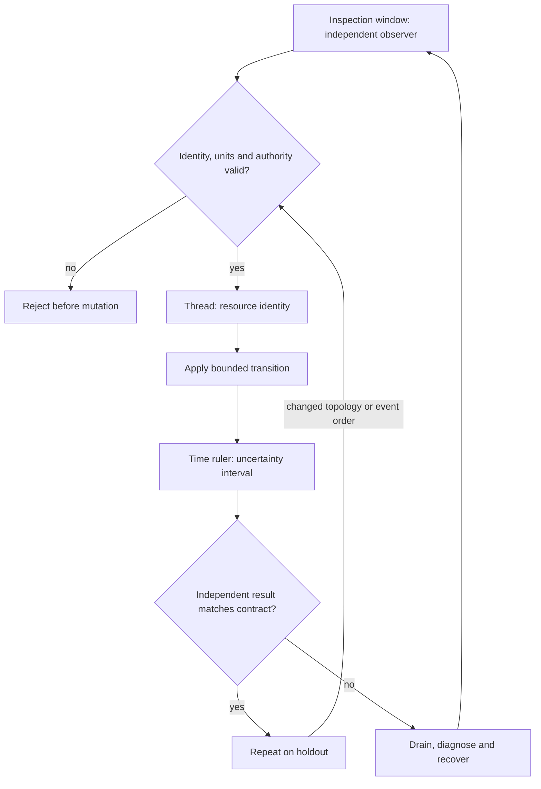

# C16 · Correlate independent observations

Prerequisite: [C15](C15.md). New skills: causal diagnosis, independent clocks and provenance, DCGM NVSM and SMI, WJH NetQ and telemetry.
This course teaches these skills through a guided build. Model examples predict behavior;
the live steps establish behavior on the named execution tier.

## State, ownership and the reason for the rule

A correlated symptom is a candidate explanation. A causal diagnosis also predicts a discriminating intervention. Align device, fabric and job observations by resource identity and time uncertainty; do not join unrelated samples merely because their timestamps print the same second. Preserve raw observations alongside normalized fields.

Use three inspection windows: compute health, transport behavior and admitted workload progress. DCGM, NVSM and SMI observe different aspects of the node. WJH and in-band telemetry concern specific network observations, while NetQ provides network visibility. None is interchangeable with a made-up JSON field carrying the product name. Localize GPU, fan and NIC faults separately, and distinguish utilization from useful performance.

## Trace the transition

The symbols name physical objects beside their actual technical referents. Solid
arrows show the labeled dependency or data path, not an implicit synchronous barrier.
The drawing describes this lesson's contract; it is not an undocumented NVIDIA
internal implementation diagram.



## Build it in code

Start the qualified native lab with `Session.start("C16")` as described in C00.
That operation reconciles real pinned DeepOps host configuration and stores the
report. Read the journal and inventory before changing state. Keep the control,
compute, services and leaf containers inside the owned Incus project.

Run [the complete planning example](../examples/C16.py) through the macro-aware
session runner. Predict both its successful and rejected states first.

```python
from ncp_lab.macros import macros, require
def overlap(a,b): return max(a[0],b[0]) <= min(a[1],b[1])
gpu = {"job":"j7","window":(100,104)}
nic = {"job":"j7","window":(103,107)}
unrelated = {"job":"j8","window":(100,101)}
require[gpu["job"] == nic["job"] and overlap(gpu["window"],nic["window"])]
require[not (gpu["job"] == unrelated["job"] and overlap(gpu["window"],unrelated["window"]))]
```

The `require` macro evaluates its predicate once and retains the check under
optimized Python execution. It is a teaching aid; live evidence is graded by
the separate Rust decision kernel. Change one input, predict the observable
effect, then run again. Save both the prediction and the observation.

## Guided live build

1. Collect BCM usage/performance/incident reports and raw DCGM, NVSM and SMI observations with identities and collection intervals. Explain disagreements instead of averaging them away.

2. Collect WJH drop reasons, in-band telemetry and NetQ congestion/latency evidence on a supported product. Join them to a specific job and path, preserving clock uncertainty.

3. Form two competing hypotheses for a GPU, fan or NIC incident. Choose one bounded intervention whose predicted observations differ between the hypotheses.

4. Apply that intervention, verify workload recovery and repeat on a holdout fault location. Produce an incident report that cites evidence and states what remains unobserved.

Use typed Python APIs, generated intent and reviewed Ansible playbooks for these
operations. Narrow command adapters are appropriate when a vendor exposes no API;
record their exact arguments, exit status, output and version. Do not substitute
an illustrative calculation for a device or product observation.

## Every facet gets its own evidence

For each row, attach the concrete input/configuration, the operation performed,
the independently observed result and a counterexample that this operation rejects.
Related rows may share one raw trace only when it establishes each distinct facet.
Missing hardware or licensed services leaves that row blocked.

| Facet identity | Required skill | Course-to-assessment obligation |
|---|---|---|
| `AIO-W-1.9/usage` | AIO: BCM reporting — usage | A versioned action, independent observation, and rejected counterexample for this specific facet. |
| `AIO-W-1.9/performance` | AIO: BCM reporting — performance | A versioned action, independent observation, and rejected counterexample for this specific facet. |
| `AIO-W-1.9/incident` | AIO: BCM reporting — incident | A versioned action, independent observation, and rejected counterexample for this specific facet. |
| `AIO-W-3.5/DCGM` | AIO: Diagnostic tools — DCGM | A versioned action, independent observation, and rejected counterexample for this specific facet. |
| `AIO-W-3.5/NVSM` | AIO: Diagnostic tools — NVSM | A versioned action, independent observation, and rejected counterexample for this specific facet. |
| `AIO-W-3.5/SMI` | AIO: Diagnostic tools — SMI | A versioned action, independent observation, and rejected counterexample for this specific facet. |
| `AIO-G-2.2/DCGM` | AIO: Diagnostic tools — DCGM | A versioned action, independent observation, and rejected counterexample for this specific facet. |
| `AIO-G-2.2/NVSM` | AIO: Diagnostic tools — NVSM | A versioned action, independent observation, and rejected counterexample for this specific facet. |
| `AIO-G-2.2/SMI` | AIO: Diagnostic tools — SMI | A versioned action, independent observation, and rejected counterexample for this specific facet. |
| `AIN-2.5/in-band-telemetry` | AIN: Packet-drop evidence — in-band-telemetry | A versioned action, independent observation, and rejected counterexample for this specific facet. |
| `AIN-2.5/WJH` | AIN: Packet-drop evidence — WJH | A versioned action, independent observation, and rejected counterexample for this specific facet. |
| `AIN-2.6/congestion` | AIN: NetQ observation — congestion | A versioned action, independent observation, and rejected counterexample for this specific facet. |
| `AIN-2.6/latency` | AIN: NetQ observation — latency | A versioned action, independent observation, and rejected counterexample for this specific facet. |
| `AIN-5.2/WJH` | AIN: Event diagnosis — WJH | A versioned action, independent observation, and rejected counterexample for this specific facet. |
| `AII-5.1/GPU` | AII: Fault localization — GPU | A versioned action, independent observation, and rejected counterexample for this specific facet. |
| `AII-5.1/fan` | AII: Fault localization — fan | A versioned action, independent observation, and rejected counterexample for this specific facet. |
| `AII-5.1/NIC` | AII: Fault localization — NIC | A versioned action, independent observation, and rejected counterexample for this specific facet. |

## Explain, perturb, recover

Submit a four-part trace: physical resource identity; authorized fabric path;
admitted workload and result; recovery after the controlled intervention. The
trainer independently removes one AIO, one AIN and one AII decision in separate
trials. Each removal must break the integrated acceptance condition; each restore
must recover it. Then repeat with a new topology, workload or event ordering.

Before moving on, explain why your planning example cannot establish the product
facets in the table. Collect those observations on the appropriate course station.
The original source references and discrepancy policy are in [the blueprint](../README.md).
