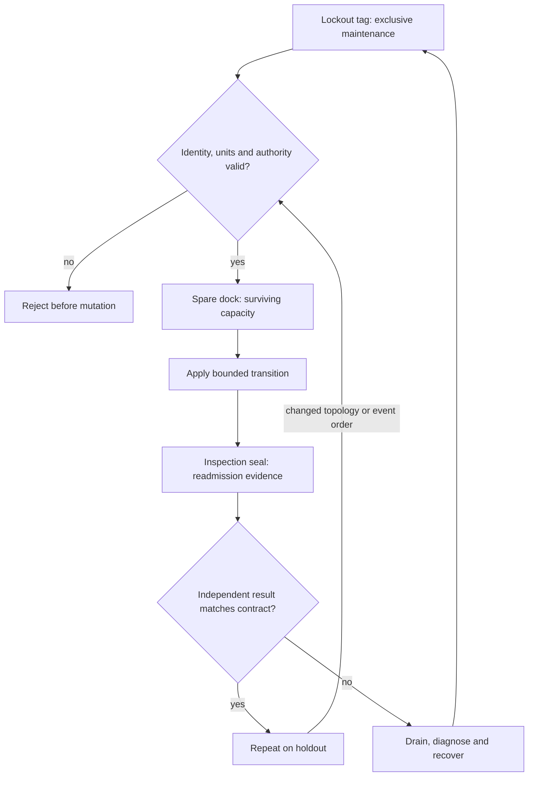

# C17 · Maintain a live failure domain

Prerequisite: [C16](C16.md). New skills: failure-domain maintenance, firmware compatibility, physical replacement, canary and rollback.
This course teaches these skills through a guided build. Model examples predict behavior;
the live steps establish behavior on the named execution tier.

## State, ownership and the reason for the rule

Maintenance acquires an exclusive right to disrupt a bounded failure domain. Drain and verify release before changing firmware or hardware. Keep the recovery path outside the domain being changed. A service restart, image update, switch firmware transition, BlueField update and optic firmware update have different compatibility and rollback rules.

Use a lockout tag on the dock. The tag represents an enforced maintenance state, not a substitute for physical safety procedures. HGX firmware faults, GPU/card/PSU isolation and replacement must follow the exact system procedure and authorized service personnel. Reconcile replacement identities before readmission. A successful flash command is not proof that the new component booted, passed validation or preserved redundant paths.

## Trace the transition

The symbols name physical objects beside their actual technical referents. Solid
arrows show the labeled dependency or data path, not an implicit synchronous barrier.
The drawing describes this lesson's contract; it is not an undocumented NVIDIA
internal implementation diagram.



## Build it in code

Start the qualified native lab with `Session.start("C17")` as described in C00.
That operation reconciles real pinned DeepOps host configuration and stores the
report. Read the journal and inventory before changing state. Keep the control,
compute, services and leaf containers inside the owned Incus project.

Run [the complete planning example](../examples/C17.py) through the macro-aware
session runner. Predict both its successful and rejected states first.

```python
from ncp_lab.macros import macros, require
domains = {"rack-a":8,"rack-b":8}
required = 8
def may_drain(names): return sum(n for k,n in domains.items() if k not in names) >= required
require[may_drain({"rack-a"})]
require[not may_drain({"rack-a","rack-b"})]
states = ["admitted","draining","released","maintaining","validated","admitted"]
require[states.index("released") < states.index("maintaining")]
```

The `require` macro evaluates its predicate once and retains the check under
optimized Python execution. It is a teaching aid; live evidence is graded by
the separate Rust decision kernel. Change one input, predict the observable
effect, then run again. Save both the prediction and the observation.

## Guided live build

1. Construct a version compatibility graph for BCM images/patches, HGX, switches, BlueField-3 and optics. Record upgrade order, supported rollback and recovery access for each component.

2. Acquire the maintenance lease, drain workloads and verify that surviving paths and capacity satisfy the service objective. Fence stale writers before proceeding.

3. Perform the supported canary update or supervised card/GPU/PSU isolation and replacement. Collect physical identity and firmware/software observations after the transition; detect an intentionally failed canary.

4. Run physical, fabric and workload acceptance before readmission. Roll back only by the supported procedure and prove that a second failure-domain maintenance cannot violate the capacity bound.

Use typed Python APIs, generated intent and reviewed Ansible playbooks for these
operations. Narrow command adapters are appropriate when a vendor exposes no API;
record their exact arguments, exit status, output and version. Do not substitute
an illustrative calculation for a device or product observation.

## Every facet gets its own evidence

For each row, attach the concrete input/configuration, the operation performed,
the independently observed result and a counterexample that this operation rejects.
Related rows may share one raw trace only when it establishes each distinct facet.
Missing hardware or licensed services leaves that row blocked.

| Facet identity | Required skill | Course-to-assessment obligation |
|---|---|---|
| `AIO-W-1.4/patch` | AIO: BCM rollout — patch | A versioned action, independent observation, and rejected counterexample for this specific facet. |
| `AIO-W-1.4/firmware` | AIO: BCM rollout — firmware | A versioned action, independent observation, and rejected counterexample for this specific facet. |
| `AIO-W-1.4/image` | AIO: BCM rollout — image | A versioned action, independent observation, and rejected counterexample for this specific facet. |
| `AII-1.4/HGX` | AII: Firmware transition — HGX | A versioned action, independent observation, and rejected counterexample for this specific facet. |
| `AII-1.4/upgrade` | AII: Firmware transition — upgrade | A versioned action, independent observation, and rejected counterexample for this specific facet. |
| `AII-1.4/fault-detection` | AII: Firmware transition — fault-detection | A versioned action, independent observation, and rejected counterexample for this specific facet. |
| `AII-4.6/firmware` | AII: Switch revision — firmware | A versioned action, independent observation, and rejected counterexample for this specific facet. |
| `AII-4.6/software` | AII: Switch revision — software | A versioned action, independent observation, and rejected counterexample for this specific facet. |
| `AII-4.7/firmware` | AII: BlueField-3 revision — firmware | A versioned action, independent observation, and rejected counterexample for this specific facet. |
| `AII-4.7/software` | AII: BlueField-3 revision — software | A versioned action, independent observation, and rejected counterexample for this specific facet. |
| `AII-4.8/firmware` | AII: Optic revision — firmware | A versioned action, independent observation, and rejected counterexample for this specific facet. |
| `AII-5.2/card` | AII: Failed-part isolation — card | A versioned action, independent observation, and rejected counterexample for this specific facet. |
| `AII-5.2/GPU` | AII: Failed-part isolation — GPU | A versioned action, independent observation, and rejected counterexample for this specific facet. |
| `AII-5.2/PSU` | AII: Failed-part isolation — PSU | A versioned action, independent observation, and rejected counterexample for this specific facet. |
| `AII-5.3/card` | AII: Part replacement — card | A versioned action, independent observation, and rejected counterexample for this specific facet. |
| `AII-5.3/GPU` | AII: Part replacement — GPU | A versioned action, independent observation, and rejected counterexample for this specific facet. |
| `AII-5.3/PSU` | AII: Part replacement — PSU | A versioned action, independent observation, and rejected counterexample for this specific facet. |
| `AIN-5.3/GPU` | AIN: Interconnect latency — GPU | A versioned action, independent observation, and rejected counterexample for this specific facet. |
| `AIN-5.3/CPU` | AIN: Interconnect latency — CPU | A versioned action, independent observation, and rejected counterexample for this specific facet. |
| `AIN-5.3/storage` | AIN: Interconnect latency — storage | A versioned action, independent observation, and rejected counterexample for this specific facet. |

## Explain, perturb, recover

Submit a four-part trace: physical resource identity; authorized fabric path;
admitted workload and result; recovery after the controlled intervention. The
trainer independently removes one AIO, one AIN and one AII decision in separate
trials. Each removal must break the integrated acceptance condition; each restore
must recover it. Then repeat with a new topology, workload or event ordering.

Before moving on, explain why your planning example cannot establish the product
facets in the table. Collect those observations on the appropriate course station.
The original source references and discrepancy policy are in [the blueprint](../README.md).
