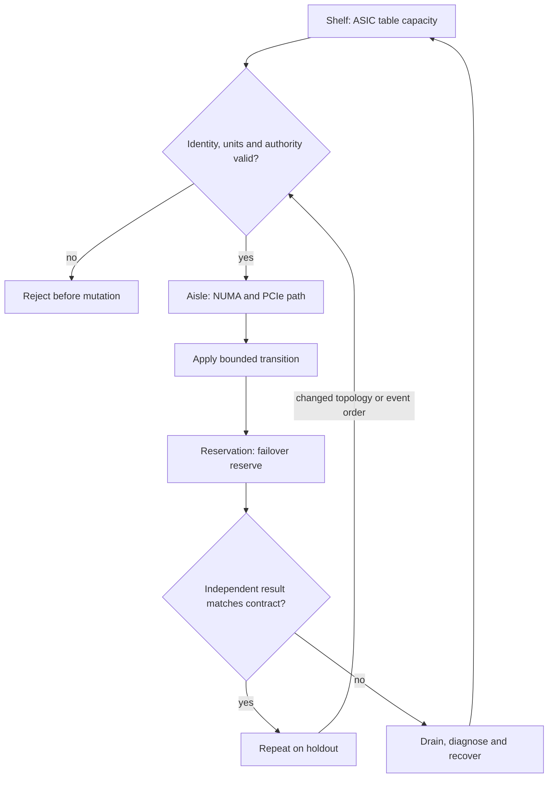

# C18 · Capacity and host affinity

Prerequisite: [C17](C17.md). New skills: finite ASIC capacity, CPU NUMA affinity, AMD and Intel host tuning, capacity forecasting.
This course teaches these skills through a guided build. Model examples predict behavior;
the live steps establish behavior on the named execution tier.

## State, ownership and the reason for the rule

A switch has finite forwarding resources, and a host has a finite locality budget. Count the resource actually consumed: routes, neighbors, next hops and other ASIC tables can exhaust independently. On the host, CPU affinity, memory placement, PCIe topology and NIC/GPU attachment interact. Increasing thread count can increase remote memory traffic and reduce useful throughput.

The drawing is a warehouse with shelves and loading aisles. A free shelf does not imply a free aisle. Use cl-resource-query on the supported platform for ASIC evidence. Tune AMD and Intel hosts using their actual topology and supported settings; do not copy a NUMA node number between machines. The experiment must bind physical identity, fabric pressure and job placement.

## Trace the transition

The symbols name physical objects beside their actual technical referents. Solid
arrows show the labeled dependency or data path, not an implicit synchronous barrier.
The drawing describes this lesson's contract; it is not an undocumented NVIDIA
internal implementation diagram.



## Build it in code

Start the qualified native lab with `Session.start("C18")` as described in C00.
That operation reconciles real pinned DeepOps host configuration and stores the
report. Read the journal and inventory before changing state. Keep the control,
compute, services and leaf containers inside the owned Incus project.

Run [the complete planning example](../examples/C18.py) through the macro-aware
session runner. Predict both its successful and rejected states first.

```python
from ncp_lab.macros import macros, require
tables = {"routes":(900,1200,200), "neighbors":(400,800,100)}
require[all(used+reserve <= total for used,total,reserve in tables.values())]
locality = {"gpu0":0,"nic0":0,"cpu-worker":0}
require[len(set(locality.values())) == 1]
```

The `require` macro evaluates its predicate once and retains the check under
optimized Python execution. It is a teaching aid; live evidence is graded by
the separate Rust decision kernel. Change one input, predict the observable
effect, then run again. Save both the prediction and the observation.

## Guided live build

1. Collect the switch resource report and relate used/available tables to the actual route/neighbor scale. Keep a reserve for failover expansion and reject a forecast that assumes unlimited ASIC entries.

2. Collect CPU, NUMA, PCIe, GPU and NIC locality on both AMD and Intel course hosts. Generate an affinity plan from observed topology rather than fixed CPU numbers.

3. Measure a workload with local and intentionally remote placement under the same network/storage conditions. Change one tuning parameter at a time and retain a correctness test.

4. Scale tenant routes and job concurrency together, then remove one path. Validate that ASIC reserve and host affinity still satisfy the service objective; compare the holdout hardware topology.

Use typed Python APIs, generated intent and reviewed Ansible playbooks for these
operations. Narrow command adapters are appropriate when a vendor exposes no API;
record their exact arguments, exit status, output and version. Do not substitute
an illustrative calculation for a device or product observation.

## Every facet gets its own evidence

For each row, attach the concrete input/configuration, the operation performed,
the independently observed result and a counterexample that this operation rejects.
Related rows may share one raw trace only when it establishes each distinct facet.
Missing hardware or licensed services leaves that row blocked.

| Facet identity | Required skill | Course-to-assessment obligation |
|---|---|---|
| `AIN-5.1/cl-resource-query` | AIN: ASIC resource diagnosis — cl-resource-query | A versioned action, independent observation, and rejected counterexample for this specific facet. |
| `AII-5.4/AMD` | AII: Host tuning — AMD | A versioned action, independent observation, and rejected counterexample for this specific facet. |
| `AII-5.4/Intel` | AII: Host tuning — Intel | A versioned action, independent observation, and rejected counterexample for this specific facet. |
| `AIO-W-3.5/DCGM` | AIO: Diagnostic tools — DCGM | A versioned action, independent observation, and rejected counterexample for this specific facet. |
| `AIO-W-3.5/NVSM` | AIO: Diagnostic tools — NVSM | A versioned action, independent observation, and rejected counterexample for this specific facet. |
| `AIO-W-3.5/SMI` | AIO: Diagnostic tools — SMI | A versioned action, independent observation, and rejected counterexample for this specific facet. |

## Explain, perturb, recover

Submit a four-part trace: physical resource identity; authorized fabric path;
admitted workload and result; recovery after the controlled intervention. The
trainer independently removes one AIO, one AIN and one AII decision in separate
trials. Each removal must break the integrated acceptance condition; each restore
must recover it. Then repeat with a new topology, workload or event ordering.

Before moving on, explain why your planning example cannot establish the product
facets in the table. Collect those observations on the appropriate course station.
The original source references and discrepancy policy are in [the blueprint](../README.md).
