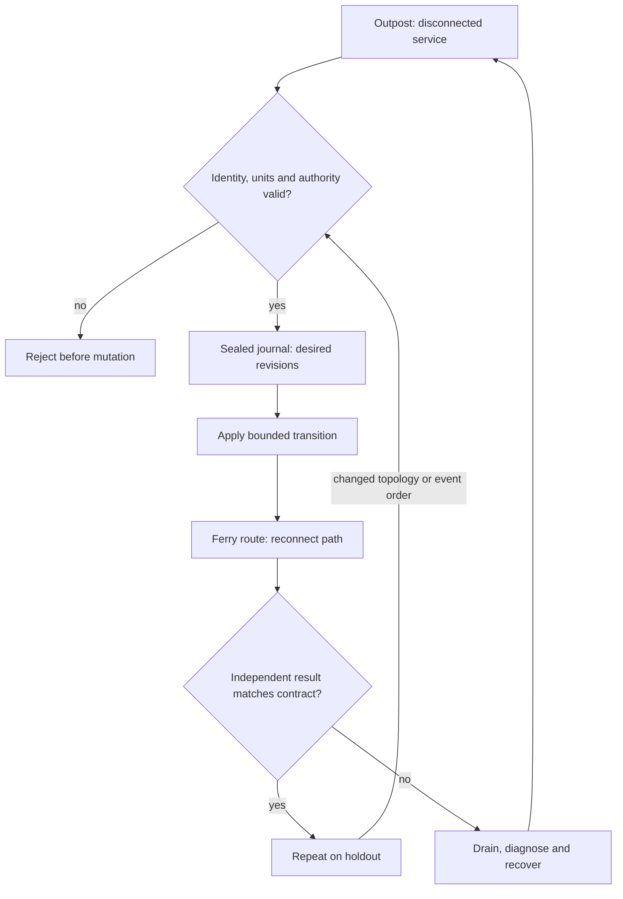

# C19 · Edge and cloud reconnection

Prerequisite: [C18](C18.md). New skills: edge reconciliation, offline identity, cloud VMI validation, reconnect conflict handling.
This course teaches these skills through a guided build. Model examples predict behavior;
the live steps establish behavior on the named execution tier.

## State, ownership and the reason for the rule

An edge node can keep running after its controller loses contact. Reconnection must reconcile two histories without replaying obsolete authority or overwriting newer workload state. Give desired configuration a revision and bind artifacts to identities. Separate a disconnected-but-healthy service from a reachable-but-stale controller report.

Fleet Command and cloud VMI remain source objectives from the AIO guide and require the real product/cloud course station. The Incus project models an edge lifecycle and exercises actual Linux network disconnection; it does not become Fleet Command by naming a function after it. A cloud GPU image still requires driver, network, storage and workload validation on its actual instance type.

## Trace the transition

The symbols name physical objects beside their actual technical referents. Solid
arrows show the labeled dependency or data path, not an implicit synchronous barrier.
The drawing describes this lesson's contract; it is not an undocumented NVIDIA
internal implementation diagram.



## Build it in code

Start the qualified native lab with `Session.start("C19")` as described in C00.
That operation reconciles real pinned DeepOps host configuration and stores the
report. Read the journal and inventory before changing state. Keep the control,
compute, services and leaf containers inside the owned Incus project.

Run [the complete planning example](../examples/C19.py) through the macro-aware
session runner. Predict both its successful and rejected states first.

```python
from ncp_lab.macros import macros, require
applied = 12
pending = [9,12,13,11]
accepted = [revision for revision in pending if revision > applied]
require[accepted == [13]]
identity = ("edge-a","gpu-uuid-a","image-digest-a")
require[identity != ("edge-a","gpu-uuid-b","image-digest-a")]
```

The `require` macro evaluates its predicate once and retains the check under
optimized Python execution. It is a teaching aid; live evidence is graded by
the separate Rust decision kernel. Change one input, predict the observable
effect, then run again. Save both the prediction and the observation.

## Guided live build

1. Administer a supported Fleet Command environment and record permitted device/service lifecycle operations. At the cloud station, deploy the intended VMI with explicit instance, image and network identity.

2. Validate GPU, NIC and storage behavior before admitting the remote workload. Use DeepOps-managed host configuration where supported, recording any platform-specific adapter.

3. Disconnect the rehearsal edge via an owned patchbay path while the native service continues. Queue versioned desired state and preserve the service checkpoint separately.

4. Reconnect with competing old and new revisions. Reject stale desired state, recover the authorized workload and repeat with a rotated endpoint identity and different path latency.

Use typed Python APIs, generated intent and reviewed Ansible playbooks for these
operations. Narrow command adapters are appropriate when a vendor exposes no API;
record their exact arguments, exit status, output and version. Do not substitute
an illustrative calculation for a device or product observation.

## Every facet gets its own evidence

For each row, attach the concrete input/configuration, the operation performed,
the independently observed result and a counterexample that this operation rejects.
Related rows may share one raw trace only when it establishes each distinct facet.
Missing hardware or licensed services leaves that row blocked.

| Facet identity | Required skill | Course-to-assessment obligation |
|---|---|---|
| `AIO-G-1.1/administration` | AIO: Fleet Command — administration | A versioned action, independent observation, and rejected counterexample for this specific facet. |
| `AIO-G-3.4/deployment` | AIO: Cloud VMI — deployment | A versioned action, independent observation, and rejected counterexample for this specific facet. |
| `AIN-5.3/GPU` | AIN: Interconnect latency — GPU | A versioned action, independent observation, and rejected counterexample for this specific facet. |
| `AIN-5.3/CPU` | AIN: Interconnect latency — CPU | A versioned action, independent observation, and rejected counterexample for this specific facet. |
| `AIN-5.3/storage` | AIN: Interconnect latency — storage | A versioned action, independent observation, and rejected counterexample for this specific facet. |
| `AII-1.10/hardware-validation` | AII: Workload acceptance — hardware-validation | A versioned action, independent observation, and rejected counterexample for this specific facet. |

## Explain, perturb, recover

Submit a four-part trace: physical resource identity; authorized fabric path;
admitted workload and result; recovery after the controlled intervention. The
trainer independently removes one AIO, one AIN and one AII decision in separate
trials. Each removal must break the integrated acceptance condition; each restore
must recover it. Then repeat with a new topology, workload or event ordering.

Before moving on, explain why your planning example cannot establish the product
facets in the table. Collect those observations on the appropriate course station.
The original source references and discrepancy policy are in [the blueprint](../README.md).
