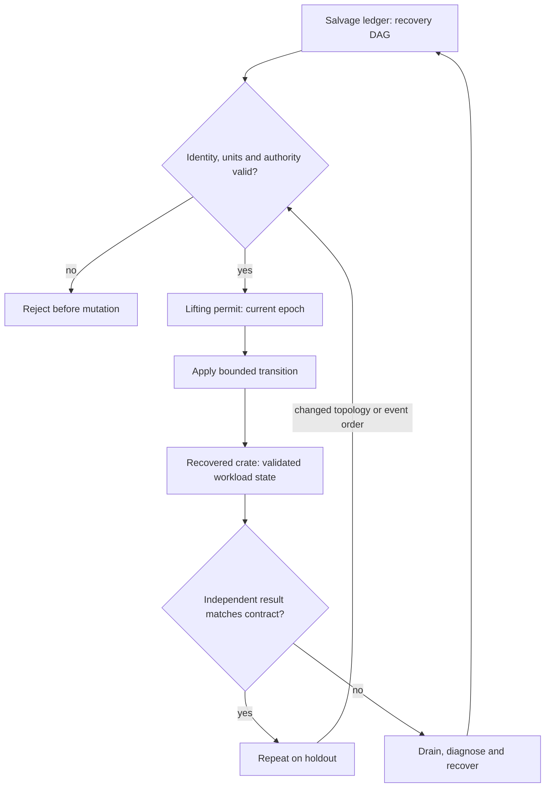

# C20 · Recover without split brain

Prerequisite: [C19](C19.md). New skills: recovery dependency graphs, split-brain exclusion, end-to-end rollback, novel incident synthesis.
This course teaches these skills through a guided build. Model examples predict behavior;
the live steps establish behavior on the named execution tier.

## State, ownership and the reason for the rule

Recovery is a new controlled transition, not an unconditional rewind. A checkpoint can restore application state while leaving a stale controller, revoked credential or replaced physical identity outside that checkpoint. Restore dependencies in a valid order and reject any operation whose ownership epoch no longer matches.

Use a salvage yard with numbered crates and a single lifting permit. Two cranes holding copies of an old permit must not both lift the same load. BCM job/node/bottleneck diagnosis, BCM control-plane diagnosis and UFM health belong in the same incident narrative but remain separate product observations. The final recovery must establish physical capacity, reachable isolated paths, single-writer authority and a correct workload result.

## Trace the transition

The symbols name physical objects beside their actual technical referents. Solid
arrows show the labeled dependency or data path, not an implicit synchronous barrier.
The drawing describes this lesson's contract; it is not an undocumented NVIDIA
internal implementation diagram.



## Build it in code

Start the qualified native lab with `Session.start("C20")` as described in C00.
That operation reconciles real pinned DeepOps host configuration and stores the
report. Read the journal and inventory before changing state. Keep the control,
compute, services and leaf containers inside the owned Incus project.

Run [the complete planning example](../examples/C20.py) through the macro-aware
session runner. Predict both its successful and rejected states first.

```python
from ncp_lab.macros import macros, require
order = ["fence","identity","fabric","storage","admission","workload"]
edges = [("fence","identity"),("identity","fabric"),("fabric","admission"),
         ("storage","admission"),("admission","workload")]
position = {name:i for i,name in enumerate(order)}
require[all(position[a] < position[b] for a,b in edges)]
current_epoch, report_epoch = 31, 30
require[current_epoch != report_epoch]
```

The `require` macro evaluates its predicate once and retains the check under
optimized Python execution. It is a teaching aid; live evidence is graded by
the separate Rust decision kernel. Change one input, predict the observable
effect, then run again. Save both the prediction and the observation.

## Guided live build

1. Capture a baseline dependency graph linking controller state, device identity, fabric policy, storage checkpoint and workload admission. Identify which state is external to each backup.

2. Diagnose a compound BCM job/node/bottleneck and UFM health incident using independent observations from prior courses. Select the smallest failure domain that explains the evidence.

3. Fence stale owners, restore dependencies and reconcile current physical/network identity before resuming work. Reject an old epoch and a correct-looking checkpoint from the wrong dataset.

4. Run the trainer holdout with reordered failures and delayed observations. Demonstrate that removing any one of the operations, networking or infrastructure repairs prevents acceptance; restore each and collect recovery evidence.

Use typed Python APIs, generated intent and reviewed Ansible playbooks for these
operations. Narrow command adapters are appropriate when a vendor exposes no API;
record their exact arguments, exit status, output and version. Do not substitute
an illustrative calculation for a device or product observation.

## Every facet gets its own evidence

For each row, attach the concrete input/configuration, the operation performed,
the independently observed result and a counterexample that this operation rejects.
Related rows may share one raw trace only when it establishes each distinct facet.
Missing hardware or licensed services leaves that row blocked.

| Facet identity | Required skill | Course-to-assessment obligation |
|---|---|---|
| `AIO-W-1.7/job` | AIO: BCM incident — job | A versioned action, independent observation, and rejected counterexample for this specific facet. |
| `AIO-W-1.7/node` | AIO: BCM incident — node | A versioned action, independent observation, and rejected counterexample for this specific facet. |
| `AIO-W-1.7/bottleneck` | AIO: BCM incident — bottleneck | A versioned action, independent observation, and rejected counterexample for this specific facet. |
| `AIO-W-4.3/control-plane` | AIO: BCM diagnosis — control-plane | A versioned action, independent observation, and rejected counterexample for this specific facet. |
| `AIO-G-4.3/control-plane` | AIO: BCM diagnosis — control-plane | A versioned action, independent observation, and rejected counterexample for this specific facet. |
| `AIN-5.4/health` | AIN: UFM diagnosis — health | A versioned action, independent observation, and rejected counterexample for this specific facet. |
| `AII-1.10/hardware-validation` | AII: Workload acceptance — hardware-validation | A versioned action, independent observation, and rejected counterexample for this specific facet. |

## Explain, perturb, recover

Submit a four-part trace: physical resource identity; authorized fabric path;
admitted workload and result; recovery after the controlled intervention. The
trainer independently removes one AIO, one AIN and one AII decision in separate
trials. Each removal must break the integrated acceptance condition; each restore
must recover it. Then repeat with a new topology, workload or event ordering.

Before moving on, explain why your planning example cannot establish the product
facets in the table. Collect those observations on the appropriate course station.
The original source references and discrepancy policy are in [the blueprint](../README.md).
