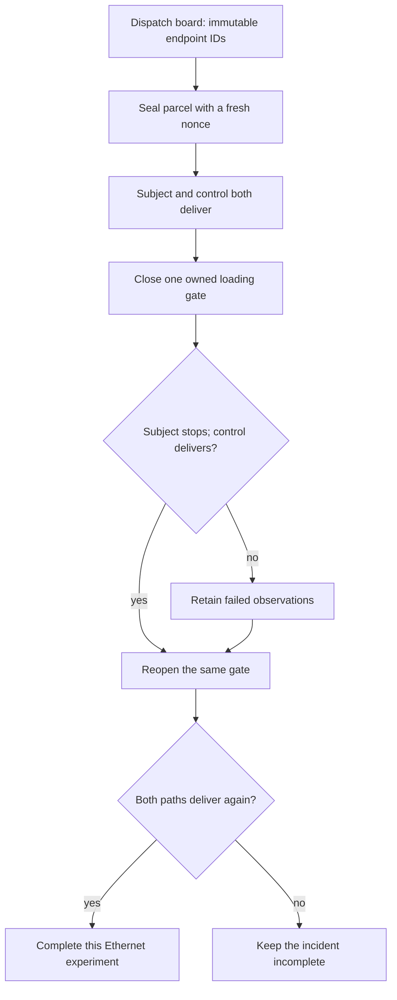

# DCIT path course · Follow one sealed parcel

This is a hands-on slice of D02, covering the adapted `2.3/server-fabric-packet-path`
obligation. Complete the NVIDIA core courses and C01's NetBox practical first.
The remaining D02 routing-protocol obligations still require their own adapters.

Think of a CPU-side dataset service feeding a GPU job. The GPU cannot consume the
dataset until its CPU dependencies can communicate. We will test that dependency
with a 32-byte unpredictable parcel and its SHA-256 acknowledgement. Passing this
experiment does not mean the GPU ran, the dataset was loaded, or RDMA worked.

The parcel belongs to one attempt. Its sender binds both a specific IPv4 address
and a specific Linux interface. The receiving process binds the destination
interface and address. It acknowledges only the correct parcel from the intended
source. An answer from a previous attempt cannot satisfy the current comparison.
The response port must also match. The counters belong to that exact interface.

Use a trainer-owned, already deployed `Fabric` from the C01 NetBox practical.
The site must contain four distinct hosts named `compute-a`, `compute-b`, `control`
and `services`, each with a selected NetBox `data0` port. Change these symbolic
names in the program to match your site; do not invent addresses or Incus names.
A switch connects the two paths. Each host has Python and the qualified native
image. Set the recipe's OS and image fingerprint explicitly for your CachyOS
profile. The separate GitHub Ubuntu fixture is not a CachyOS qualification.

The native lifecycle, daemon socket and evidence directory stay with the trainer.
Run this code in the same Python environment that has the pinned Ansible dependency.
Choose a new output path for every attempt. Do not place a learner inside a host
administrator account to make the example convenient.

```python
from integrations.incus.diagnostics import Endpoint, Flow, path_study

@path_study
def dataset_dependency(source="compute-a", target="compute-b"):
    return (
        Flow(Endpoint(source, "data0"), Endpoint(target, "data0")),
        Flow(Endpoint("control", "data0"), Endpoint("services", "data0")),
    )

def investigate(fabric, output):
    # fabric is already compiled from NetBox and deployed by the trainer.
    # Planning resolves names to immutable NetBox IDs before effects.
    study = dataset_dependency(fabric)
    return study.run(output)

report = investigate(fabric, "/srv/ncp/evidence/path-001.json")
print(report["complete"], report["tier"], report["gpu_execution"])
# A successful native run prints: True emulated False
```

Read the program as a sequence of ownership transfers. `Endpoint` carries a
NetBox device name and port name. `Flow` pairs source and destination intent.
`@path_study` expands two flows into one reviewed observation procedure. Calling
the decorated function resolves and checks the plan. Calling `.run()` performs
the effects. Compilation does not send packets or disable a cable.

Before reading the result, predict each transition:

1. Establish host identities through the real pinned NVIDIA DeepOps hosts role.
   Apply the generated network configuration twice. Every host must report zero
   changes on the second application. This is the AIO reconciliation condition.
2. Resolve the NetBox port into the actual owned guest, interface and address.
   Check the four live instance ownership markers. This is an AII inventory and
   installation check at the emulation tier, not a physical adapter certificate.
3. Send the subject parcel and a separate control parcel. Require receiver and
   sender agreement plus increasing source TX and RX counters. This is the AIN
   path condition; a planned route alone cannot establish delivery.
4. Disable the source's single selected patchbay cable. The subject must fail
   while the control still succeeds. If both fail, the fault is not sufficiently
   localized. If neither fails, investigate an unintended path or bad intervention.
5. Restore that exact owned cable and repeat both transfers. A failed intermediate
   check still enters restoration. Read the incomplete report before another attempt.



The loading gate represents a Linux bridge/cable state, not an optical switch or
ASIC queue. The independent control represents a separate dependency path, not
proof that every tenant is healthy. The acknowledgement proves a bounded UDP
exchange; it cannot prove bulk throughput, absence of packet loss under load or
application correctness. Counters are supporting observations, not unique packet
identifiers. A configured socket that fails to run is a probe error, never the
expected network-failure observation.

Change only `source` and `target`, reverse their order, choose a new report path
and run again. Predict the source interface, selected cable and affected direction.
Then request a nonexistent NetBox port. Planning must reject it before any cable
operation. Reuse an earlier report path: it must be refused without overwriting
the evidence. These are executable ownership and immutability checks.

Read `checklist.records` beside `observations`. A complete report has all nine
named checks. The shared formally checked `report_complete` predicate rejects
missing or failed checks. Its proof assumes that the observations supplied by
the Python runner are truthful. The runner, operating system and network stack
are not covered by that scalar proof. The report always disables live mastery.

If the controller is forcibly terminated, inspect the journal, cable and
`state/diagnostic.lock` before recovery; a finally block cannot run after power
loss. A stale lock requires operator investigation. Destroying the lab uses its
owned lifecycle journal. Never delete an unrelated host bridge to clear an error.
