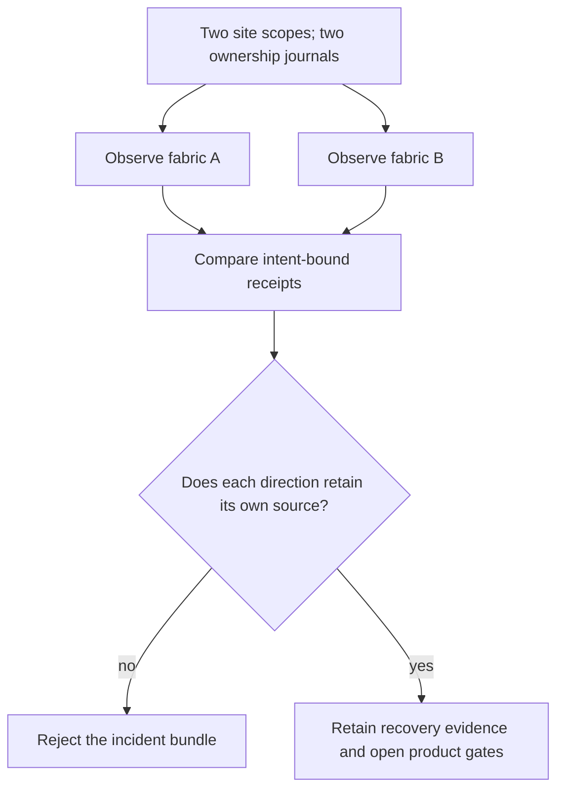

# DCIT path project · Recover a dependency without widening the outage

Assume the entire NVIDIA core has been studied and the path course has been
completed. This project practices every skill declared by that course. It
combines them across independent deployments; it introduces no new runtime API.

Build two small native fabrics from separate NetBox site scopes and disjoint
overlay pools using C01's `@native_fabric`. Keep their output directories and
ownership journals distinct. Each needs four host endpoints and a switch. Record
both image fingerprints and all selected NetBox IDs before deploying. Use
`Fabric.deploy()` and the course's generated `investigate` function throughout.

Your production-style deliverable is an incident bundle for each deployment:
source intent, the exact compiled plan, reconciliation evidence, attempted
intervention, subject/control observations, restoration result and the remaining
hardware/product gates. Do not call this a production-ready GPU platform merely
because both Ethernet experiments finish.

1. Predict which host is allowed to transmit the parcel in each fabric. Derive
   the endpoint names from each site's inventory; do not copy generated addresses
   from one deployment into another.
2. Run the course program in the first fabric. Bind its report to that fabric's
   `plan_identity`. Run the second using another report path. Explain why neither
   receipt can be used as the other's observation.
3. Reverse the subject direction in both fabrics. Predict the new source cable
   before executing. Compare the subject and unaffected control observations.
4. Preserve one intentional preflight rejection: an ambiguous or absent endpoint.
   Verify that the earlier receipts and active fabric still belong to their original
   attempts. Remove the bad input, not the guard.
5. Write a recovery decision that names the source-side fault boundary and the
   observations that would falsify it. Explain what further real workload and
   hardware evidence you need before resuming a GPU production job.

Acceptance requires the original NVIDIA reasoning in one causal argument. AII
establishes what was installed and which identities own the resources. AIN
establishes the actual data path and the intervention's scope. AIO establishes
reconciliation, observability and recovery. Omitting any of those makes the
integrated conclusion unsupported; reporting a partial checklist is diagnostic
feedback, not fractional mastery.

The private exercise delivery must provide independent fault scenarios and
collector identities. The public path program is a guided experiment; it is not
the private oracle and cannot award a Rustlings station receipt.
