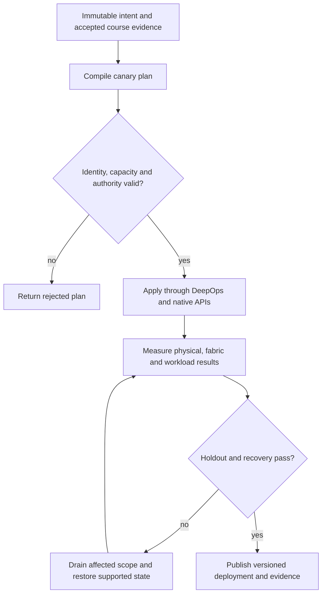

# P01 · Intent before intervention in a production workflow

Prerequisites: **all C01–C20**, plus the complete course evidence portfolio.
Level 1/20. This project combines already taught skills; it does not introduce
an untracked prerequisite. Start with `Session.start("P01")` so real DeepOps
reconciliation accompanies this build.

## Deliver the system

Build a commissioning compiler that joins NetBox intent, resource envelopes and workload permits. Its deliverable is an immutable deployment bundle, a dependency DAG, a rejected-plan report and a recovery transcript. Add a second rack without changing the admission contract.

Use Incus system containers, patchbay, petgraph, NetBox and native services.
Rusternetes + KWOK provide API/state rehearsal; actual processes provide workload
results. Any unavoidable NVIDIA dependency exception must be qualified and
recorded before use. No such exception is preapproved by this project.

## Guided construction

1. Load the accepted course evidence and inventory revision. Express the system's
   inputs and output contract as immutable Python records or Rust structs.
   Include identity, units, capacity, timeout, ownership and rollback target.
2. Compose the earlier course transformations into an intent compiler. Generate
   the configuration and a before/after diff. Verify that a rejected input has
   produced no partial deployment. Review macro expansion when macros generate effects.
3. Apply the smallest canary through the native/DeepOps adapters. Establish the
   unit-specific observations below, then reconcile again and inspect the no-op result.
4. Add the next failure domain while retaining the same acceptance contract.
   Use independent network and device observations; compare them with scheduler/API state.
5. Exercise a partial failure, recovery and a second workload placement. Retain
   rejected runs. Produce the handover artifacts so another operator can reconstruct
   the exact decision from source, configuration and evidence.

- Read the NetBox snapshot and compile it with the existing simulator netbox module. Compare device IDs, interfaces and cable endpoints against the manifest; retain the source snapshot digest.
- Build a control node, two compute nodes, a service node and a leaf in the Incus manifest. Assign an explicit image fingerprint and resource budget. Reconcile their hostnames through the pinned DeepOps hosts role.
- Run the envelope example. Lower cooling below demand and predict rejection before evaluating it. Then import the manifest into Twin and request a transfer between the two compute identities.
- Observe the real Linux path separately. Remove one trainer-owned patchbay cable, repeat the same payload, restore the cable, and compare admission, path and workload outcomes. Repeat against a second NetBox revision.

## Promotion and rollback flow

## Unit-specific design rationale

Treat a deployment as a transaction with three independent inputs: the physical envelope, the fabric graph and the workload admission policy. NetBox describes intended identity and cabling; it does not prove that a cable exists. Petgraph can discover a path in that intent; it does not establish that packets traverse it. DeepOps applies reviewed host configuration; a zero exit code does not establish GPU workload correctness.

Allocate no workload permit until all three inputs refer to the same site revision. Use watts for both power and cooling limits, MiB for host memory, bytes for payloads and bits per second for links. Preserve a rejected intent as data. Do not partially mutate a shared plan and then return an error. The immutable envelope below teaches this commit boundary. It is a planning model, not an electrical commissioning procedure.

Use [C01's executable example](../examples/C01.py) as a small local contract,
then compose it with the previous projects. A constant successful example is not
a production adapter. Repeat the underlying live observations after every
identity, firmware, topology or workload change that invalidates them.

## Reviewable deliverables

- Source and expanded/generated configuration, pinned dependencies and NetBox revision.
- DeepOps report and actual running service/device identities.
- Resource/path/admission invariants, negative isolation checks and a measured workload result.
- Canary, holdout and rollback traces with deadlines and failure ownership.
- Operator runbook, residual limitations and the complete facet evidence table from [C01](../courses/C01.md).

If a new solution requires a new skill, retain the solution and add that skill to
a course before marking the project taught. No production-readiness claim is
valid while its live qualification gates are blocked.
