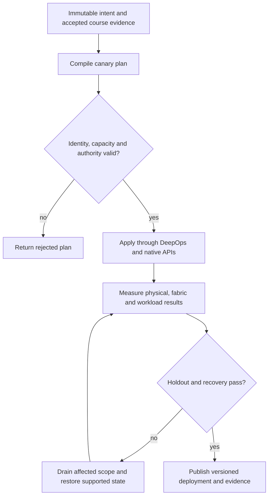

# P02 · Commission a rail in a production workflow

Prerequisites: **all C01–C20**, plus P01.
Level 2/20. This project combines already taught skills; it does not introduce
an untracked prerequisite. Start with `Session.start("P02")` so real DeepOps
reconciliation accompanies this build.

## Deliver the system

Create a rail acceptance service for two scalable units. Generate installation records from NetBox, reconcile through DeepOps, and quarantine any endpoint whose physical and logical identities disagree. Admission consumes only a signed-off rail revision.

Use Incus system containers, patchbay, petgraph, NetBox and native services.
Rusternetes + KWOK provide API/state rehearsal; actual processes provide workload
results. Any unavoidable NVIDIA dependency exception must be qualified and
recorded before use. No such exception is preapproved by this project.

## Guided construction

1. Load the accepted course evidence and inventory revision. Express the system's
   inputs and output contract as immutable Python records or Rust structs.
   Include identity, units, capacity, timeout, ownership and rollback target.
2. Compose the earlier course transformations into an intent compiler. Generate
   the configuration and a before/after diff. Verify that a rejected input has
   produced no partial deployment. Review macro expansion when macros generate effects.
3. Apply the smallest canary through the native/DeepOps adapters. Establish the
   unit-specific observations below, then reconcile again and inspect the no-op result.
4. Add the next failure domain while retaining the same acceptance contract.
   Use independent network and device observations; compare them with scheduler/API state.
5. Exercise a partial failure, recovery and a second workload placement. Retain
   rejected runs. Produce the handover artifacts so another operator can reconstruct
   the exact decision from source, configuration and evidence.

- Join rack, slot, GPU UUID, NIC PCI address and switch port into one rail record. Reject duplicate endpoint ownership before generating native network configuration.
- Use OOB access to collect BMC identity and TPM/boot evidence. Compare the power and cooling envelope with the actual installed parts and site limits.
- Audit cables and optics at both ends: supported part number, speed, breakout mode, firmware and signal/error counters. Obtain supervised physical GPU installation evidence and correlate it with post-install SMI inventory.
- Run the same acceptance workload before and after the trainer moves one logical attachment in the rehearsal graph. Explain why a graph repair cannot certify a real optic, then repeat the physical rail check on the holdout.

## Promotion and rollback flow

## Unit-specific design rationale

A rail is an identity-preserving attachment pattern, not merely another reachable switch. A logical GPU ordinal can change after a rebuild; the physical GPU, NIC PCI function, slot and switch port must still join through stable inventory identities. Keep BMC/OOB management distinct from the workload plane so a data-path failure does not also remove the recovery path.

The drawing is a cable loom: each strand has two recorded endpoints. A matching label is weaker evidence than LLDP/port identity, and both are weaker than physical inspection for a mislabelled optic. TPM state, power feeds, cooling, GPU insertion and signal quality require their own observations. A synthetic SMI record proves parser behavior only. Never energize, reseat or replace hardware from a generic lesson; follow the exact system service procedure with the authorized hardware operator.

Use [C02's executable example](../examples/C02.py) as a small local contract,
then compose it with the previous projects. A constant successful example is not
a production adapter. Repeat the underlying live observations after every
identity, firmware, topology or workload change that invalidates them.

## Reviewable deliverables

- Source and expanded/generated configuration, pinned dependencies and NetBox revision.
- DeepOps report and actual running service/device identities.
- Resource/path/admission invariants, negative isolation checks and a measured workload result.
- Canary, holdout and rollback traces with deadlines and failure ownership.
- Operator runbook, residual limitations and the complete facet evidence table from [C02](../courses/C02.md).

If a new solution requires a new skill, retain the solution and add that skill to
a course before marking the project taught. No production-readiness claim is
valid while its live qualification gates are blocked.
