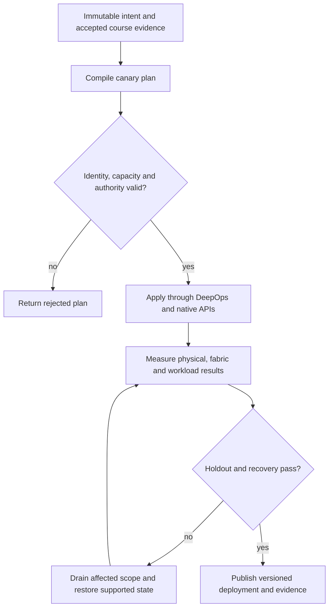

# P03 · Software and payload supply in a production workflow

Prerequisites: **all C01–C20**, plus P02.
Level 3/20. This project combines already taught skills; it does not introduce
an untracked prerequisite. Start with `Session.start("P03")` so real DeepOps
reconciliation accompanies this build.

## Deliver the system

Build a digest-pinned software promotion pipeline for native Incus services. Couple artifact approval to rail compatibility and an actual workload canary. The pipeline must stop on unsupported DeepOps roles and retain the last known-good native package set.

Use Incus system containers, patchbay, petgraph, NetBox and native services.
Rusternetes + KWOK provide API/state rehearsal; actual processes provide workload
results. Any unavoidable NVIDIA dependency exception must be qualified and
recorded before use. No such exception is preapproved by this project.

## Guided construction

1. Load the accepted course evidence and inventory revision. Express the system's
   inputs and output contract as immutable Python records or Rust structs.
   Include identity, units, capacity, timeout, ownership and rollback target.
2. Compose the earlier course transformations into an intent compiler. Generate
   the configuration and a before/after diff. Verify that a rejected input has
   produced no partial deployment. Review macro expansion when macros generate effects.
3. Apply the smallest canary through the native/DeepOps adapters. Establish the
   unit-specific observations below, then reconcile again and inspect the no-op result.
4. Add the next failure domain while retaining the same acceptance contract.
   Use independent network and device observations; compare them with scheduler/API state.
5. Exercise a partial failure, recovery and a second workload placement. Retain
   rejected runs. Produce the handover artifacts so another operator can reconstruct
   the exact decision from source, configuration and evidence.

- Create a compatibility manifest from actual source revisions and binary/library hashes. Provision OS and packages only through a reviewed adapter for the real host distribution.
- Use a temporary canary to install, update and remove the GPU and DOCA userspace packages; record host driver identity separately. Preserve a rollback package set and drain before disruptive changes.
- Install and exercise the NGC client against a permitted payload. Verify digest, entitlement, destination capacity and network path; inject a DNS or TLS failure without changing the payload.
- At the external Docker course station, diagnose a daemon failure separately from toolkit/device injection, then demonstrate a real GPU result. Carry the assessor evidence forward; the Incus exercise installs no Docker daemon.

## Promotion and rollback flow

## Unit-specific design rationale

A tag is a mutable name. A digest identifies bytes; a compatibility record states where those bytes were tested. Neither establishes that the running process loaded the expected driver or library. Record the OS, kernel, GPU driver, CUDA userspace, DOCA host/DPU components and payload digest independently. Incus guests share the host kernel: installing a guest package cannot provide an independent GPU kernel driver.

Teach Docker daemon/toolkit diagnosis and GPU execution in the course's external product station because those are explicit source objectives. The projects and incidents use native processes in Incus. Do not relabel a system container as a Docker demonstration. NGC retrieval failures can arise from credentials, DNS, TLS, routing, storage or digest mismatch; test the layer before replacing the payload. Upstream DeepOps OS support must be checked rather than forged with Ansible facts.

Use [C03's executable example](../examples/C03.py) as a small local contract,
then compose it with the previous projects. A constant successful example is not
a production adapter. Repeat the underlying live observations after every
identity, firmware, topology or workload change that invalidates them.

## Reviewable deliverables

- Source and expanded/generated configuration, pinned dependencies and NetBox revision.
- DeepOps report and actual running service/device identities.
- Resource/path/admission invariants, negative isolation checks and a measured workload result.
- Canary, holdout and rollback traces with deadlines and failure ownership.
- Operator runbook, residual limitations and the complete facet evidence table from [C03](../courses/C03.md).

If a new solution requires a new skill, retain the solution and add that skill to
a course before marking the project taught. No production-readiness claim is
valid while its live qualification gates are blocked.
