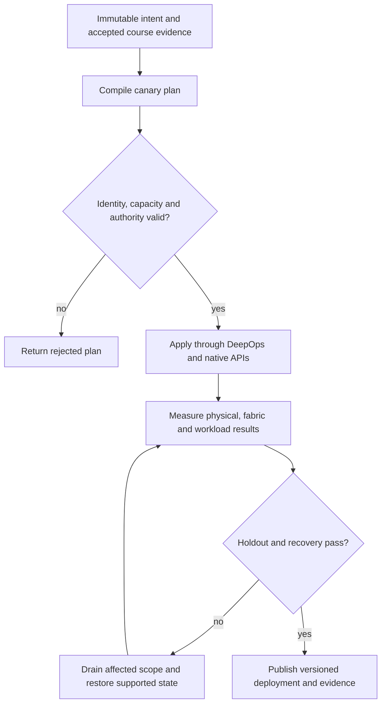

# P04 · Cluster authority and fencing in a production workflow

Prerequisites: **all C01–C20**, plus P03.
Level 4/20. This project combines already taught skills; it does not introduce
an untracked prerequisite. Start with `Session.start("P04")` so real DeepOps
reconciliation accompanies this build.

## Deliver the system

Create a tenant provisioning gateway with a single-writer allocation ledger. The gateway reconciles categories and native Incus services, consumes physical/fabric acceptance and emits operator-readable evidence. A product adapter must be explicitly qualified before BCM completion is recorded.

Use Incus system containers, patchbay, petgraph, NetBox and native services.
Rusternetes + KWOK provide API/state rehearsal; actual processes provide workload
results. Any unavoidable NVIDIA dependency exception must be qualified and
recorded before use. No such exception is preapproved by this project.

## Guided construction

1. Load the accepted course evidence and inventory revision. Express the system's
   inputs and output contract as immutable Python records or Rust structs.
   Include identity, units, capacity, timeout, ownership and rollback target.
2. Compose the earlier course transformations into an intent compiler. Generate
   the configuration and a before/after diff. Verify that a rejected input has
   produced no partial deployment. Review macro expansion when macros generate effects.
3. Apply the smallest canary through the native/DeepOps adapters. Establish the
   unit-specific observations below, then reconcile again and inspect the no-op result.
4. Add the next failure domain while retaining the same acceptance contract.
   Use independent network and device observations; compare them with scheduler/API state.
5. Exercise a partial failure, recovery and a second workload placement. Retain
   rejected runs. Produce the handover artifacts so another operator can reconstruct
   the exact decision from source, configuration and evidence.

- Install/configure the licensed product in its supported course station and record exact versions. Use DeepOps for the surrounding host intent; identify each tool owner explicitly.
- Create least-privilege accounts and roles. Test one allowed and one denied provisioning/allocation action for each role; retain the denied API response.
- Build categories for physical inventory and workload purpose. Associate node, DPU and switch intent, then compare Slurm and Kubernetes-oriented allocation views with independent workload observations.
- Configure and verify supported BCM HA. Fence the old writer, fail the active controller and check a fresh write through the successor. Recheck Base View utilization, performance and health without treating a stale green tile as recovery.

## Promotion and rollback flow

## Unit-specific design rationale

A controller holds a lease to change a resource; possession of a dashboard session is not that lease. Express identity as subject, resource and permitted operation. An admission request may read several categories, but only one active owner may write a given allocation. A failed controller must be fenced before its successor acts. A timeout alone does not prove that the old writer stopped.

Mission Control, Base View and BCM have different responsibilities and require actual product observations. Build categories from hardware and workload needs; do not assume category labels enforce network isolation. Separate reported utilization, measured performance and health. A BCM service can be reachable while scheduling, node provisioning or a DPU/switch workflow remains unhealthy.

Use [C04's executable example](../examples/C04.py) as a small local contract,
then compose it with the previous projects. A constant successful example is not
a production adapter. Repeat the underlying live observations after every
identity, firmware, topology or workload change that invalidates them.

## Reviewable deliverables

- Source and expanded/generated configuration, pinned dependencies and NetBox revision.
- DeepOps report and actual running service/device identities.
- Resource/path/admission invariants, negative isolation checks and a measured workload result.
- Canary, holdout and rollback traces with deadlines and failure ownership.
- Operator runbook, residual limitations and the complete facet evidence table from [C04](../courses/C04.md).

If a new solution requires a new skill, retain the solution and add that skill to
a course before marking the project taught. No production-readiness claim is
valid while its live qualification gates are blocked.
