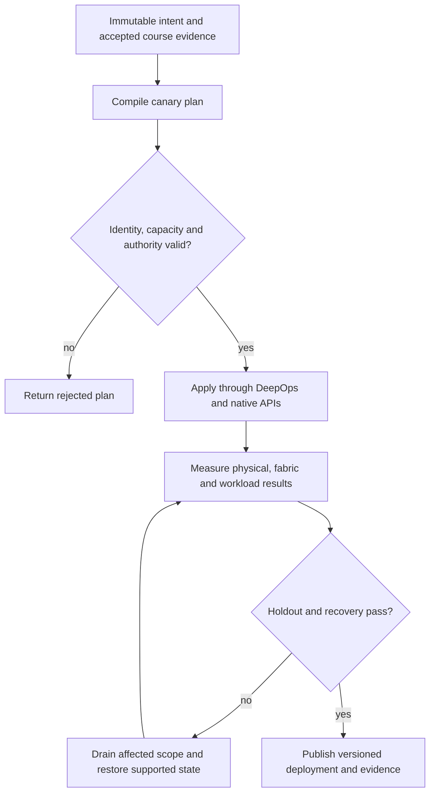

# P05 · Routed tenant boundaries in a production workflow

Prerequisites: **all C01–C20**, plus P04.
Level 5/20. This project combines already taught skills; it does not introduce
an untracked prerequisite. Start with `Session.start("P05")` so real DeepOps
reconciliation accompanies this build.

## Deliver the system

Build a two-rack tenant fabric compiler with staged rollout and rollback. Combine C02 rail identities, C04 authority and C05 overlay intent; admit workloads only when the physical path and negative isolation probes agree.

Use Incus system containers, patchbay, petgraph, NetBox and native services.
Rusternetes + KWOK provide API/state rehearsal; actual processes provide workload
results. Any unavoidable NVIDIA dependency exception must be qualified and
recorded before use. No such exception is preapproved by this project.

## Guided construction

1. Load the accepted course evidence and inventory revision. Express the system's
   inputs and output contract as immutable Python records or Rust structs.
   Include identity, units, capacity, timeout, ownership and rollback target.
2. Compose the earlier course transformations into an intent compiler. Generate
   the configuration and a before/after diff. Verify that a rejected input has
   produced no partial deployment. Review macro expansion when macros generate effects.
3. Apply the smallest canary through the native/DeepOps adapters. Establish the
   unit-specific observations below, then reconcile again and inspect the no-op result.
4. Add the next failure domain while retaining the same acceptance contract.
   Use independent network and device observations; compare them with scheduler/API state.
5. Exercise a partial failure, recovery and a second workload placement. Retain
   rejected runs. Produce the handover artifacts so another operator can reconstruct
   the exact decision from source, configuration and evidence.

- Declare two tenants with distinct VNI, subnet and route-target identities; check collisions as a pure function before rendering NVUE templates.
- Apply the native Linux/FRR rehearsal through DeepOps-backed automation. On the product station, apply the corresponding NVUE and Ansible VLAN/RoCE intent and read back its effective state.
- Probe same-tenant reachability and cross-tenant denial from independent endpoints. Capture BGP/EVPN route and neighbor evidence alongside the workload request ID.
- Withdraw one path and repeat both permitted and forbidden probes. Reapply identical intent and compare the change set; a no-op must not erase the isolation test.

## Promotion and rollback flow

## Unit-specific design rationale

A route advertises reachability; a tenant boundary constrains who may use that reachability. Keep underlay adjacency, overlay membership and workload authorization separate. An established BGP session does not prove correct EVPN route import/export. A permitted route target is not a substitute for testing forbidden traffic.

Compile tenant declarations into reviewed NVUE/Ansible intent, then compare intended and observed state. The simulator graph models topology, and Linux/FRR can exercise selected routing behaviors. Neither implements every Spectrum ASIC or NVUE behavior. Teach idempotence as a postcondition: the second reconciliation produces no new change, while an unauthorized flow remains denied after both runs.

Use [C05's executable example](../examples/C05.py) as a small local contract,
then compose it with the previous projects. A constant successful example is not
a production adapter. Repeat the underlying live observations after every
identity, firmware, topology or workload change that invalidates them.

## Reviewable deliverables

- Source and expanded/generated configuration, pinned dependencies and NetBox revision.
- DeepOps report and actual running service/device identities.
- Resource/path/admission invariants, negative isolation checks and a measured workload result.
- Canary, holdout and rollback traces with deadlines and failure ownership.
- Operator runbook, residual limitations and the complete facet evidence table from [C05](../courses/C05.md).

If a new solution requires a new skill, retain the solution and add that skill to
a course before marking the project taught. No production-readiness claim is
valid while its live qualification gates are blocked.
