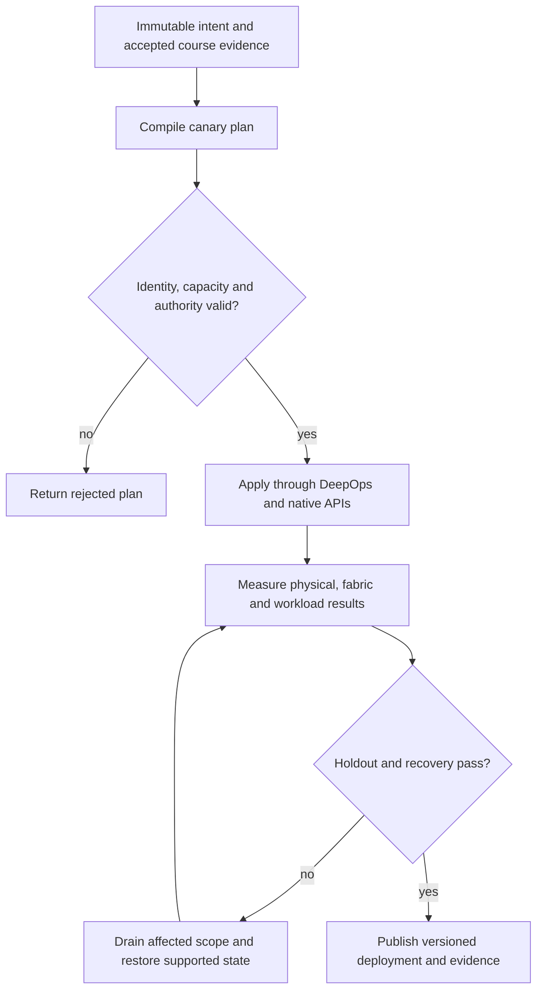

# P06 · Congestion without deadlock in a production workflow

Prerequisites: **all C01–C20**, plus P05.
Level 6/20. This project combines already taught skills; it does not introduce
an untracked prerequisite. Start with `Session.start("P06")` so real DeepOps
reconciliation accompanies this build.

## Deliver the system

Create a congestion policy compiler that emits both switch configuration and an experiment matrix. Combine tenant isolation, GPU placement and job admission; promote only policies that meet useful-work and recovery objectives across independent incasts.

Use Incus system containers, patchbay, petgraph, NetBox and native services.
Rusternetes + KWOK provide API/state rehearsal; actual processes provide workload
results. Any unavoidable NVIDIA dependency exception must be qualified and
recorded before use. No such exception is preapproved by this project.

## Guided construction

1. Load the accepted course evidence and inventory revision. Express the system's
   inputs and output contract as immutable Python records or Rust structs.
   Include identity, units, capacity, timeout, ownership and rollback target.
2. Compose the earlier course transformations into an intent compiler. Generate
   the configuration and a before/after diff. Verify that a rejected input has
   produced no partial deployment. Review macro expansion when macros generate effects.
3. Apply the smallest canary through the native/DeepOps adapters. Establish the
   unit-specific observations below, then reconcile again and inspect the no-op result.
4. Add the next failure domain while retaining the same acceptance contract.
   Use independent network and device observations; compare them with scheduler/API state.
5. Exercise a partial failure, recovery and a second workload placement. Retain
   rejected runs. Produce the handover artifacts so another operator can reconstruct
   the exact decision from source, configuration and evidence.

- Fix workload placement and collect a baseline with offered load, useful throughput, completion latency, queue/mark/drop counters and pause durations.
- Calculate the illustrative headroom lower bound in bytes. Compare it with the documented allocation rules for the actual switch; record the difference rather than rounding toward a desired answer.
- Apply QoS, ECN, PFC and adaptive-routing changes one at a time through versioned automation. Observe which counters should change and which workload results must remain correct.
- Introduce an incast and a path loss. Confirm that congestion recovery preserves progress for other priorities and tenants. Roll back a policy that avoids drops by stopping useful work.

## Promotion and rollback flow

## Unit-specific design rationale

ECN asks a congestion-control loop to reduce offered load. PFC pauses a selected priority at a link; it is not end-to-end congestion control. A configuration that prevents one drop can still create pause propagation, unfairness or deadlock. Link utilization alone cannot distinguish useful throughput from stalled work.

The reservoir drawing represents queue occupancy, not a literal shared ASIC implementation. The headroom example estimates bytes arriving while a sender reacts plus one in-flight frame. Real allocation also depends on the exact ASIC, cable delay, MTU, pipeline and buffer policy. Spectrum-X adaptive routing and SuperNIC behavior require product measurements; tc netem provides delay/rate/fault emulation and must never be reported as PFC or ECN ASIC validation.

Use [C06's executable example](../examples/C06.py) as a small local contract,
then compose it with the previous projects. A constant successful example is not
a production adapter. Repeat the underlying live observations after every
identity, firmware, topology or workload change that invalidates them.

## Reviewable deliverables

- Source and expanded/generated configuration, pinned dependencies and NetBox revision.
- DeepOps report and actual running service/device identities.
- Resource/path/admission invariants, negative isolation checks and a measured workload result.
- Canary, holdout and rollback traces with deadlines and failure ownership.
- Operator runbook, residual limitations and the complete facet evidence table from [C06](../courses/C06.md).

If a new solution requires a new skill, retain the solution and add that skill to
a course before marking the project taught. No production-readiness claim is
valid while its live qualification gates are blocked.
