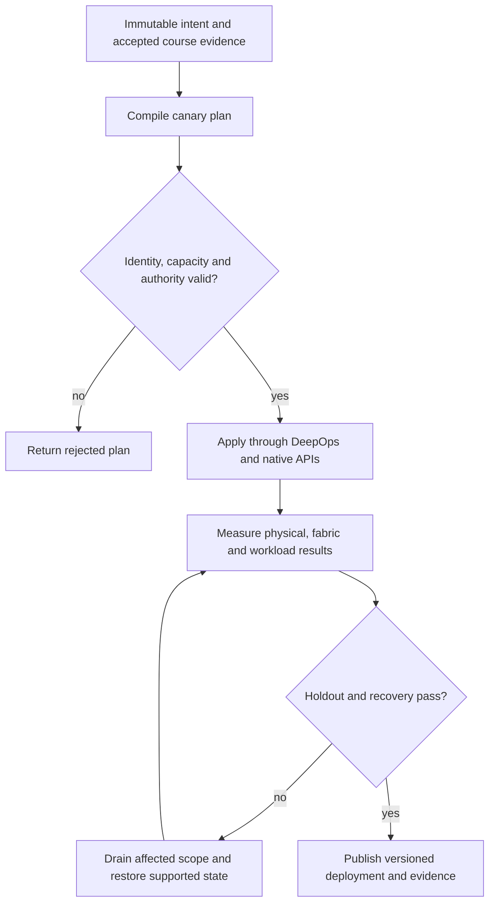

# P07 · InfiniBand membership and failover in a production workflow

Prerequisites: **all C01–C20**, plus P06.
Level 7/20. This project combines already taught skills; it does not introduce
an untracked prerequisite. Start with `Session.start("P07")` so real DeepOps
reconciliation accompanies this build.

## Deliver the system

Build a tenant-aware IB acceptance pipeline that joins physical port identity, PKey policy, UFM state and Slurm admission. Use ibsim for preflight, then require independent native measurements before promotion.

Use Incus system containers, patchbay, petgraph, NetBox and native services.
Rusternetes + KWOK provide API/state rehearsal; actual processes provide workload
results. Any unavoidable NVIDIA dependency exception must be qualified and
recorded before use. No such exception is preapproved by this project.

## Guided construction

1. Load the accepted course evidence and inventory revision. Express the system's
   inputs and output contract as immutable Python records or Rust structs.
   Include identity, units, capacity, timeout, ownership and rollback target.
2. Compose the earlier course transformations into an intent compiler. Generate
   the configuration and a before/after diff. Verify that a rejected input has
   produced no partial deployment. Review macro expansion when macros generate effects.
3. Apply the smallest canary through the native/DeepOps adapters. Establish the
   unit-specific observations below, then reconcile again and inspect the no-op result.
4. Add the next failure domain while retaining the same acceptance contract.
   Use independent network and device observations; compare them with scheduler/API state.
5. Exercise a partial failure, recovery and a second workload placement. Retain
   rejected runs. Produce the handover artifacts so another operator can reconstruct
   the exact decision from source, configuration and evidence.

- Provision a reviewed fabric and its supported management HA configuration. Record active/standby manager identities and test takeover without competing active authorities.
- Generate PKey membership from tenant intent. Test full/full, full/limited, limited/limited and different-partition cases before admitting the workload.
- Collect ibstat, ibnodes and iblinkinfo for identities/state, ibdiagnet for diagnostics, ibping for a management reachability probe, and ib_write_lat/ib_write_bw for distinct data-path measurements. Use Python subprocess arrays only behind an evidence adapter.
- Change QoS and adaptive routing with a fixed placement; observe UFM link-state/bandwidth and the workload result. Repeat after a manager or link failover and verify forbidden membership remains forbidden.

## Promotion and rollback flow

## Unit-specific design rationale

InfiniBand reachability requires more than an active physical link. The subnet manager supplies fabric configuration; partition membership restricts communication. A PKey combines a partition identity with a membership bit. Limited members of the same partition cannot communicate directly with each other; at least one endpoint must be a full member. Do not infer tenant isolation from equal low bits alone.

Keep fabric-management simulation, verbs execution and UFM product evidence separate. ibsim can exercise management behavior; the existing software Fabric checks memory regions and completion rules; native rust-ibverbs requires real supported devices. Latency and bandwidth tools answer different questions. A successful ibping cannot certify RDMA bandwidth or workload completion.

Use [C07's executable example](../examples/C07.py) as a small local contract,
then compose it with the previous projects. A constant successful example is not
a production adapter. Repeat the underlying live observations after every
identity, firmware, topology or workload change that invalidates them.

## Reviewable deliverables

- Source and expanded/generated configuration, pinned dependencies and NetBox revision.
- DeepOps report and actual running service/device identities.
- Resource/path/admission invariants, negative isolation checks and a measured workload result.
- Canary, holdout and rollback traces with deadlines and failure ownership.
- Operator runbook, residual limitations and the complete facet evidence table from [C07](../courses/C07.md).

If a new solution requires a new skill, retain the solution and add that skill to
a course before marking the project taught. No production-readiness claim is
valid while its live qualification gates are blocked.
