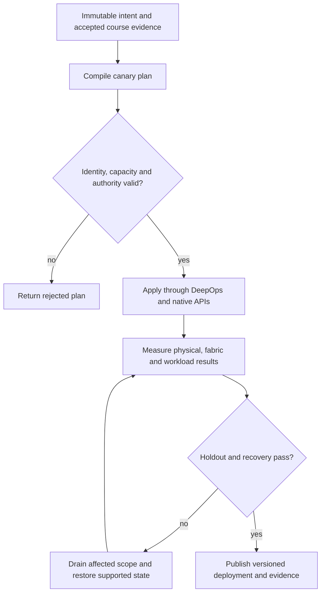

# P08 · DPU control and data ownership in a production workflow

Prerequisites: **all C01–C20**, plus P07.
Level 8/20. This project combines already taught skills; it does not introduce
an untracked prerequisite. Start with `Session.start("P08")` so real DeepOps
reconciliation accompanies this build.

## Deliver the system

Build a versioned DPU service rollout across two failure domains. Combine supply-chain approval, fabric isolation and GPU job draining. The service canary must prove both packet behavior and a real workload result before fleet promotion.

Use Incus system containers, patchbay, petgraph, NetBox and native services.
Rusternetes + KWOK provide API/state rehearsal; actual processes provide workload
results. Any unavoidable NVIDIA dependency exception must be qualified and
recorded before use. No such exception is preapproved by this project.

## Guided construction

1. Load the accepted course evidence and inventory revision. Express the system's
   inputs and output contract as immutable Python records or Rust structs.
   Include identity, units, capacity, timeout, ownership and rollback target.
2. Compose the earlier course transformations into an intent compiler. Generate
   the configuration and a before/after diff. Verify that a rejected input has
   produced no partial deployment. Review macro expansion when macros generate effects.
3. Apply the smallest canary through the native/DeepOps adapters. Establish the
   unit-specific observations below, then reconcile again and inspect the no-op result.
4. Add the next failure domain while retaining the same acceptance contract.
   Use independent network and device observations; compare them with scheduler/API state.
5. Exercise a partial failure, recovery and a second workload placement. Retain
   rejected runs. Produce the handover artifacts so another operator can reconstruct
   the exact decision from source, configuration and evidence.

- Inventory host PCI identity, BlueField generation, DPU mode and firmware. Establish an independent management path and recovery procedure before applying a BFB or disruptive configuration.
- Install matching supported DOCA components on host and DPU through reviewed automation. Deploy an actual Arm service and capture its process identity and lifecycle.
- Observe a permitted and a denied packet path using representor/counter evidence appropriate to the selected mode. Distinguish software forwarding from hardware offload.
- Configure SuperNIC packet-processing and congestion behavior on the supported product. Correlate its observations with host GPU workload progress, then test host-service and DPU-service failures separately.

## Promotion and rollback flow

## Unit-specific design rationale

The host CPU, BlueField Arm subsystem and NIC datapath are distinct execution and authority domains. A command issued on the host does not imply that an Arm service was updated. A packet crossing a representor does not by itself prove the expected offload. State the DPU mode and supported ownership model before changing host/DPU software.

Treat the DPU as a customs station with two control desks and a forwarding lane. The picture must not imply that every packet traverses Arm userspace. Record firmware, host driver, DPU OS/DOCA and service revisions separately. A rollback must restore a compatible set, not just one package. Network isolation and workload admission must agree about who owns the offloaded resources.

Use [C08's executable example](../examples/C08.py) as a small local contract,
then compose it with the previous projects. A constant successful example is not
a production adapter. Repeat the underlying live observations after every
identity, firmware, topology or workload change that invalidates them.

## Reviewable deliverables

- Source and expanded/generated configuration, pinned dependencies and NetBox revision.
- DeepOps report and actual running service/device identities.
- Resource/path/admission invariants, negative isolation checks and a measured workload result.
- Canary, holdout and rollback traces with deadlines and failure ownership.
- Operator runbook, residual limitations and the complete facet evidence table from [C08](../courses/C08.md).

If a new solution requires a new skill, retain the solution and add that skill to
a course before marking the project taught. No production-readiness claim is
valid while its live qualification gates are blocked.
