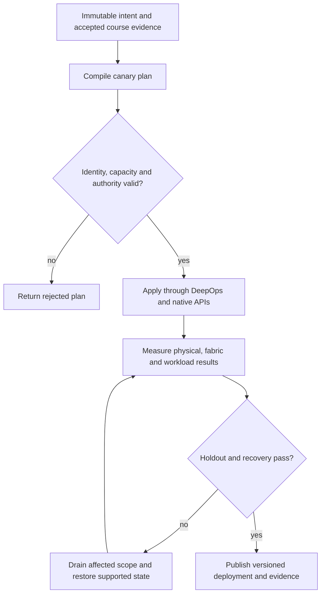

# P09 · Kubernetes API and real execution in a production workflow

Prerequisites: **all C01–C20**, plus P08.
Level 9/20. This project combines already taught skills; it does not introduce
an untracked prerequisite. Start with `Session.start("P09")` so real DeepOps
reconciliation accompanies this build.

## Deliver the system

Build a Rusternetes scheduling rehearsal linked to a native Incus inference service. Export API scale tests to KWOK, while physical service acceptance consumes real process/GPU/network observations. Maintain a compatibility report for every NVIDIA operator feature used.

Use Incus system containers, patchbay, petgraph, NetBox and native services.
Rusternetes + KWOK provide API/state rehearsal; actual processes provide workload
results. Any unavoidable NVIDIA dependency exception must be qualified and
recorded before use. No such exception is preapproved by this project.

## Guided construction

1. Load the accepted course evidence and inventory revision. Express the system's
   inputs and output contract as immutable Python records or Rust structs.
   Include identity, units, capacity, timeout, ownership and rollback target.
2. Compose the earlier course transformations into an intent compiler. Generate
   the configuration and a before/after diff. Verify that a rejected input has
   produced no partial deployment. Review macro expansion when macros generate effects.
3. Apply the smallest canary through the native/DeepOps adapters. Establish the
   unit-specific observations below, then reconcile again and inspect the no-op result.
4. Add the next failure domain while retaining the same acceptance contract.
   Use independent network and device observations; compare them with scheduler/API state.
5. Exercise a partial failure, recovery and a second workload placement. Retain
   rejected runs. Produce the handover artifacts so another operator can reconstruct
   the exact decision from source, configuration and evidence.

- Use DeepOps-backed host reconciliation, then start pinned etcd and Rusternetes services natively inside the control container. Select its TLS kubeconfig explicitly through kr8s.
- Generate tainted synthetic worker objects with integrations.incus.services.worker_objects. Create them with ncp_lab.cluster.Cluster; test that a normal workload cannot accidentally be treated as executed by KWOK.
- Probe API create/read/watch/update/delete and RBAC denial. In the product course station, install/initialize the supported cluster and deploy Network Operator for RDMA/InfiniBand; inspect reconciliation and device/network evidence.
- Deploy inference as a native Incus service for the project route. Compare API status, process identity and actual response separately; kill the process while leaving a synthetic Running object and require detection.

## Promotion and rollback flow

## Unit-specific design rationale

The API records desired and observed objects. A scheduler selects placement; a controller reconciles objects; a worker executes the payload. Rusternetes supplies the selected control plane. KWOK simulates worker lifecycle and status. A KWOK Running pod is not a CUDA process, and creating a GPU resource field does not allocate a physical GPU.

Use a dispatch board for API state and a workshop floor for native Incus processes. Keep the arrow between them explicit: the native workload adapter, not KWOK, launches the process. NVIDIA Network Operator and BCM Kubernetes bootstrap objectives still require original-product course evidence. Test discovery, watches, status subresources, RBAC, CRDs and admission compatibility before claiming an operator runs on Rusternetes. Unsupported behavior is blocked, not silently replaced by success.

Use [C09's executable example](../examples/C09.py) as a small local contract,
then compose it with the previous projects. A constant successful example is not
a production adapter. Repeat the underlying live observations after every
identity, firmware, topology or workload change that invalidates them.

## Reviewable deliverables

- Source and expanded/generated configuration, pinned dependencies and NetBox revision.
- DeepOps report and actual running service/device identities.
- Resource/path/admission invariants, negative isolation checks and a measured workload result.
- Canary, holdout and rollback traces with deadlines and failure ownership.
- Operator runbook, residual limitations and the complete facet evidence table from [C09](../courses/C09.md).

If a new solution requires a new skill, retain the solution and add that skill to
a course before marking the project taught. No production-readiness claim is
valid while its live qualification gates are blocked.
