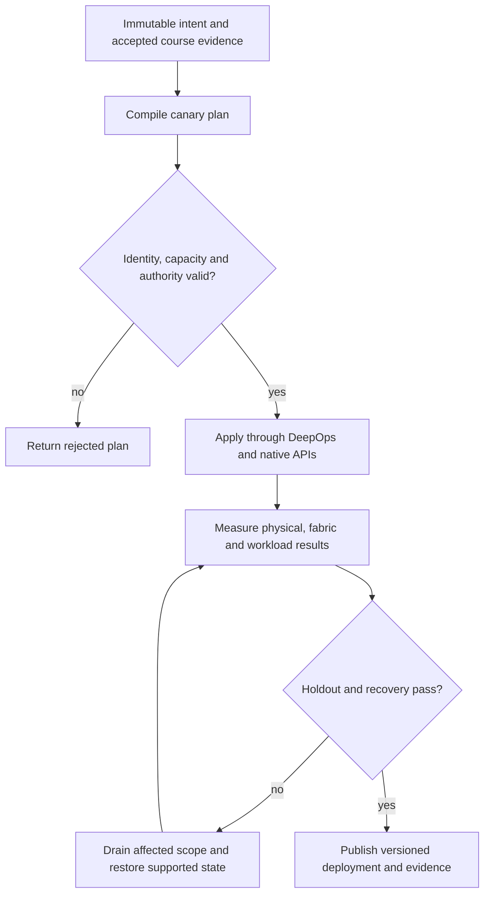

# P10 · Slurm admission and locality in a production workflow

Prerequisites: **all C01–C20**, plus P09.
Level 10/20. This project combines already taught skills; it does not introduce
an untracked prerequisite. Start with `Session.start("P10")` so real DeepOps
reconciliation accompanies this build.

## Deliver the system

Build a code-generated Slurm training service over the native Incus lab. Join scheduler accounts, GPU/NIC locality and dataset access; retain a qualified Enroot/Pyxis path where applicable without installing Docker.

Use Incus system containers, patchbay, petgraph, NetBox and native services.
Rusternetes + KWOK provide API/state rehearsal; actual processes provide workload
results. Any unavoidable NVIDIA dependency exception must be qualified and
recorded before use. No such exception is preapproved by this project.

## Guided construction

1. Load the accepted course evidence and inventory revision. Express the system's
   inputs and output contract as immutable Python records or Rust structs.
   Include identity, units, capacity, timeout, ownership and rollback target.
2. Compose the earlier course transformations into an intent compiler. Generate
   the configuration and a before/after diff. Verify that a rejected input has
   produced no partial deployment. Review macro expansion when macros generate effects.
3. Apply the smallest canary through the native/DeepOps adapters. Establish the
   unit-specific observations below, then reconcile again and inspect the no-op result.
4. Add the next failure domain while retaining the same acceptance contract.
   Use independent network and device observations; compare them with scheduler/API state.
5. Exercise a partial failure, recovery and a second workload placement. Retain
   rejected runs. Produce the handover artifacts so another operator can reconstruct
   the exact decision from source, configuration and evidence.

- Inspect the pinned DeepOps Slurm playbook and role inputs. Build a supported course station or qualify the native OS adapter; record installation, controller/worker services and their actual revisions.
- Generate categories, interfaces and GRES from stable physical inventory. Submit one allowed and one rejected allocation using the scheduler API or a narrow Python adapter.
- Deploy a small real training payload through Slurm. When Enroot/Pyxis is used, record the payload identity, mount/device visibility and process ancestry independently of the allocation response.
- Drain one rail, resubmit under a new placement and verify no job escapes its resource grant. Correlate completion with the actual network and storage paths, then recover the drained capacity.

## Promotion and rollback flow

## Unit-specific design rationale

A Slurm allocation grants scheduler resources; it does not prove that the selected device, NIC and storage path are usable. GRES identity must correspond to the actual visible GPU or MIG device. Node categories and interfaces constrain placement, while partitions and accounts constrain admission. Preserve their distinct meanings in generated configuration.

Use a loading permit for allocation and a crane for execution. Enroot prepares a userspace environment and Pyxis integrates it with Slurm; neither replaces the host GPU driver or creates a new physical GPU. Real DeepOps Slurm roles must be run on a supported or qualified adapted OS. The current CachyOS role port remains a release gate; do not overwrite distribution facts to make upstream tasks appear supported.

Use [C10's executable example](../examples/C10.py) as a small local contract,
then compose it with the previous projects. A constant successful example is not
a production adapter. Repeat the underlying live observations after every
identity, firmware, topology or workload change that invalidates them.

## Reviewable deliverables

- Source and expanded/generated configuration, pinned dependencies and NetBox revision.
- DeepOps report and actual running service/device identities.
- Resource/path/admission invariants, negative isolation checks and a measured workload result.
- Canary, holdout and rollback traces with deadlines and failure ownership.
- Operator runbook, residual limitations and the complete facet evidence table from [C10](../courses/C10.md).

If a new solution requires a new skill, retain the solution and add that skill to
a course before marking the project taught. No production-readiness claim is
valid while its live qualification gates are blocked.
