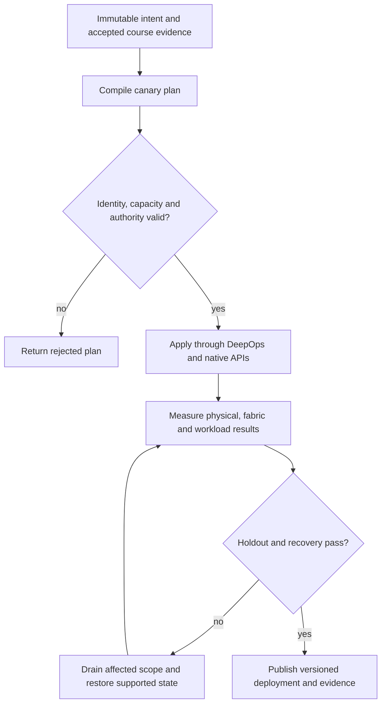

# P11 · Team quotas across schedulers in a production workflow

Prerequisites: **all C01–C20**, plus P10.
Level 11/20. This project combines already taught skills; it does not introduce
an untracked prerequisite. Start with `Session.start("P11")` so real DeepOps
reconciliation accompanies this build.

## Deliver the system

Build a two-service GPU tenancy controller with an inference SLO and a checkpointable training queue. Integrate C04 authority, C06 congestion, C10 scheduling and the shared quota ledger. Rusternetes + KWOK rehearse scale; native Incus processes establish actual execution.

Use Incus system containers, patchbay, petgraph, NetBox and native services.
Rusternetes + KWOK provide API/state rehearsal; actual processes provide workload
results. Any unavoidable NVIDIA dependency exception must be qualified and
recorded before use. No such exception is preapproved by this project.

## Guided construction

1. Load the accepted course evidence and inventory revision. Express the system's
   inputs and output contract as immutable Python records or Rust structs.
   Include identity, units, capacity, timeout, ownership and rollback target.
2. Compose the earlier course transformations into an intent compiler. Generate
   the configuration and a before/after diff. Verify that a rejected input has
   produced no partial deployment. Review macro expansion when macros generate effects.
3. Apply the smallest canary through the native/DeepOps adapters. Establish the
   unit-specific observations below, then reconcile again and inspect the no-op result.
4. Add the next failure domain while retaining the same acceptance contract.
   Use independent network and device observations; compare them with scheduler/API state.
5. Exercise a partial failure, recovery and a second workload placement. Retain
   rejected runs. Produce the handover artifacts so another operator can reconstruct
   the exact decision from source, configuration and evidence.

- Install and administer the supported Run:ai product in the course station. Record identity, project policy and the actual inference/training deployment paths.
- Create a common physical resource ledger and separate scheduler views. Generate team policy for Run:ai, Slurm and Kubernetes-oriented admission; prevent simultaneous ownership of the same device.
- Measure inference latency and training progress before borrowing idle quota. Preempt through the supported API, verify checkpoint/restart behavior and observe actual resource release.
- Repeat under a fabric bottleneck. Explain why a quota increase cannot cure a congested path, and show that a failed preemption does not manufacture free capacity in the ledger.

## Promotion and rollback flow

## Unit-specific design rationale

A team budget must have one authoritative owner even when several schedulers expose it. Adding the same physical GPU to Slurm and a Kubernetes-oriented scheduler does not double capacity. Distinguish a quota, a reservation, a running allocation and observed utilization. A borrowed idle resource may need to be returned before a higher-priority request starts.

The shared ledger is a scale with conserved weights. It is an accounting analogy: it does not assert that all Run:ai allocation policies are equivalent to simple integer division. Training favors sustained throughput; inference may require a tail-latency objective. Preemption is a workload transition with checkpoint and recovery consequences, not only a subtraction from a counter.

Use [C11's executable example](../examples/C11.py) as a small local contract,
then compose it with the previous projects. A constant successful example is not
a production adapter. Repeat the underlying live observations after every
identity, firmware, topology or workload change that invalidates them.

## Reviewable deliverables

- Source and expanded/generated configuration, pinned dependencies and NetBox revision.
- DeepOps report and actual running service/device identities.
- Resource/path/admission invariants, negative isolation checks and a measured workload result.
- Canary, holdout and rollback traces with deadlines and failure ownership.
- Operator runbook, residual limitations and the complete facet evidence table from [C11](../courses/C11.md).

If a new solution requires a new skill, retain the solution and add that skill to
a course before marking the project taught. No production-readiness claim is
valid while its live qualification gates are blocked.
