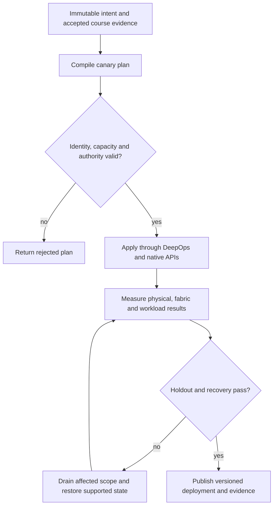

# P12 · MIG geometry and disruption in a production workflow

Prerequisites: **all C01–C20**, plus P11.
Level 12/20. This project combines already taught skills; it does not introduce
an untracked prerequisite. Start with `Session.start("P12")` so real DeepOps
reconciliation accompanies this build.

## Deliver the system

Build a MIG reconfiguration controller with a two-phase drain/apply protocol. It must bind the placement catalogue to GPU identity, coordinate fabric placement and resume only after scheduler inventory and native workload evidence agree.

Use Incus system containers, patchbay, petgraph, NetBox and native services.
Rusternetes + KWOK provide API/state rehearsal; actual processes provide workload
results. Any unavoidable NVIDIA dependency exception must be qualified and
recorded before use. No such exception is preapproved by this project.

## Guided construction

1. Load the accepted course evidence and inventory revision. Express the system's
   inputs and output contract as immutable Python records or Rust structs.
   Include identity, units, capacity, timeout, ownership and rollback target.
2. Compose the earlier course transformations into an intent compiler. Generate
   the configuration and a before/after diff. Verify that a rejected input has
   produced no partial deployment. Review macro expansion when macros generate effects.
3. Apply the smallest canary through the native/DeepOps adapters. Establish the
   unit-specific observations below, then reconcile again and inspect the no-op result.
4. Add the next failure domain while retaining the same acceptance contract.
   Use independent network and device observations; compare them with scheduler/API state.
5. Exercise a partial failure, recovery and a second workload placement. Retain
   rejected runs. Produce the handover artifacts so another operator can reconstruct
   the exact decision from source, configuration and evidence.

- Read the physical GPU model, supported profiles and placement options from actual product tooling. Save that catalogue with the driver revision; never reuse an A100 catalogue for an unrelated model.
- Compile requested partitions against the catalogue. Reject an unsupported arrangement even when the sum of advertised memory or slices appears to fit.
- Drain affected allocations and confirm users have released the device. Apply the supported MIG transition, rediscover GI/CI identifiers and regenerate scheduler resource advertisements.
- Run AI and HPC acceptance workloads over the intended NIC/storage path. Compare isolation and performance, then restore the original layout and reject a stale pre-change device identity.

## Promotion and rollback flow

## Unit-specific design rationale

A MIG profile is a supported partition shape on a particular GPU model. GPU instances partition relevant device resources; compute instances subdivide compute within a GPU instance. Memory-size arithmetic alone does not establish a legal layout. Consult the model-specific profile and placement catalogue, and record the generated GI/CI identities after each change.

Use a machined tray for placement: enough total area does not imply that every shape fits every slot. This is a geometry analogy, not an assertion that all resources have identical boundaries. Drain active users before disruptive reconfiguration and refresh scheduler/device inventory afterward. Test both AI and HPC workload behavior; do not assume a profile appropriate for inference preserves a collective application's requirements.

Use [C12's executable example](../examples/C12.py) as a small local contract,
then compose it with the previous projects. A constant successful example is not
a production adapter. Repeat the underlying live observations after every
identity, firmware, topology or workload change that invalidates them.

## Reviewable deliverables

- Source and expanded/generated configuration, pinned dependencies and NetBox revision.
- DeepOps report and actual running service/device identities.
- Resource/path/admission invariants, negative isolation checks and a measured workload result.
- Canary, holdout and rollback traces with deadlines and failure ownership.
- Operator runbook, residual limitations and the complete facet evidence table from [C12](../courses/C12.md).

If a new solution requires a new skill, retain the solution and add that skill to
a course before marking the project taught. No production-readiness claim is
valid while its live qualification gates are blocked.
