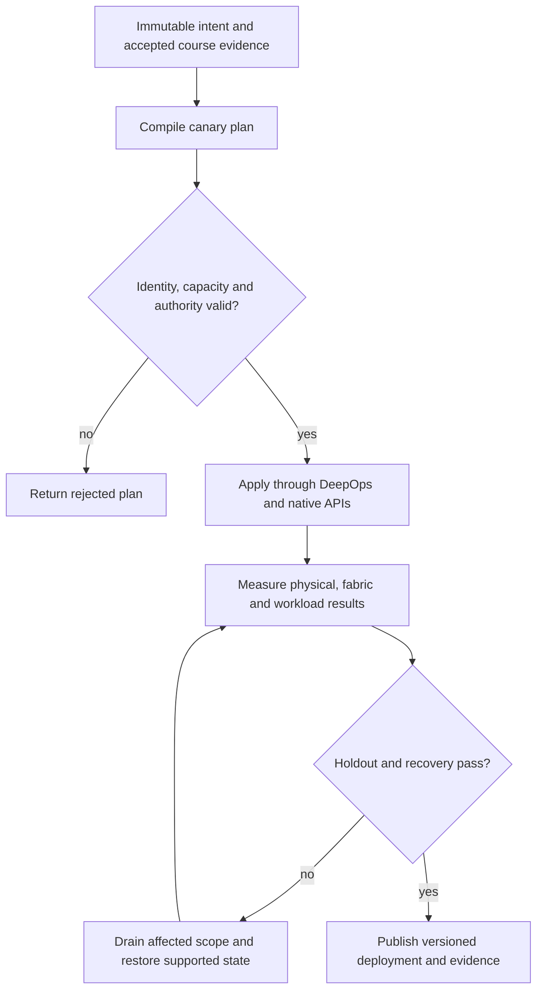

# P13 · Storage to GPU lifetime in a production workflow

Prerequisites: **all C01–C20**, plus P12.
Level 13/20. This project combines already taught skills; it does not introduce
an untracked prerequisite. Start with `Session.start("P13")` so real DeepOps
reconciliation accompanies this build.

## Deliver the system

Build a versioned dataset and checkpoint service for training. Combine C03 artifact identity, C05 isolation, C10 admission and C13 buffer/durability rules. Expose an explicit recovery-point contract and verify it under interrupted writes.

Use Incus system containers, patchbay, petgraph, NetBox and native services.
Rusternetes + KWOK provide API/state rehearsal; actual processes provide workload
results. Any unavoidable NVIDIA dependency exception must be qualified and
recorded before use. No such exception is preapproved by this project.

## Guided construction

1. Load the accepted course evidence and inventory revision. Express the system's
   inputs and output contract as immutable Python records or Rust structs.
   Include identity, units, capacity, timeout, ownership and rollback target.
2. Compose the earlier course transformations into an intent compiler. Generate
   the configuration and a before/after diff. Verify that a rejected input has
   produced no partial deployment. Review macro expansion when macros generate effects.
3. Apply the smallest canary through the native/DeepOps adapters. Establish the
   unit-specific observations below, then reconcile again and inspect the no-op result.
4. Add the next failure domain while retaining the same acceptance contract.
   Use independent network and device observations; compare them with scheduler/API state.
5. Exercise a partial failure, recovery and a second workload placement. Retain
   rejected runs. Produce the handover artifacts so another operator can reconstruct
   the exact decision from source, configuration and evidence.

- Compute working-set, checkpoint, retention and recovery capacity from explicit units. Install/configure the actual storage service using its supported third-party parameters and DeepOps-managed host mounts.
- Run sequential, random and concurrent acceptance loads with recorded block sizes, queue depth, dataset identity and cache conditions. Compare latency distributions and sustained throughput rather than one warm-cache sample.
- Trace Magnum IO/GDS path selection, buffer registration and completion. Introduce a controlled unsupported alignment or path condition and observe the documented failure/fallback behavior without labelling it direct DMA.
- Corrupt or truncate a test object, reject its checksum, restore it and verify a real GPU consumer. Repeat with a slower network path and distinguish storage, transport and compute bottlenecks.

## Promotion and rollback flow

## Unit-specific design rationale

A storage read has at least four separate obligations: locate the intended bytes, transport them through an authorized path, place them in a live destination buffer and establish completion before consuming them. Completion of a transfer does not automatically mean application consumption or durable storage. Keep the owner of a registered buffer alive until the relevant completion rule permits release.

GPUDirect Storage can avoid a CPU bounce buffer on a supported path. Fallback can still return correct bytes while changing CPU use and throughput. Diagnose correctness first, then prove which path executed. The existing simulator Fabric models registered-memory lifetime and transfers; it does not implement a filesystem or certify GPUDirect Storage. Third-party storage tuning must use measured workload distributions and the vendor's supported parameters.

Use [C13's executable example](../examples/C13.py) as a small local contract,
then compose it with the previous projects. A constant successful example is not
a production adapter. Repeat the underlying live observations after every
identity, firmware, topology or workload change that invalidates them.

## Reviewable deliverables

- Source and expanded/generated configuration, pinned dependencies and NetBox revision.
- DeepOps report and actual running service/device identities.
- Resource/path/admission invariants, negative isolation checks and a measured workload result.
- Canary, holdout and rollback traces with deadlines and failure ownership.
- Operator runbook, residual limitations and the complete facet evidence table from [C13](../courses/C13.md).

If a new solution requires a new skill, retain the solution and add that skill to
a course before marking the project taught. No production-readiness claim is
valid while its live qualification gates are blocked.
