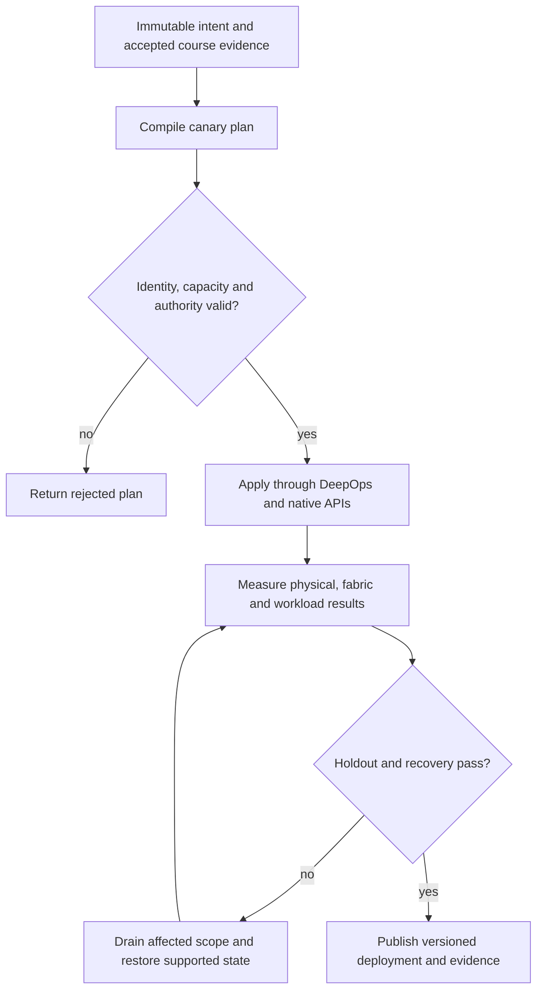

# P14 · Collectives across both fabrics in a production workflow

Prerequisites: **all C01–C20**, plus P13.
Level 14/20. This project combines already taught skills; it does not introduce
an untracked prerequisite. Start with `Session.start("P14")` so real DeepOps
reconciliation accompanies this build.

## Deliver the system

Build a collective acceptance service that selects local and remote tests from the rank graph. Join physical rail identity, scheduler admission and transport observations; reject a numerically correct result collected on the wrong execution path.

Use Incus system containers, patchbay, petgraph, NetBox and native services.
Rusternetes + KWOK provide API/state rehearsal; actual processes provide workload
results. Any unavoidable NVIDIA dependency exception must be qualified and
recorded before use. No such exception is preapproved by this project.

## Guided construction

1. Load the accepted course evidence and inventory revision. Express the system's
   inputs and output contract as immutable Python records or Rust structs.
   Include identity, units, capacity, timeout, ownership and rollback target.
2. Compose the earlier course transformations into an intent compiler. Generate
   the configuration and a before/after diff. Verify that a rejected input has
   produced no partial deployment. Review macro expansion when macros generate effects.
3. Apply the smallest canary through the native/DeepOps adapters. Establish the
   unit-specific observations below, then reconcile again and inspect the no-op result.
4. Add the next failure domain while retaining the same acceptance contract.
   Use independent network and device observations; compare them with scheduler/API state.
5. Exercise a partial failure, recovery and a second workload placement. Retain
   rejected runs. Produce the handover artifacts so another operator can reconstruct
   the exact decision from source, configuration and evidence.

- Create a rank-to-node-to-GPU-to-NIC map. Validate equal element counts and supported reduce-scatter divisibility; reject duplicate device assignments before launching.
- Inspect the actual NVLink/NVSwitch topology and supported Fabric Manager service state. Run a local collective and correlate its correctness and transport evidence with that topology.
- Use the simulator native NCCL backend with pinned CUDA/NCCL libraries for a namespace-separated rehearsal on the host. Physical inter-node acceptance additionally requires actual separate hosts and a qualified distributed launch adapter. Record rank-local completion time, aggregate network counters and result values; do not attribute all interface bytes exclusively to NCCL.
- Inject one local-fabric service failure and one inter-node path failure in separate authorized trials. Recover each, repeat on a different rank placement and explain GPU/CPU/storage interconnect latency independently.

## Promotion and rollback flow

## Unit-specific design rationale

A collective is a contract over ranks, buffers, element counts and an operation. Every rank must participate consistently. A correct mathematical result does not identify the transport used, and an attractive bandwidth number does not prove the result is correct. Distinguish intra-node NVLink/NVSwitch paths from inter-node NIC/switch paths and host/storage paths.

The diagram is a set of loading cranes inside a dock and shipping lanes between docks. NVSwitch is not an Ethernet leaf, and Fabric Manager is not a generic Linux bridge manager. The existing simulator deliberately delegates collective arithmetic to native NCCL. It validates shapes and device assignments first, and native execution records library identities and real completion time; use that path rather than writing a Python sum and calling it NCCL.

Use [C14's executable example](../examples/C14.py) as a small local contract,
then compose it with the previous projects. A constant successful example is not
a production adapter. Repeat the underlying live observations after every
identity, firmware, topology or workload change that invalidates them.

## Reviewable deliverables

- Source and expanded/generated configuration, pinned dependencies and NetBox revision.
- DeepOps report and actual running service/device identities.
- Resource/path/admission invariants, negative isolation checks and a measured workload result.
- Canary, holdout and rollback traces with deadlines and failure ownership.
- Operator runbook, residual limitations and the complete facet evidence table from [C14](../courses/C14.md).

If a new solution requires a new skill, retain the solution and add that skill to
a course before marking the project taught. No production-readiness claim is
valid while its live qualification gates are blocked.
