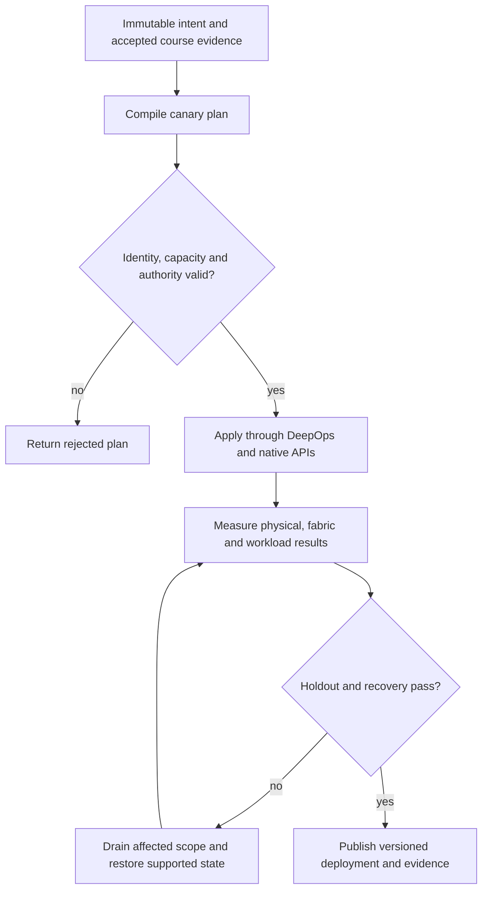

# P15 · Acceptance under sustained load in a production workflow

Prerequisites: **all C01–C20**, plus P14.
Level 15/20. This project combines already taught skills; it does not introduce
an untracked prerequisite. Start with `Session.start("P15")` so real DeepOps
reconciliation accompanies this build.

## Deliver the system

Build an acceptance pipeline for a newly commissioned scalable unit. Generate the full benchmark matrix from inventory, enforce abort/recovery contracts and publish a traceable release report that cannot omit a failed workload family.

Use Incus system containers, patchbay, petgraph, NetBox and native services.
Rusternetes + KWOK provide API/state rehearsal; actual processes provide workload
results. Any unavoidable NVIDIA dependency exception must be qualified and
recorded before use. No such exception is preapproved by this project.

## Guided construction

1. Load the accepted course evidence and inventory revision. Express the system's
   inputs and output contract as immutable Python records or Rust structs.
   Include identity, units, capacity, timeout, ownership and rollback target.
2. Compose the earlier course transformations into an intent compiler. Generate
   the configuration and a before/after diff. Verify that a rejected input has
   produced no partial deployment. Review macro expansion when macros generate effects.
3. Apply the smallest canary through the native/DeepOps adapters. Establish the
   unit-specific observations below, then reconcile again and inspect the no-op result.
4. Add the next failure domain while retaining the same acceptance contract.
   Use independent network and device observations; compare them with scheduler/API state.
5. Exercise a partial failure, recovery and a second workload placement. Retain
   rejected runs. Produce the handover artifacts so another operator can reconstruct
   the exact decision from source, configuration and evidence.

- Write thresholds and abort conditions before collecting data. Verify the physical installation, cooling and network path with an initial hardware acceptance workload.
- Execute node stress, HPL and ClusterKit separately. Record actual participating devices, correctness checks, duration, temperatures, throttling and errors.
- Run NCCL, HPL and NeMo burn-in workloads with a justified duration and concurrency. Collect time-series observations across compute, storage and fabric; keep every failed interval.
- Introduce a bounded path impairment and a recoverable service interruption. Confirm both the steady-state objective and recovery bound on a second workload placement. Stop safely when a declared abort condition holds.

## Promotion and rollback flow

## Unit-specific design rationale

Acceptance is a predeclared predicate over a measurement window, not the best sample in that window. Define correctness, duration, concurrency, thermal envelope, permitted errors and recovery behavior before a soak begins. HPL, NCCL, ClusterKit, NeMo and node stress test different behavior; one cannot stand in for all the others.

Use a test kiln: sustained heat reveals a defect that a quick inspection misses. The analogy stops at the actual cooling and device limits. A monotonic timestamp bounds elapsed time; aligned device and network records allow diagnosis. Keep the workload identity and environmental conditions fixed when comparing runs. A tool that exits successfully while skipping a GPU is not an accepted GPU test.

Use [C15's executable example](../examples/C15.py) as a small local contract,
then compose it with the previous projects. A constant successful example is not
a production adapter. Repeat the underlying live observations after every
identity, firmware, topology or workload change that invalidates them.

## Reviewable deliverables

- Source and expanded/generated configuration, pinned dependencies and NetBox revision.
- DeepOps report and actual running service/device identities.
- Resource/path/admission invariants, negative isolation checks and a measured workload result.
- Canary, holdout and rollback traces with deadlines and failure ownership.
- Operator runbook, residual limitations and the complete facet evidence table from [C15](../courses/C15.md).

If a new solution requires a new skill, retain the solution and add that skill to
a course before marking the project taught. No production-readiness claim is
valid while its live qualification gates are blocked.
