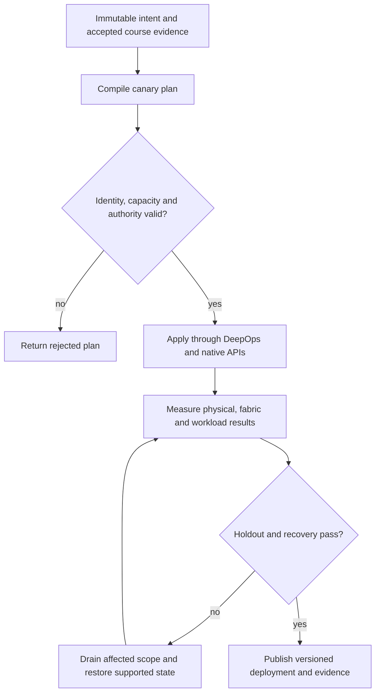

# P16 · Correlate independent observations in a production workflow

Prerequisites: **all C01–C20**, plus P15.
Level 16/20. This project combines already taught skills; it does not introduce
an untracked prerequisite. Start with `Session.start("P16")` so real DeepOps
reconciliation accompanies this build.

## Deliver the system

Build an incident evidence graph across job IDs, physical devices, fabric ports and time intervals. Produce a minimal discriminating probe plan and an auditable recovery narrative, using all prior course measurement methods.

Use Incus system containers, patchbay, petgraph, NetBox and native services.
Rusternetes + KWOK provide API/state rehearsal; actual processes provide workload
results. Any unavoidable NVIDIA dependency exception must be qualified and
recorded before use. No such exception is preapproved by this project.

## Guided construction

1. Load the accepted course evidence and inventory revision. Express the system's
   inputs and output contract as immutable Python records or Rust structs.
   Include identity, units, capacity, timeout, ownership and rollback target.
2. Compose the earlier course transformations into an intent compiler. Generate
   the configuration and a before/after diff. Verify that a rejected input has
   produced no partial deployment. Review macro expansion when macros generate effects.
3. Apply the smallest canary through the native/DeepOps adapters. Establish the
   unit-specific observations below, then reconcile again and inspect the no-op result.
4. Add the next failure domain while retaining the same acceptance contract.
   Use independent network and device observations; compare them with scheduler/API state.
5. Exercise a partial failure, recovery and a second workload placement. Retain
   rejected runs. Produce the handover artifacts so another operator can reconstruct
   the exact decision from source, configuration and evidence.

- Collect BCM usage/performance/incident reports and raw DCGM, NVSM and SMI observations with identities and collection intervals. Explain disagreements instead of averaging them away.
- Collect WJH drop reasons, in-band telemetry and NetQ congestion/latency evidence on a supported product. Join them to a specific job and path, preserving clock uncertainty.
- Form two competing hypotheses for a GPU, fan or NIC incident. Choose one bounded intervention whose predicted observations differ between the hypotheses.
- Apply that intervention, verify workload recovery and repeat on a holdout fault location. Produce an incident report that cites evidence and states what remains unobserved.

## Promotion and rollback flow

## Unit-specific design rationale

A correlated symptom is a candidate explanation. A causal diagnosis also predicts a discriminating intervention. Align device, fabric and job observations by resource identity and time uncertainty; do not join unrelated samples merely because their timestamps print the same second. Preserve raw observations alongside normalized fields.

Use three inspection windows: compute health, transport behavior and admitted workload progress. DCGM, NVSM and SMI observe different aspects of the node. WJH and in-band telemetry concern specific network observations, while NetQ provides network visibility. None is interchangeable with a made-up JSON field carrying the product name. Localize GPU, fan and NIC faults separately, and distinguish utilization from useful performance.

Use [C16's executable example](../examples/C16.py) as a small local contract,
then compose it with the previous projects. A constant successful example is not
a production adapter. Repeat the underlying live observations after every
identity, firmware, topology or workload change that invalidates them.

## Reviewable deliverables

- Source and expanded/generated configuration, pinned dependencies and NetBox revision.
- DeepOps report and actual running service/device identities.
- Resource/path/admission invariants, negative isolation checks and a measured workload result.
- Canary, holdout and rollback traces with deadlines and failure ownership.
- Operator runbook, residual limitations and the complete facet evidence table from [C16](../courses/C16.md).

If a new solution requires a new skill, retain the solution and add that skill to
a course before marking the project taught. No production-readiness claim is
valid while its live qualification gates are blocked.
