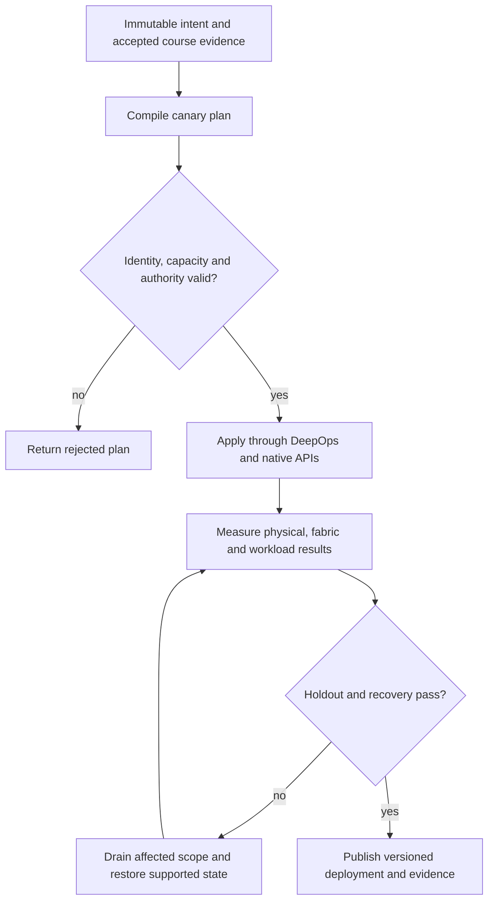

# P17 · Maintain a live failure domain in a production workflow

Prerequisites: **all C01–C20**, plus P16.
Level 17/20. This project combines already taught skills; it does not introduce
an untracked prerequisite. Start with `Session.start("P17")` so real DeepOps
reconciliation accompanies this build.

## Deliver the system

Build a rolling maintenance controller for two redundant scalable units. Its state machine coordinates physical service, network redundancy and scheduler drains; every release of the maintenance lease requires new acceptance evidence.

Use Incus system containers, patchbay, petgraph, NetBox and native services.
Rusternetes + KWOK provide API/state rehearsal; actual processes provide workload
results. Any unavoidable NVIDIA dependency exception must be qualified and
recorded before use. No such exception is preapproved by this project.

## Guided construction

1. Load the accepted course evidence and inventory revision. Express the system's
   inputs and output contract as immutable Python records or Rust structs.
   Include identity, units, capacity, timeout, ownership and rollback target.
2. Compose the earlier course transformations into an intent compiler. Generate
   the configuration and a before/after diff. Verify that a rejected input has
   produced no partial deployment. Review macro expansion when macros generate effects.
3. Apply the smallest canary through the native/DeepOps adapters. Establish the
   unit-specific observations below, then reconcile again and inspect the no-op result.
4. Add the next failure domain while retaining the same acceptance contract.
   Use independent network and device observations; compare them with scheduler/API state.
5. Exercise a partial failure, recovery and a second workload placement. Retain
   rejected runs. Produce the handover artifacts so another operator can reconstruct
   the exact decision from source, configuration and evidence.

- Construct a version compatibility graph for BCM images/patches, HGX, switches, BlueField-3 and optics. Record upgrade order, supported rollback and recovery access for each component.
- Acquire the maintenance lease, drain workloads and verify that surviving paths and capacity satisfy the service objective. Fence stale writers before proceeding.
- Perform the supported canary update or supervised card/GPU/PSU isolation and replacement. Collect physical identity and firmware/software observations after the transition; detect an intentionally failed canary.
- Run physical, fabric and workload acceptance before readmission. Roll back only by the supported procedure and prove that a second failure-domain maintenance cannot violate the capacity bound.

## Promotion and rollback flow

## Unit-specific design rationale

Maintenance acquires an exclusive right to disrupt a bounded failure domain. Drain and verify release before changing firmware or hardware. Keep the recovery path outside the domain being changed. A service restart, image update, switch firmware transition, BlueField update and optic firmware update have different compatibility and rollback rules.

Use a lockout tag on the dock. The tag represents an enforced maintenance state, not a substitute for physical safety procedures. HGX firmware faults, GPU/card/PSU isolation and replacement must follow the exact system procedure and authorized service personnel. Reconcile replacement identities before readmission. A successful flash command is not proof that the new component booted, passed validation or preserved redundant paths.

Use [C17's executable example](../examples/C17.py) as a small local contract,
then compose it with the previous projects. A constant successful example is not
a production adapter. Repeat the underlying live observations after every
identity, firmware, topology or workload change that invalidates them.

## Reviewable deliverables

- Source and expanded/generated configuration, pinned dependencies and NetBox revision.
- DeepOps report and actual running service/device identities.
- Resource/path/admission invariants, negative isolation checks and a measured workload result.
- Canary, holdout and rollback traces with deadlines and failure ownership.
- Operator runbook, residual limitations and the complete facet evidence table from [C17](../courses/C17.md).

If a new solution requires a new skill, retain the solution and add that skill to
a course before marking the project taught. No production-readiness claim is
valid while its live qualification gates are blocked.
