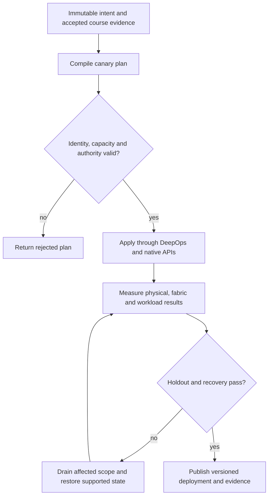

# P18 · Capacity and host affinity in a production workflow

Prerequisites: **all C01–C20**, plus P17.
Level 18/20. This project combines already taught skills; it does not introduce
an untracked prerequisite. Start with `Session.start("P18")` so real DeepOps
reconciliation accompanies this build.

## Deliver the system

Build a capacity forecast and placement compiler for heterogeneous CPU hosts. Integrate ASIC table reserves, GPU/NIC locality, storage demand and scheduler policy; explain the limiting resource for each admitted plan.

Use Incus system containers, patchbay, petgraph, NetBox and native services.
Rusternetes + KWOK provide API/state rehearsal; actual processes provide workload
results. Any unavoidable NVIDIA dependency exception must be qualified and
recorded before use. No such exception is preapproved by this project.

## Guided construction

1. Load the accepted course evidence and inventory revision. Express the system's
   inputs and output contract as immutable Python records or Rust structs.
   Include identity, units, capacity, timeout, ownership and rollback target.
2. Compose the earlier course transformations into an intent compiler. Generate
   the configuration and a before/after diff. Verify that a rejected input has
   produced no partial deployment. Review macro expansion when macros generate effects.
3. Apply the smallest canary through the native/DeepOps adapters. Establish the
   unit-specific observations below, then reconcile again and inspect the no-op result.
4. Add the next failure domain while retaining the same acceptance contract.
   Use independent network and device observations; compare them with scheduler/API state.
5. Exercise a partial failure, recovery and a second workload placement. Retain
   rejected runs. Produce the handover artifacts so another operator can reconstruct
   the exact decision from source, configuration and evidence.

- Collect the switch resource report and relate used/available tables to the actual route/neighbor scale. Keep a reserve for failover expansion and reject a forecast that assumes unlimited ASIC entries.
- Collect CPU, NUMA, PCIe, GPU and NIC locality on both AMD and Intel course hosts. Generate an affinity plan from observed topology rather than fixed CPU numbers.
- Measure a workload with local and intentionally remote placement under the same network/storage conditions. Change one tuning parameter at a time and retain a correctness test.
- Scale tenant routes and job concurrency together, then remove one path. Validate that ASIC reserve and host affinity still satisfy the service objective; compare the holdout hardware topology.

## Promotion and rollback flow

## Unit-specific design rationale

A switch has finite forwarding resources, and a host has a finite locality budget. Count the resource actually consumed: routes, neighbors, next hops and other ASIC tables can exhaust independently. On the host, CPU affinity, memory placement, PCIe topology and NIC/GPU attachment interact. Increasing thread count can increase remote memory traffic and reduce useful throughput.

The drawing is a warehouse with shelves and loading aisles. A free shelf does not imply a free aisle. Use cl-resource-query on the supported platform for ASIC evidence. Tune AMD and Intel hosts using their actual topology and supported settings; do not copy a NUMA node number between machines. The experiment must bind physical identity, fabric pressure and job placement.

Use [C18's executable example](../examples/C18.py) as a small local contract,
then compose it with the previous projects. A constant successful example is not
a production adapter. Repeat the underlying live observations after every
identity, firmware, topology or workload change that invalidates them.

## Reviewable deliverables

- Source and expanded/generated configuration, pinned dependencies and NetBox revision.
- DeepOps report and actual running service/device identities.
- Resource/path/admission invariants, negative isolation checks and a measured workload result.
- Canary, holdout and rollback traces with deadlines and failure ownership.
- Operator runbook, residual limitations and the complete facet evidence table from [C18](../courses/C18.md).

If a new solution requires a new skill, retain the solution and add that skill to
a course before marking the project taught. No production-readiness claim is
valid while its live qualification gates are blocked.
