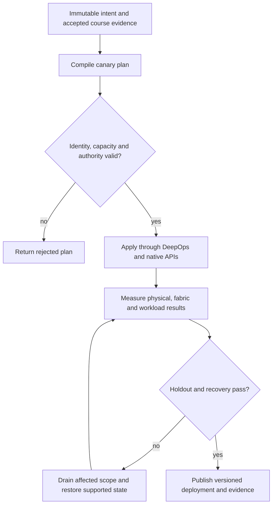

# P19 · Edge and cloud reconnection in a production workflow

Prerequisites: **all C01–C20**, plus P18.
Level 19/20. This project combines already taught skills; it does not introduce
an untracked prerequisite. Start with `Session.start("P19")` so real DeepOps
reconciliation accompanies this build.

## Deliver the system

Build an intermittently connected inference outpost with a revisioned control journal. Combine artifact pinning, network isolation, quota ownership and checkpoint integrity; qualify the real Fleet Command/cloud adapter separately.

Use Incus system containers, patchbay, petgraph, NetBox and native services.
Rusternetes + KWOK provide API/state rehearsal; actual processes provide workload
results. Any unavoidable NVIDIA dependency exception must be qualified and
recorded before use. No such exception is preapproved by this project.

## Guided construction

1. Load the accepted course evidence and inventory revision. Express the system's
   inputs and output contract as immutable Python records or Rust structs.
   Include identity, units, capacity, timeout, ownership and rollback target.
2. Compose the earlier course transformations into an intent compiler. Generate
   the configuration and a before/after diff. Verify that a rejected input has
   produced no partial deployment. Review macro expansion when macros generate effects.
3. Apply the smallest canary through the native/DeepOps adapters. Establish the
   unit-specific observations below, then reconcile again and inspect the no-op result.
4. Add the next failure domain while retaining the same acceptance contract.
   Use independent network and device observations; compare them with scheduler/API state.
5. Exercise a partial failure, recovery and a second workload placement. Retain
   rejected runs. Produce the handover artifacts so another operator can reconstruct
   the exact decision from source, configuration and evidence.

- Administer a supported Fleet Command environment and record permitted device/service lifecycle operations. At the cloud station, deploy the intended VMI with explicit instance, image and network identity.
- Validate GPU, NIC and storage behavior before admitting the remote workload. Use DeepOps-managed host configuration where supported, recording any platform-specific adapter.
- Disconnect the rehearsal edge via an owned patchbay path while the native service continues. Queue versioned desired state and preserve the service checkpoint separately.
- Reconnect with competing old and new revisions. Reject stale desired state, recover the authorized workload and repeat with a rotated endpoint identity and different path latency.

## Promotion and rollback flow

## Unit-specific design rationale

An edge node can keep running after its controller loses contact. Reconnection must reconcile two histories without replaying obsolete authority or overwriting newer workload state. Give desired configuration a revision and bind artifacts to identities. Separate a disconnected-but-healthy service from a reachable-but-stale controller report.

Fleet Command and cloud VMI remain source objectives from the AIO guide and require the real product/cloud course station. The Incus project models an edge lifecycle and exercises actual Linux network disconnection; it does not become Fleet Command by naming a function after it. A cloud GPU image still requires driver, network, storage and workload validation on its actual instance type.

Use [C19's executable example](../examples/C19.py) as a small local contract,
then compose it with the previous projects. A constant successful example is not
a production adapter. Repeat the underlying live observations after every
identity, firmware, topology or workload change that invalidates them.

## Reviewable deliverables

- Source and expanded/generated configuration, pinned dependencies and NetBox revision.
- DeepOps report and actual running service/device identities.
- Resource/path/admission invariants, negative isolation checks and a measured workload result.
- Canary, holdout and rollback traces with deadlines and failure ownership.
- Operator runbook, residual limitations and the complete facet evidence table from [C19](../courses/C19.md).

If a new solution requires a new skill, retain the solution and add that skill to
a course before marking the project taught. No production-readiness claim is
valid while its live qualification gates are blocked.
