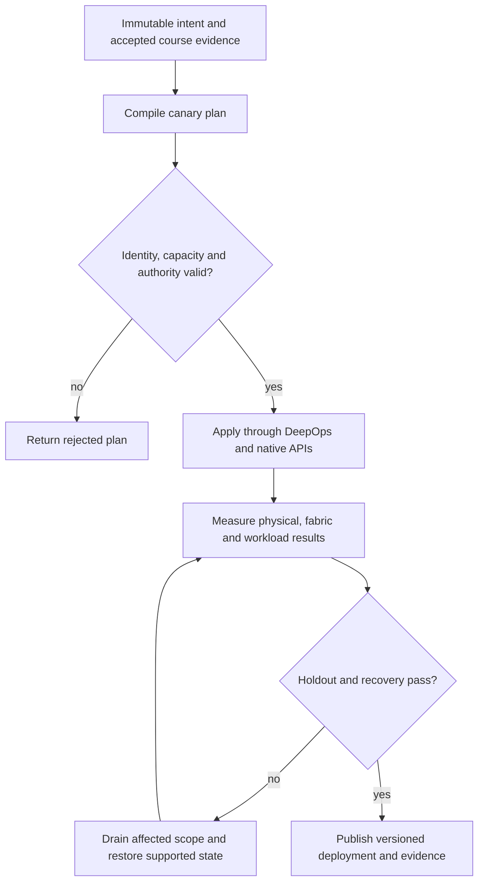

# P20 · Recover without split brain in a production workflow

Prerequisites: **all C01–C20**, plus P19.
Level 20/20. This project combines already taught skills; it does not introduce
an untracked prerequisite. Start with `Session.start("P20")` so real DeepOps
reconciliation accompanies this build.

## Deliver the system

Build a production-oriented recovery orchestrator for a multi-tenant AI factory. Integrate all prior projects into a versioned plan/evidence/rollback system. Its release artifact includes the complete objective ledger, all holdouts, explicit blocked capabilities and an operator handover.

Use Incus system containers, patchbay, petgraph, NetBox and native services.
Rusternetes + KWOK provide API/state rehearsal; actual processes provide workload
results. Any unavoidable NVIDIA dependency exception must be qualified and
recorded before use. No such exception is preapproved by this project.

## Guided construction

1. Load the accepted course evidence and inventory revision. Express the system's
   inputs and output contract as immutable Python records or Rust structs.
   Include identity, units, capacity, timeout, ownership and rollback target.
2. Compose the earlier course transformations into an intent compiler. Generate
   the configuration and a before/after diff. Verify that a rejected input has
   produced no partial deployment. Review macro expansion when macros generate effects.
3. Apply the smallest canary through the native/DeepOps adapters. Establish the
   unit-specific observations below, then reconcile again and inspect the no-op result.
4. Add the next failure domain while retaining the same acceptance contract.
   Use independent network and device observations; compare them with scheduler/API state.
5. Exercise a partial failure, recovery and a second workload placement. Retain
   rejected runs. Produce the handover artifacts so another operator can reconstruct
   the exact decision from source, configuration and evidence.

- Capture a baseline dependency graph linking controller state, device identity, fabric policy, storage checkpoint and workload admission. Identify which state is external to each backup.
- Diagnose a compound BCM job/node/bottleneck and UFM health incident using independent observations from prior courses. Select the smallest failure domain that explains the evidence.
- Fence stale owners, restore dependencies and reconcile current physical/network identity before resuming work. Reject an old epoch and a correct-looking checkpoint from the wrong dataset.
- Run the trainer holdout with reordered failures and delayed observations. Demonstrate that removing any one of the operations, networking or infrastructure repairs prevents acceptance; restore each and collect recovery evidence.

## Promotion and rollback flow

## Unit-specific design rationale

Recovery is a new controlled transition, not an unconditional rewind. A checkpoint can restore application state while leaving a stale controller, revoked credential or replaced physical identity outside that checkpoint. Restore dependencies in a valid order and reject any operation whose ownership epoch no longer matches.

Use a salvage yard with numbered crates and a single lifting permit. Two cranes holding copies of an old permit must not both lift the same load. BCM job/node/bottleneck diagnosis, BCM control-plane diagnosis and UFM health belong in the same incident narrative but remain separate product observations. The final recovery must establish physical capacity, reachable isolated paths, single-writer authority and a correct workload result.

Use [C20's executable example](../examples/C20.py) as a small local contract,
then compose it with the previous projects. A constant successful example is not
a production adapter. Repeat the underlying live observations after every
identity, firmware, topology or workload change that invalidates them.

## Reviewable deliverables

- Source and expanded/generated configuration, pinned dependencies and NetBox revision.
- DeepOps report and actual running service/device identities.
- Resource/path/admission invariants, negative isolation checks and a measured workload result.
- Canary, holdout and rollback traces with deadlines and failure ownership.
- Operator runbook, residual limitations and the complete facet evidence table from [C20](../courses/C20.md).

If a new solution requires a new skill, retain the solution and add that skill to
a course before marking the project taught. No production-readiness claim is
valid while its live qualification gates are blocked.
