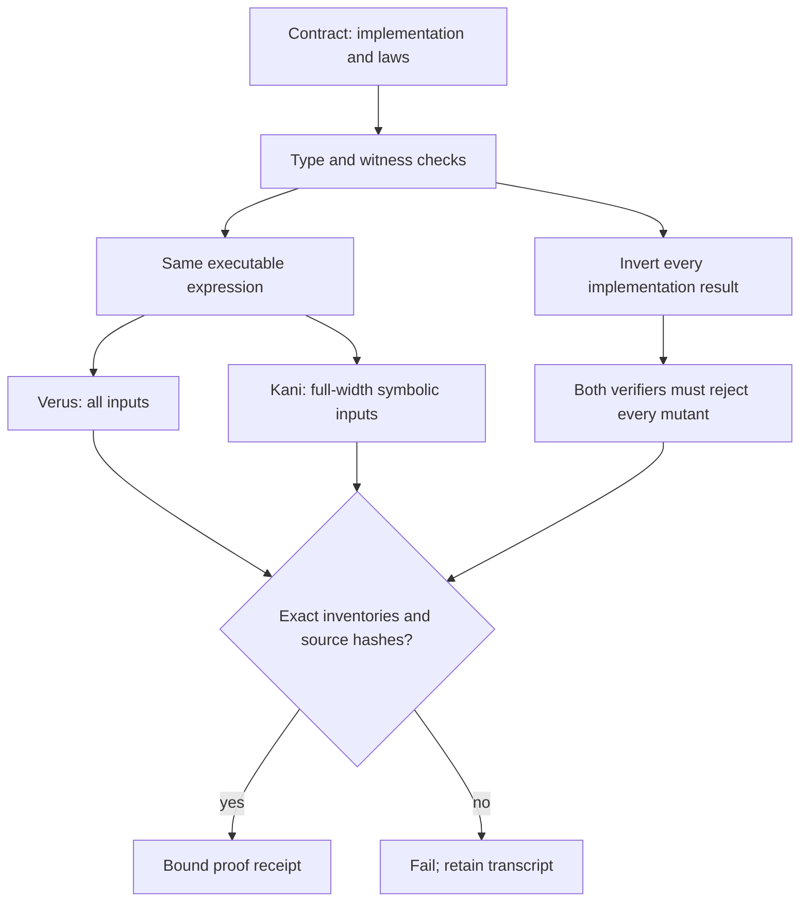

# Reusable metaprogramming and metaverification

Define a decision once in [specification.py](specification.py). The typed decorator
expands its executable expression into Rust and Verus, and its postconditions into
Verus obligations and full-width symbolic Kani harnesses. Every predicate needs
accepting and rejecting witnesses that distinguish the incorrect result.

```python
@predicate(parameters={"parent": "u16", "child": "u16", "total": "u16"},
           witnesses=[((0, 1, 2), True), ((1, 0, 2), False)],
           scope="Prerequisites precede consumers.")
def ordered_edge(parent, child, total, result):
    return parent.lt(child) & child.lt(total), [
        result.eq(~(child.le(parent) | total.le(child)))]
```

The expression language accepts only typed variables, bounded unsigned literals,
boolean operations, comparisons and bit operations. Python `and/or`, raw Rust,
unbound variables, type coercions, assumptions, preconditions and proof bypasses
are rejected. The current language deliberately describes total predicates;
stateful algorithms require a separately reviewed extension and new proof rules.
Expanded expressions are bounded to 4,096 nodes and depth 64, even when a small
shared expression graph would otherwise expand exponentially. Contracts also bound
their parameters, properties and witnesses; each verifier process has a deadline.



## Agent workflow

Run from the repository root:

```sh
python3 tools/meta.py explain ordered_edge
python3 tools/meta.py impact
python3 tools/meta.py render
python3 tools/meta.py check
VERUS=/path/to/verus python3 tools/meta.py verify
```

Each command emits one JSON line. A failure names the contract, changed artifact
or transcript directory; inspect that item before asking an agent to read whole
logs. `check` is read-only. `render` validates the complete expansion and every
destination before writing; its hash manifest commits last. Each replacement is
atomic, while an interrupted multi-file publication is detected on the next check.
Retiring generated paths requires an explicit reviewed migration.

`prove` runs both tools on every predicate and then on inverted implementations.
A missing harness, incomplete inventory, successful mutant, nonzero positive
exit or partial Verus run fails. Successful receipts bind sources, tool versions,
installed verifier/solver distributions, generated code and complete transcripts.
Unchanged local runs can reuse that receipt after rechecking its contents. This
is a performance cache, **not** a signed attestation or a learner evidence source.
`verify` also runs the compiler/report negative tests under ordinary and optimized
Python, the Rust witnesses, and all concrete material obligations in compiled Rust.
`prove` runs just the dual proof stage after the same generation/structure check.
CI always uses `verify --fresh`. Tool installation is explicit; the runner never downloads
or installs software. Exact versions and the Verus archive checksum are in
[toolchain.json](toolchain.json).

## Material generation and finite refinement

Both historical build scripts delegate to the same pipeline. A build first
validates the source-obligation lock, author registry and typed learning graph;
then renders the entire batch in memory, checks it, and only then publishes.
The compiler records every course, project and incident's explicit facet set.
Projects can use any skill taught by their course prerequisites. Exercises require
both a teaching ancestor and a project ancestor that practices each skill.
New required skills therefore require a teaching/practice predecessor instead of
being silently deleted. The reusable graph supports arbitrary bounded sequences;
the current NCP edition adapter retains its 20 units and 40 incidents.

The current edition produces **783 concrete obligations**: prerequisite ordering,
skill availability, exact facet declarations, domain completeness and station
ordering. Skill sets use checked 64-bit chunks, so the 65th or 129th skill cannot
disappear through a truncated mask. The compiler evaluates these predicates before
publication and emits the same obligations for the verified Rust implementation.
These are finite structural checks using proven predicates, not universal proofs
about the prose, compiler, parsers or learners.

[source-obligations.json](source-obligations.json) is a reviewed input. Generation
never refreshes it. If a source discrepancy requires changing it, inspect the
official source and the diff; do not regenerate the lock merely to turn CI green.
The authored C00 and NetBox practical remain explicit exceptions to generated
pages. Unregistered files in the generated material directories fail the gate.

`impact` reports changed inputs, affected generated outputs, and whether proof
inputs changed. An ordinary lesson edit rechecks all declared material structure
without invalidating an unchanged local predicate proof. A change to the DSL,
specifications, compiler, proof runner or relevant shared helpers invalidates that
receipt. This avoids repeated agent output and solver work without weakening CI.

## Shared runtime checklist and assessment boundary

[evidence.py](evidence.py) supplies one exact named checklist to the Incus, NetBox
and Rusternetes qualification adapters. Every name must occur once with a real
boolean outcome; completion is recomputed, bound to an identity, and rejected if
any required check is missing, false or duplicated. Cleanup is an explicit
obligation. The adapter must still perform each operation truthfully; the checklist
cannot prove a caller's observation. Its Python evaluation uses the same typed
expression, while the formal theorem applies to the generated Rust predicate.

The production Rust assessment directly imports the generated evidence and receipt
predicates. Its all-station mutation test now invokes the production acceptance
function instead of a test-local reimplementation. Unexpected facet bits fail as
well as missing ones. Collection, parsing and baseline/holdout mask construction
remain outside the scalar predicate proof.

## What these proofs establish

The eight generated Rust predicates satisfy their stated postconditions for all
values of their declared types. Kani harnesses contain no assumptions, loops or
unwinding shortcuts. Verus runs with `--no-cheating`. The same expression emitter
supplies production and proof bodies, avoiding hand-maintained proof copies.

The specifications, Python compiler, report parsers, Rust/Verus/Kani toolchains,
solvers and host remain trusted. Witness checks and negative controls challenge
that boundary; they do not formally prove the compiler. These predicates do not
prove the truth of NVIDIA observations, instructional quality, whole Rustlings,
or the entire exercise bank. The previous seven-function Rustlings kernel keeps
its separate proof scope. Never widen a claim merely because a workflow is green.

Primary tool semantics: [Verus attributes](https://verus-lang.github.io/verus/guide/reference-attributes.html)
and [Kani proof attributes](https://model-checking.github.io/kani/reference/attributes.html).
