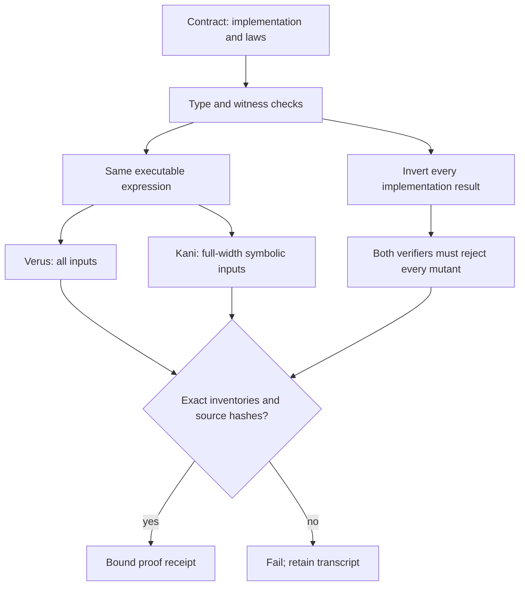

# Reusable metaprogramming and metaverification

Define a decision once in [specification.py](specification.py). The typed decorator
expands its executable expression into Rust and Verus, and its postconditions into
Verus obligations and full-width symbolic Kani harnesses. Every predicate needs
accepting and rejecting witnesses that distinguish the incorrect result.

```python
@predicate(parameters={"parent": "u16", "child": "u16", "total": "u16"},
           witnesses=[((0, 1, 2), True), ((1, 0, 2), False)],
           scope="Prerequisites precede consumers.")
def ordered_edge(parent, child, total, result):
    return parent.lt(child) & child.lt(total), [
        result.eq(~(child.le(parent) | total.le(child)))]
```

The expression language accepts only typed variables, bounded unsigned literals,
boolean operations, comparisons and bit operations. Python `and/or`, raw Rust,
unbound variables, type coercions, assumptions, preconditions and proof bypasses
are rejected. The current language deliberately describes total predicates;
stateful algorithms require a separately reviewed extension and new proof rules.



## Agent workflow

Run from the repository root:

```sh
python3 tools/meta.py explain ordered_edge
python3 tools/meta.py render
python3 tools/meta.py check
VERUS=/path/to/verus python3 tools/meta.py prove
```

Each command emits one JSON line. A failure names the contract, changed artifact
or transcript directory; inspect that item before asking an agent to read whole
logs. `check` is read-only. `render` validates the complete expansion and every
destination before writing; its hash manifest commits last. Each replacement is
atomic, while an interrupted multi-file publication is detected on the next check.
Retiring generated paths requires an explicit reviewed migration.

`prove` runs both tools on every predicate and then on inverted implementations.
A missing harness, incomplete inventory, successful mutant, nonzero positive
exit or partial Verus run fails. Successful receipts bind sources, tool versions,
installed verifier/solver distributions, generated code and complete transcripts.
Unchanged local runs can reuse that receipt after rechecking its contents. This
is a performance cache, **not** a signed attestation or a learner evidence source.
CI always uses `--fresh`. Tool installation is explicit; the runner never downloads
or installs software. Exact versions and the Verus archive checksum are in
[toolchain.json](toolchain.json).

## What these proofs establish

The eight generated Rust predicates satisfy their stated postconditions for all
values of their declared types. Kani harnesses contain no assumptions, loops or
unwinding shortcuts. Verus runs with `--no-cheating`. The same expression emitter
supplies production and proof bodies, avoiding hand-maintained proof copies.

The specifications, Python compiler, report parsers, Rust/Verus/Kani toolchains,
solvers and host remain trusted. Witness checks and negative controls challenge
that boundary; they do not formally prove the compiler. These predicates do not
prove the truth of NVIDIA observations, instructional quality, whole Rustlings,
or the entire exercise bank. The previous seven-function Rustlings kernel keeps
its separate proof scope. Never widen a claim merely because a workflow is green.

Primary tool semantics: [Verus attributes](https://verus-lang.github.io/verus/guide/reference-attributes.html)
and [Kani proof attributes](https://model-checking.github.io/kani/reference/attributes.html).
